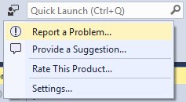

# Contributing 

## Before Submitting an Bug or Feature Request
First, please do a search in [open issues/feature requests](https://github.com/Microsoft/project-cascade/issues) to see if the issue or feature request has already been filed. Use this [query](https://github.com/Microsoft/project-cascade/issues?q=is%3Aopen+is%3Aissue+label%3Afeature-request+sort%3Areactions-%2B1-desc) to search for the most popular feature requests.

If you find your issue/feature already exists, make relevant comments and add your [reaction](https://github.com/blog/2119-add-reactions-to-pull-requests-issues-and-comments). Use a reaction in place of a "+1" comment.

👍 - upvote

👎 - downvote

If you cannot find an existing issue that describes your bug or feature, submit an issue using the guidelines below.

## Writing Good Bug Reports and Feature Requests

File a single issue per problem and feature request.

* Do not enumerate multiple bugs or feature requests in the same issue.
* Do not add your issue as a comment to an existing issue unless it's for the identical input. Many issues look similar, but have different causes.

The more information you can provide, the more likely someone will be successful reproducing the issue and finding a fix. 

* Reproducible steps (1... 2... 3...) and what you expected versus what you actually saw. 
* Images, animations, or a link to a video. 
* A code snippet that demonstrates the issue or a link to a code repository we can easily pull down onto our machine to recreate the issue. 

> **Note:** Because we need to copy and paste the code snippet, including a code snippet as a media file (i.e. .gif) is not sufficient. 

Please remember to do the following:

* Search the [issue repository](https://github.com/Microsoft/project-cascade/issues) to see if there exists a duplicate. 
* If code related, simplify your code around the issue so we can better isolate the problem. 

Don't feel bad if we can't reproduce the issue and ask for more information!

### Filing Visual Studio Bugs

Visual Studio has a built in feedback mechanism via the "Report a Problem..." tool that provides the engineering team detailed information about your installation that you should use to log bugs or problems you encounter when using VS.

 

Steps: 
1. As always, first search existing problem reports to see if one already exists.  
    - You may search for existing issues using "**Project Cascade**" in the Visual Studio Feedback tool.
    - However, be aware your problem may be related to multiple clients and therefore is logged in the GitHub [issue repository](https://github.com/Microsoft/project-cascade/issues).
2. If you find it, up vote it.
3. If not, create one using the Visual Studio Feedback tool and use "**Project Cascade:**" at the start of your title.
4. Next, follow the guidelines above for writing good bug descriptions.

> NOTE: Suggestions or feature requests should be filed as [GitHub issues](https://github.com/Microsoft/project-cascade/issues) via the process described below instead of "Provide a Suggestion..." as many are broadly applicable to multiple clients.

After it is filed, your issue has been may be moved to a [GitHub issue](https://github.com/Microsoft/project-cascade/issues) for future tracking if it applies multiple clients or turns out to be a feature request. In this event, a link to the corresponding GitHub issue number will be referenced in comments on your raised problem report. 

### Filing VS Code or General Service Bugs 

After ensuring there is not an [existing issue](https://github.com/Microsoft/project-cascade/issues), create an issue in [this repository](https://github.com/Microsoft/project-cascade/issues). 

Please include the following with each issue in addition to following the guidelines above for writing good bug descriptions.

* The product and version of the tool you are using
* Your operating system
* List of extensions that you have installed (if applicable). 

> **Tip:** You can easily add the list of extensions by creating the issue using `Report Issues` from VS Code's Help menu. 

* If in VS Code, errors in the Dev Tools Console (Help | Toggle Developer Tools)

### Filing Feature Requests
Many feature requests start out life as reported bugs or issues and should therefore follow the processes described above.  However, if you believe you have a feature request that is not a bug, you can follow these steps:

1. Use this [query](https://github.com/Microsoft/project-cascade/issues?q=is%3Aopen+is%3Aissue+label%3Afeature-request+sort%3Areactions-%2B1-desc) to search for the most popular feature requests to see if it already exists.  
2. If so, 👍 (upvote) it.
3. If not, be as specific as you can be with the problem or scenario you are trying to solve with the requested feature and let us know any painful workarounds you are having to do.

As with issues, don't feel bad if we ask for more information while we try to understand your scenario.

## Contributing to documentation

You may contribute to documentation by submitting pull requests to this repository. Most contributions require you to agree to a Contributor License Agreement (CLA) declaring that you have the right to, and actually do, grant us the rights to use your contribution. For details, visit https://cla.microsoft.com.

When you submit a pull request, a CLA-bot will automatically determine whether you need to provide
a CLA and decorate the PR appropriately (e.g., label, comment). Simply follow the instructions
provided by the bot. You will only need to do this once across all repos using our CLA.

## Discussion Etiquette
In order to keep the conversation clear and transparent, please limit discussion to English and keep things on topic with the issue. Be considerate to others and try to be courteous and professional at all times. This project has adopted the [Microsoft Open Source Code of Conduct](https://opensource.microsoft.com/codeofconduct/).

For more information see the [Code of Conduct FAQ](https://opensource.microsoft.com/codeofconduct/faq/) or contact [opencode@microsoft.com](mailto:opencode@microsoft.com) with any additional questions or comments.
