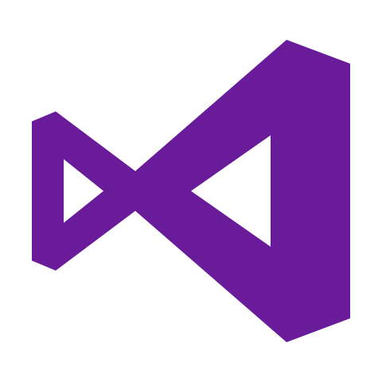

<!--
Copyright © Microsoft Corporation
All rights reserved.
Creative Commons Attribution 4.0 License (International): https://creativecommons.org/licenses/by/4.0/legalcode
-->

# Visual Studio Live Share Docs & Feedback

<table style="width: 100%; border-style: none;"><tr>
<td style="width: 140px; text-align: center;"></td>
<td>
<strong>Visual Studio Live Share</strong> 
<i>Enabling developers to achieve greater confidence at speed by streamlining collaboration in real-time during development. 
<strong><a href="https://aka.ms/vsls">Learn more!</a></strong></i>
</td>
</tr></table>

Many Visual Studio Live Features are available across a number of languages and platforms. [See here to find out what we currently support](https://aka.ms/vsls-docs/platform-support) and note more will be coming in the future. **Visual Studio Live Share is currently in public preview. User experience and features are not final.**

 

>**Tip:** Did you know you can *join your own collaboration session*? This allows you to try Live Share on your own or to spin up an instance of VS or VS Code and connect to it remotely! You can even use the same identity on both instances. Check it out!

## Quickstarts

- [Share your first project](https://aka.ms/vsls-docs/share)
- [Join your first collaboration session](https://aka.ms/vsls-docs/join)

## How-tos

- [Collaborate using Visual Studio Code](https://aka.ms/vsls-docs/vscode)
- [Collaborate using Visual Studio](https://aka.ms/vsls-docs/vs)

## Reference

- [Connectivity requirements](https://aka.ms/vsls-docs/connection-mode)
- [Security features](https://aka.ms/vsls-security)
- [Linux install details](https://aka.ms/vsls-linux)
- [Language and platform support](https://aka.ms/vsls-docs/platform-support)
- [Extension support](https://aka.ms/vsls-docs/extensions)
- [Common Use Cases](https://aka.ms/vsls-usecases)
- [Troubleshooting](https://aka.ms/vsls-troubleshooting)

## Resources

- [Provide feedback](https://aka.ms/vsls-support)
- [FAQ](https://aka.ms/vsls-faq)

## Community-created content

- [Remote pair programming with VS Live Share](https://m.youtube.com/watch?v=vq5FzSPmu-I&feature=youtu.be)
- [Getting Started with Live Coding in Visual Studio Code w/Live Share](https://scotch.io/tutorials/getting-started-with-live-coding-in-visual-studio-code-with-live-share)
- [Visual Studio Code: VS Live Share from Across the World](https://youtu.be/D7w0uGmQEc8)
- [Visual Studio Live Share - Two Developers Coding at Once](https://youtu.be/cg6pRv0D8pw)

## Download and install Visual Studio Live Share

<table style="width: 100%; border:none;">
<tr>
    <td width="128px" style="width: 128px; text-align: center; border:none;"></td>
    <td style="border:none;">
        <strong>Visual Studio Code (1.22.0+)</strong> 
        1. Install <a href="https://code.visualstudio.com/">Visual Studio Code</a> for Windows (7, 8.1, or 10), macOS <b>(Sierra+)</b>, or 64-bit Linux <b>(<a href="https://aka.ms/vsls-docs/vscode/install">details</a>)</b> 
        2. Download and install the VS Live Share extension from the marketplace.  
        3. Reload and wait for dependencies to download and install (see status bar). 
        4. <strong>Linux</strong>: If prompted to <a href="https://aka.ms/vsls-docs/linux-prerequisites">install libraries</a>, click install, enter password, restart VS Code when done. 
        
    </td>
</tr>
<tr style="border:none;">
    <td width="128px" style="width: 128px; text-align: center; border:none;"></td>
    <td style="border:none;">
        <strong>Visual Studio 2017 15.6 or higher</strong> 
        1. Install the latest version of <a href="https://visualstudio.microsoft.com/vs/">VS 2017</a> (15.6+) on Windows (7, 8.1, or 10). 
        2. Install a <a href="https://aka.ms/vsls-docs/platform-support">supported workload</a>. (e.g. ASP.NET, .NET Core, C++, and/or Node.js) 
        3. Download and install the VS Live Share extension from the marketplace.  
         
    </td>
</tr>
</table>

By downloading and using Visual Studio Live Share, you agree to the [license terms](https://aka.ms/vsls-license) and [privacy statement](https://www.microsoft.com/en-us/privacystatement/EnterpriseDev/default.aspx). See [troubleshooting](https://aka.ms/vsls-troubleshooting) if you run into problems.

## Contributing & Feedback

Have a question or feedback? There are many ways to contribute.

- [Up-vote a feature or request a new one](https://aka.ms/vsls-feature-requests)
- Search [existing bugs](https://aka.ms/vsls-bugs) or [report a problem](CONTRIBUTING.md#file-a-problem-report)
- Shoot us a [mail](mailto:vsls-feedback@microsoft.com) with suggestions or questions
- Jump on the community [Slack](https://aka.ms/vsls-slack) to chat with the team
- Hit us up on Twitter using [#vsliveshare](https://aka.ms/vsls-twitter)!

This project has adopted the [Microsoft Open Source Code of Conduct](https://opensource.microsoft.com/codeofconduct/).
For more information see the [Code of Conduct FAQ](https://opensource.microsoft.com/codeofconduct/faq/) or
contact [opencode@microsoft.com](mailto:opencode@microsoft.com) with any additional questions or comments.

## License

By downloading and using Visual Studio Live Share, you agree to the product [license terms](https://aka.ms/vsls-license) and [privacy statement](https://www.microsoft.com/en-us/privacystatement/EnterpriseDev/default.aspx).

License for documentation:

    Copyright © Microsoft Corporation
    All rights reserved.
    Creative Commons Attribution 4.0 License (International): https://creativecommons.org/licenses/by/4.0/legalcode

License for documentation code samples:

    The MIT License (MIT)
    Copyright (c) Microsoft Corporation
