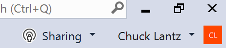
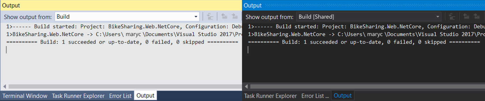
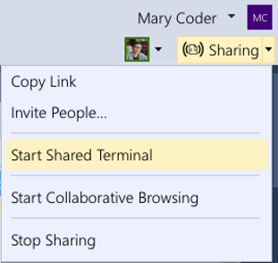
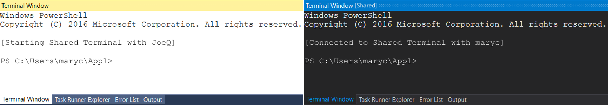

# Visual Studio Enabled Features

This document provides information on capabilities enabled by the Visual Studio Project Cascade extension. See [getting started](getting-started.md) for information on sharing and joining collaboration sessions in VS and other tools.

**Table of Contents**
- [Recap: Owners and participants](#recap-owners-and-participants)
- [Collaborative editing](#collaborative-editing)
- [Collaborative debugging](#collaborative-debugging)
- [Additional capabilities](#additional-capabilities)
- [Additional known participant limitations](#additional-known-participant-limitations)
- [More information](#more-information)

## Recap: Owners and participants
All collaboration activities in Project Cascade involve a single "owner" and one or more "participants."  The owner is the person that started the collaboration session and therefore not only owns the session but the content being shared as well.  Participants are then anyone that joins an owner's collaboration session. See [getting started](getting-started.md) for information on starting and joining collaboration sessions.

Owners can use all of their tools and services as they would normally but participants are only given access to the specific things the owner has shared with them. This includes code, running servers, debugging sessions and more. Currently all content that is shared is kept on the owner's machine and not synchronized to the cloud or on the participant's machine which enables _instant access_ and _increased security_. 

The advantage is that the entire solution is available the moment a participant joins and the moment an owner ends a collaboration session, the content is no longer available to any participant. While content will not be available to participants if the owner's machine is offline/shut down during a session, the collaboration session will automatically start up again for participants when the owner's machine is back online and the tool is re-opened.  

## Collaborative editing
Once a participant has joined a collaboration session all collaborators will immediately be able to see each others edits and highlights in real-time. Simply select a file from the Solution Explorer and start editing. Participants will see edits as you make them and can contribute themselves in real time so you can iterate and rapidly nail to down solutions.

In addition, each collaborator can navigate to any file in the shared project. This means you can edit together in the same file or independently in separate files and thus seamlessly switch between investigation, small tweaks, and collaborative editing. The resulting edits are persisted on the owner's machine so there is no need to synchronize, push, or send files around once you're done editing. The edits are "just there."

Further, to better allow you to highlight where problems might exist or convey ideas, selections are also visible to all participants.

Since you may want to quickly jump to where another collaborator is located, the upper right corner shows you who is currently in the collaboration session and you can go to their exact location by simply double-clicking on their icon.  

### Known co-editing participant limitations
While Project Cascade's approach provides instant access and better security, there are currently some shortcomings participants will experience while co-editing. (Owners do not have these limitations.)

We want to hear from you! See [this query](https://github.com/Microsoft/project-cascade/issues?utf8=%E2%9C%93&q=is%3Aissue%20is%3Aopen%20label%3Afeature-request%20label%3A%22area%3A%20co-edit%22%20sort%3Areactions-%2B1%20) to find a complete list of logged limitations for co-editing. Up-vote (👍) fixes for those you feel are critical or raise new issues if there is something you need missing from the list!

To jump start the conversation, the following are some limitations of particular note for _participants_ (only):

- Participants are currently limited to using "folder view" in the solution explorer ([Up-vote](https://github.com/Microsoft/project-cascade/issues/5))
- Participants need top manually edit config files to view or change dependencies (packages/references) ([Up-vote](https://github.com/Microsoft/project-cascade/issues/17)) 
- Editing features in extensions that directly access the file system will be unavailable ([Vote on extensions you want!](https://github.com/Microsoft/project-cascade/issues/9))
- Full intellisense, fixers, and other advanced editing features are only available to C#, ASP.NET languages/markup, HTML, CSS, JavaScript, and TypeScript. ([Vote on the languages/platforms you want!](https://github.com/Microsoft/project-cascade/issues/12))
- The undo and redo stacks are currently combined across all participants ([Up-vote](https://github.com/Microsoft/project-cascade/issues/7))
- Participants are not able to use the Task Runner Explorer or see its output ([Up-vote](https://github.com/Microsoft/project-cascade/issues/18))

## Collaborative Debugging
Project Cascade's collaborative debugging feature is a powerful and unique way to debug an issue. Beyond enabling a collaborative experience to troubleshoot problems it also gives all collaborators the ability to investigate issues that may be environment specific by providing a shared debugging session on the owner's machine. 

> **Note:** All traffic is secured and encrypted and access is limited to only those resources needed to facilitate debug and browser access to the web application. These resources are only available to participants of the collaboration session.

Using it simple. The owner simply needs to start debugging via the usual means in Visual Studio.

While the build and deployment is happening, all participants can see progress in the Output window. This is also true if the owner opted to "Start with Debugging" or simply build the project or solution.

Once the debugger attaches on the owner's side, all participants are also attached. While there is one debugging "session" running on the owner's machine, all collaborators are connected to it and have their own view. A browser window on connected to the web application running on the owner's machine also automatically starts up.

Anyone can step through the debugging process which enables seamless switching between collaborators without having to negotiate control.

Each collaborator can investigate different variables, jump to different files in the call stack, variables, and breakpoints are shared across all participants and can be added by anyone. Co-editing features then allow each collaborator to track where the other is located to provide the unique ability to seamlessly switch between concurrently investigating different aspects of the problem and collaboratively debugging.

Since participants could get disconnected for some reason or may wish to stop debugging temporarily, Project Cascade also allows them to re-attach by simply launching the debugging session via standard means.

### Known co-debugging participant limitations
There are currently some shortcomings participants will experience while co-debugging. (Owners do not have these limitations.)

As before, we want to hear from you! See [this query](https://github.com/Microsoft/project-cascade/issues?utf8=%E2%9C%93&q=is%3Aissue%20is%3Aopen%20label%3Afeature-request%20label%3A%22area%3A%20co-debug%22%20sort%3Areactions-%2B1%20) to find a complete list of logged limitations for co-debugging. Up-vote (👍) fixes for those you feel are critical or raise new issues if there is something you need missing from the list!

To jump start the conversation, the following are some limitations of particular note for _participants_ (only):

- Participants cannot currently start a build or debugging session on their own ([Up-vote](https://github.com/Microsoft/project-cascade/issues/21))
- Participants can see saved .diagsession results but cannot see or use profilers ([Up-vote](https://github.com/Microsoft/project-cascade/issues/19))
- Co-debugging is currently limited to .NET/.NET Core and Node.js based applications ([Vote on languages/platforms you want!](https://github.com/Microsoft/project-cascade/issues/12))
- Participants are not able to use the Task Runner Explorer or see its output ([Up-vote](https://github.com/Microsoft/project-cascade/issues/18))
- Debugging features in extensions that require direct access the file system will be unavailable ([Vote on extensions you want!](https://github.com/Microsoft/project-cascade/issues/9))

## Additional Capabilities

### Shared terminals / command prompts

Modern development often involves the use of certain command line tools. Project Cascade provides a shared terminal capability that allows participants to use these command line tools collaboratively on the owner's machine. While not started by default, getting one going is simple. Click on the "Share" button in the upper-right hand corner and selected "Shared Terminal".

At this point a shared terminal session with the VS developer command prompt is started on the owners machine and all participants have access.

The owner can terminate the terminal session at any time by simply closing the tool window.

### Download a copy

???

## Additional known participant limitations
In addition to the co-editing and co-debugging limitations listed above, there are a few others worth noting for participants. As above, owners do not have these limitations.  Once again, we want to hear from you! See [this query for all open feature requests](https://github.com/Microsoft/project-cascade/issues?utf8=%E2%9C%93&q=is%3Aopen%20is%3Aissue%20label%3Afeature-request%20sort%3Areactions-%2B1%20). Up-vote (👍) fixes for those you feel are critical or raise new issues if there is something you need missing from the list!

- Participants cannot currently use source control diffing ([Up-vote](https://github.com/Microsoft/project-cascade/issues/15))
- Participants cannot currently perform source control operations ([Up-vote](https://github.com/Microsoft/project-cascade/issues/16))
- Participants cannot currently see results or use the Test Explorer ([Up-vote](https://github.com/Microsoft/project-cascade/issues/20))
- Extension features that directly access the file system will be unavailable ([Vote on extensions you want!](https://github.com/Microsoft/project-cascade/issues/9))
- Visual Studio users cannot currently share additional local servers (ports) with participants ([Up-vote](https://github.com/Microsoft/project-cascade/issues/23))

## More information

- [Getting started](getting-started.md)
- [Visual Studio Code features](collab-vscode.md)
- [Roadmap](roadmap.md)
- [FAQ](faq.md)
