# Visual Studio Code Enabled Features

This document provides information on capabilities enabled by the VS Code Visual Studio Live Share extension. See [getting started](getting-started.md) for information on sharing and joining collaboration sessions in VS Code and other tools.

**Table of Contents**
- [Recap: Owners and participants](#recap-owners-and-participants)
- [Command palette and scoped command menu](#command-palette-and-scoped-command-menu)
- [Collaborative editing](#collaborative-editing)
- [Collaborative debugging](#collaborative-debugging)
   - [Sharing the running application in a browser](#sharing-the-running-application-in-a-browser)
- [Additional capabilities](#additional-capabilities)
    - [Sharing a local server](#sharing-a-local-server)
- [Additional known participant limitations](#additional-known-participant-limitations)
- [More information](#more-information)
    - [Getting started and managing collaboration sessions](getting-started.md)
    - [Visual Studio features](collab-vs.md)

## Recap: Owners and participants
All collaboration activities in Visual Studio Live Share involve a single "owner" and one or more "participants."  The owner is the person that started the collaboration session and therefore not only owns the session but the content being shared as well.  Participants are then anyone that joins an owner's collaboration session. See [getting started](getting-started.md) for information on starting and joining collaboration sessions.

Owners can use all of their tools and services as they would normally but participants are only given access to the specific things the owner has shared with them. This includes code, running servers, debugging sessions and more. Currently all content that is shared is kept on the owner's machine and not synchronized to the cloud or on the participant's machine which enables _instant access_ and _increased security_. 

The advantage is that the entire solution is available the moment a participant joins and the moment an owner ends a collaboration session, the content is no longer available to any participant. While content will not be available to participants if the owner's machine is offline/shut down during a session, the collaboration session will automatically start up again for participants when the owner's machine is back online and the tool is re-opened.  

## Command palette and scoped command menu
Nearly all Visual Studio Live Share functions are available from the Visual Studio Code "Command Palette" that can be accessed using Ctrl + Shift + P or F1. You can find a complete list of commands by typing "live share".

However, since this list can get long, you may find it easier to take advantage of a scoped command menu available from the status bar. Clicking on the sign in / session state icon in the status bar will immediately bring up a contextualized list of commands that are available for you to use.

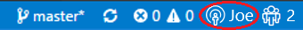

This document will assume you are using this command menu but note that these commands are also available from the VS Code command palette if you prefer.

## Collaborative editing

Once a participant has joined a collaboration session all collaborators will immediately be able to see each others edits and highlights in real-time. 

> **Tip:** If you are using VS Code with ASP.NET Core and C#, make sure you have the [C# extension installed](https://marketplace.visualstudio.com/items?itemName=ms-vscode.csharp). Both the owner and all participants should have the extension installed or participants will miss out on capabilities. 

Simply select a file from the file explorer and start editing. Participants will see edits as you make them and can contribute themselves in real time so you can iterate and rapidly nail to down solutions.

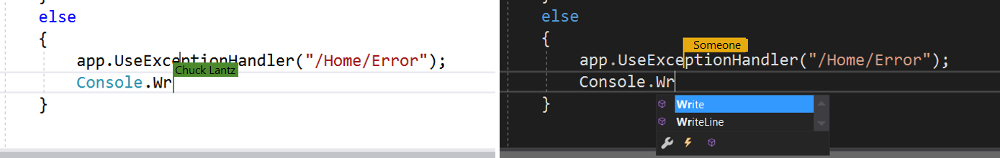

In addition, each collaborator can navigate to any file in the shared project. This means you can edit together in the same file or independently in separate files and thus seamlessly switch between investigation, small tweaks, and collaborative editing. The resulting edits are persisted on the owner's machine so there is no need to synchronize, push, or send files around once you're done editing. The edits are "just there."

Further, to better allow you to highlight where problems might exist or convey ideas, selections are also visible to all participants.

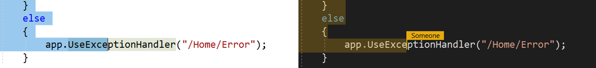

### Moving to a collaborator's edit location

Since you may want to quickly jump to where another collaborator is located, if there is only one other person in the session you can hover over a status bar icon to see the name of the person in the session and their locaiton. Simply clicking on this same icon to jumps the active editor to their exact location. 

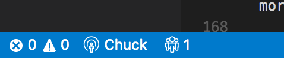

If there is more than one other person in the collaboration session, clicking on the icon presents a list of those currently in the collaboration session. You may then select a collaborator from the list to jump to their location.

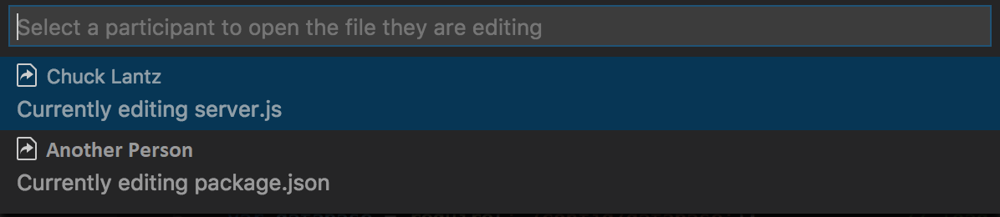

### Pinning to a collaborator's edit location

At times the person you are collaborating with may need to show you a few different places in code to explain a problem or possible solution. While you could repeatedly jump to their location as described above you can also "pin" a tab set to their location.

Simply click on the pin icon in the upper right of the tab set. As above, if more than one other person is in the collaboration session you'll be asked to select the participant you want to follow.

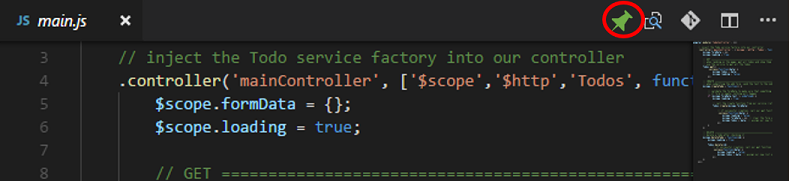

The pin is for a tab set so you can use split view to have a set that is pinned and a set that is unpinned if you so desire.

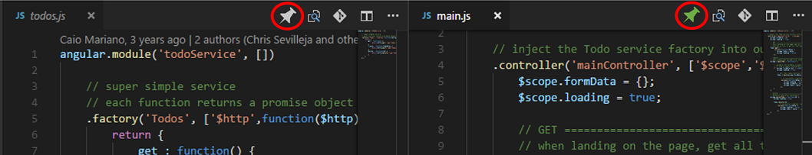

To make it easy to hop in and out of pinning, the tab set is un-pinned if any of the following occurs:
1. You move the scroll bar
2. You edit
3. You click the pin icon again

Simply click the pin icon again to pin once again.

### Known co-editing participant limitations
While Visual Studio Live Share's approach provides instant access and better security, there are currently some shortcomings participants will experience while co-editing. (Owners do not have these limitations.)

We want to hear from you! See [this query](https://github.com/Microsoft/live-share/issues?utf8=%E2%9C%93&q=is%3Aissue%20is%3Aopen%20label%3Afeature-request%20label%3A%22area%3A%20co-edit%22%20sort%3Areactions-%2B1%20) to find a complete list of logged limitations for co-editing. Up-vote (👍) fixes for those you feel are critical or raise new issues if there is something you need missing from the list!

To jump start the conversation, the following are some limitations of particular note for _participants_ (only):

- Editing features in extensions that directly access the file system will be unavailable ([Vote on extensions you want!](https://github.com/Microsoft/live-share/issues/8))
- Full intellisense, fixers, and other advanced editing features are only available to C#, ASP.NET languages/markup, HTML, CSS, JavaScript, and TypeScript. ([Vote on the languages/platforms you want!](https://github.com/Microsoft/live-share/issues/12))
- The undo and redo stacks are currently combined across all participants ([Up-vote](https://github.com/Microsoft/live-share/issues/7))
- Participants are not able to use VS Code's task support against the remote project ([Up-vote](https://github.com/Microsoft/live-share/issues/6))

## Collaborative debugging

Visual Studio Live Share's collaborative debugging feature is a powerful and unique way to debug an issue. Beyond enabling a collaborative experience to troubleshoot problems it also gives all collaborators the ability to investigate issues that may be environment specific by providing a shared debugging session on the owner's machine. 

Using it simple. 

1. If you are using VS Code with ASP.NET Core or C#, make sure you and all of your collaborators have the [C# extension installed](https://marketplace.visualstudio.com/items?itemName=ms-vscode.csharp). Both the owner and all participants should have the extension installed in order for debugging to work. 

2. Next, if not already set up for the project, the owner should [configure launch.json](https://code.visualstudio.com/Docs/editor/debugging#_launch-configurations) to debug the application from VS Code as you would normally. No special setup is required.

3. Finally, start debugging using the button in the debug tab as normal.

    

    > **Tip:** You can participate in VS debugging sessions from VS Code and vice versa! If the owner is using Visual Studio, you can check out the [Visual Studio instructions](collab-vs.md#collaborative-debugging) but the steps are roughly the same. 

While any build, deployment, or other scripts are running, all participants can see progress in the Output window. (In fact, this is also true if the owner opted to "Start with Debugging".)

> **Note:** All traffic is secured and encrypted and access is limited to only those resources needed to facilitate debug and browser access to the web application. These resources are only available to participants of the collaboration session.

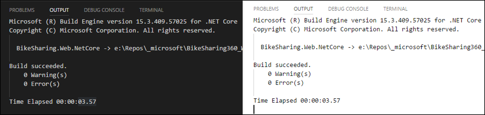

Once the debugger attaches on the owner's side, all participants are also attached. While there is one debugging "session" running on the owner's machine, all collaborators are connected to it and have their own view. 

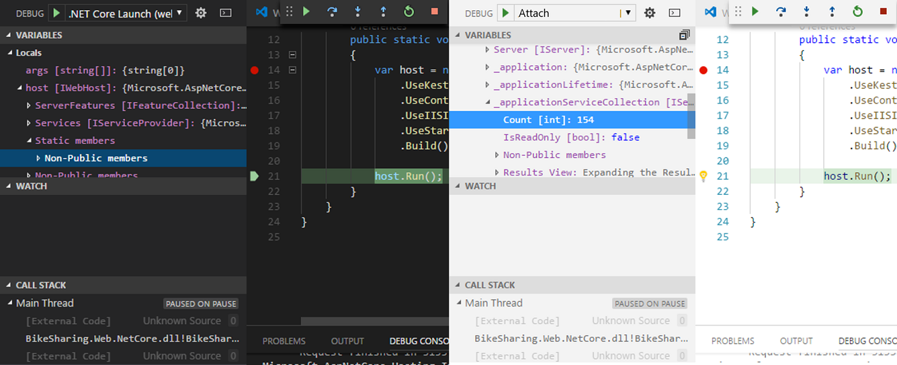

Anyone can step through the debugging process which enables seamless switching between collaborators without having to negotiate control.

Each collaborator can investigate different variables, jump to different files in the call stack, variables, and breakpoints are shared across all participants and can be added by anyone. Co-editing features then allow each collaborator to track where the other is located to provide the unique ability to seamlessly switch between concurrently investigating different aspects of the problem and collaboratively debugging.

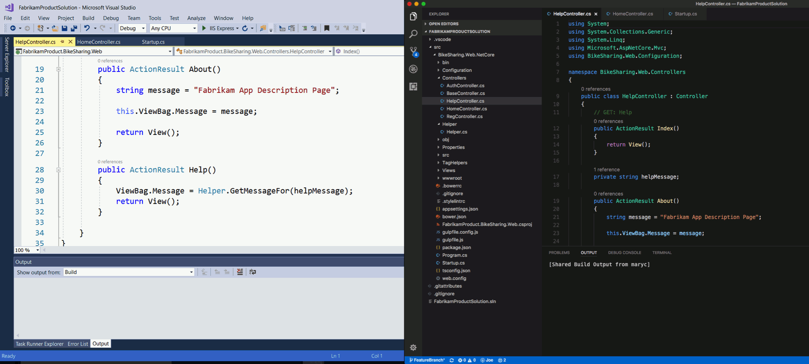

Since participants could get disconnected for some reason or may wish to stop debugging temporarily, Visual Studio Live Share also allows them to re-attach by simply launching the debugging session via an the debug tab.

#### Sharing the running application in a browser

After the application is running (even if not being debugged), the owner can then opt to set up a connection to the running web application for all participants and automatically open a browser by:

1. Clicking on the session state icon in the status bar 
    
    

2. Selecting "Share Web App in Browser".

    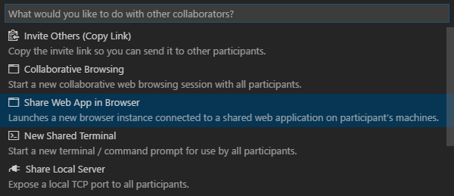

3. If not set in settings.json or already specified, you will be prompted to enter the port the application is running on.

    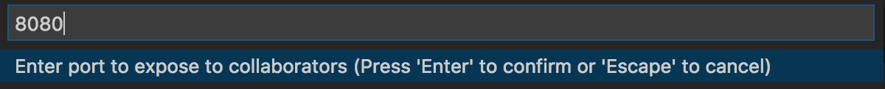

The system default browser is then started on all participant's machines connected to the running application.

> **Tip:** Additional local server ports can also be shared securely such as RESTful endponts or databases if desired.  See [sharing a local server](#sharing-a-local-server).

### Known co-debugging participant limitations
There are currently some shortcomings participants will experience while building, running, or co-debugging. (Owners do not have these limitations.)  

We want to hear from you! See [this query](https://github.com/Microsoft/live-share/issues?utf8=%E2%9C%93&q=is%3Aissue%20is%3Aopen%20label%3Afeature-request%20label%3A%22area%3A%20co-debug%22%20sort%3Areactions-%2B1%20) to find a complete list of logged limitations for co-debugging. Up-vote (👍) fixes for those you feel are critical or raise new issues if there is something you need missing from the list!

To jump start the conversation, the following are some limitations of particular note for _participants_ (only):

- Participants cannot currently start a build or debugging session on their own ([Up-vote](https://github.com/Microsoft/live-share/issues/21))
- Co-debugging is currently limited to .NET/.NET Core and Node.js based applications ([Vote on languages/platforms you want!](https://github.com/Microsoft/live-share/issues/12))    
- Participants are not able to use VS Code's task support to start, stop, or build the application ([Up-vote](https://github.com/Microsoft/live-share/issues/6))

- Build/run/debug features in extensions that require direct access the file system will be unavailable ([Vote on extensions you want!](https://github.com/Microsoft/live-share/issues/8))

## Additional capabilities

### Sharing a local server

From time to time, as a collaboration session owner you may find that you want to share additional local servers or services with participants. This can range from other RESTful end-points to databases or other servers.  For security purposes, only servers running on ports you specify are available to other participants. Fortunately, its easy to add another one.

1. First, the owner should click on the session state status bar icon.

     

2. Select "Share Local Server"

    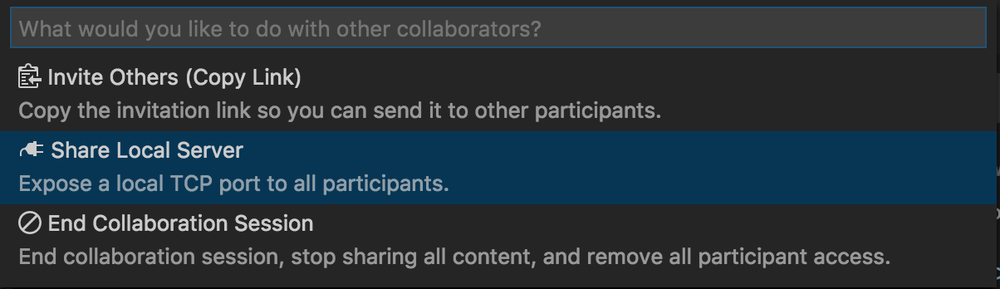 

3. Enter the port number the server is running on and optionally a name.

    

That's it!

Optionally, participants can see a list of currently shared ports (by name if specified) by clicking on the session state status bar icon as above and selecting "Access Shared Server".  Selecting one copies it to the clipboard.

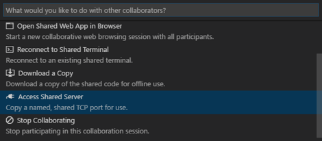 

To **stop** sharing a local server, the owner simply needs to click the session state status bar icon as above, select "Stop Sharing Local Server", and select the port they want to stop sharing.

## Additional known participant limitations

In addition to the co-editing and co-debugging limitations listed above, there are a few others worth noting for participants. As above, owners do not have these limitations.  

Once again, we want to hear from you! See [this query for all open feature requests](https://aka.ms/vsls-feature-requests). Up-vote (👍) fixes for those you feel are critical or raise new issues if there is something you need missing from the list!

To jump start the conversation, the following are some additional limitations of particular note for _participants_ (only):

- Participants cannot currently use source control diffing ([Up-vote](https://github.com/Microsoft/live-share/issues/15))
- Participants cannot currently perform source control operations ([Up-vote](https://github.com/Microsoft/live-share/issues/16))
- Extension features that directly access the file system will be unavailable ([Vote on extensions you want!](https://github.com/Microsoft/live-share/issues/8))
- Participants are not able to use VS Code's task support against the owner's content ([Up-vote](https://github.com/Microsoft/live-share/issues/6))

## More information

- [Getting started](getting-started.md)
- [Visual Studio features](collab-vs.md)
- [FAQ](https://aka.ms/vsls-faq)
