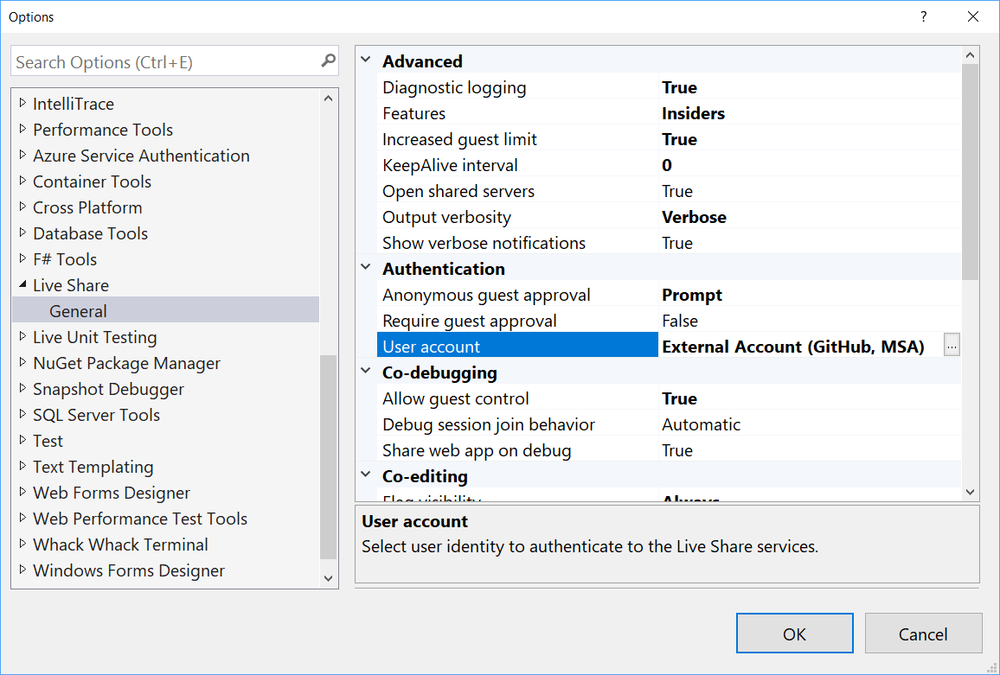
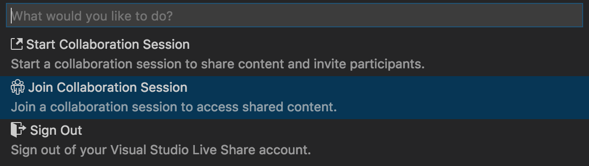
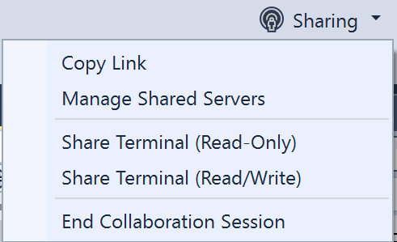
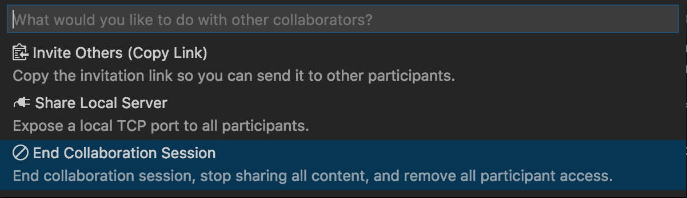
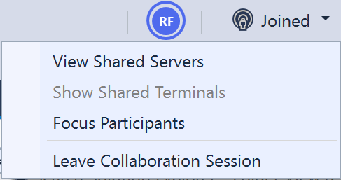
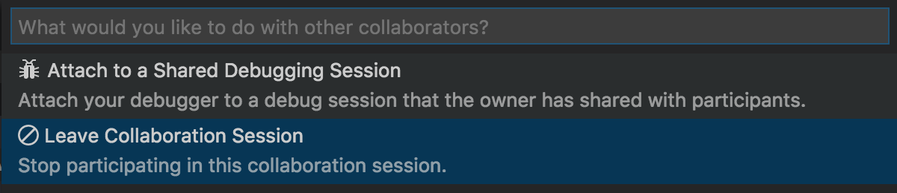

# Getting Started

**Table of Contents**

- [Collaboration Session Host and Guests](#collaboration-session-host-and-guests)
- [Downloading and installing](#downloading-and-installing)
- [Signing into Visual Studio Live Share from within your IDE/editor](#signing-into-visual-studio-live-share-from-within-your-ideeditor)
- [Starting a collaboration session](#starting-a-collaboration-session-and-sharing)
- [Joining a collaboration session](#joining-a-collaboration-session)
  - [Manually joining](#manually-joining)
- [Changing the Connection Mode](#changing-the-connection-mode)
- [What can I do with a collaboration session?](#what-can-i-do-with-a-collaboration-session)
- [Ending a collaboration session](#ending-a-collaboration-session)
- [Session states](#session-states)
- [Known guest limitations](#known-guest-limitations)
- [More information](#more-information)
  - [Visual Studio features](collab-vs.md)
  - [Visual Studio Code features](collab-vscode.md)

## Collaboration Session Host and Guests

All collaboration activities in Visual Studio Live Share involve a single "collaboration session host" with one or more "guest." The host is the person that started the collaboration session and anyone that joins is a guest.

Collaboration session hosts can use all of their tools and services as they would normally but guests are only given access to the specific things the host has shared with them. This includes code, running servers, debugging sessions and more.  Currently all content that is shared is kept on the host's machine and not synchronized to the cloud or on the guest's machine which enables _instant access_ and _increased security_.  The advantage is that the entire solution is available the moment a guest joins and the moment a host ends a collaboration session the content is no longer available since temp files created during the session by the editor to improve performance are automatically cleaned up.

## Downloading and installing

Requirements:

- **Visual Studio 2017 Update 6** - Any edition of Visual Studio 2017 with update 6 installed (15.6) running on Windows 7, 8.1, or 10.
- **Visual Studio Code Insiders** - Windows 7, 8.1, or 10 or macOS Sierra (10.12) and above only.  _El Capitan (10.11) and below are not currently supported due to [.NET Core 2.0 requirements](https://github.com/dotnet/core/blob/master/release-notes/2.0/2.0-supported-os.md)._

Download and setup instructions:

<table style="width: 100%; border-style: none;">
<tr>
    <td style="width: 128px; text-align: center; border:none;"></td>
    <td>
        <strong>Visual Studio 2017 Update 6</strong> 
       1. Install VS 2017 Update 6 (15.6) on Windows (7, 8.1, or 10). 
       2. Install a supported workload: ASP.NET, .NET Core, and/or Node.js 
       3. Download the Visual Studio Live Share VSIX and double click to install.  
        
    </td>
</tr>
<tr>
    <td style="width: 128px; text-align: center; border:none;"></td>
    <td>
        <strong>Visual Studio Code Insiders</strong> 
        1. Install <a href="https://code.visualstudio.com/insiders/">Visual Studio Code Insiders</a> for Windows (7, 8.1, or 10) or macOS <b>(Sierra and up only).</b> 
        2. Download the Visual Studio Live Share extension for Visual Studio Code. 
        3. Start VS Code Insiders, press F1, select "Extensions: Install from VSIX...", select the extension.  
        4. Wait for the install to complete and reload. 
        
    </td>
</tr>
</table>

By downloading and using Visual Studio Live Share, you agree to the [license terms](http://aka.ms/vsls-license) and [privacy statement](https://www.microsoft.com/en-us/privacystatement/EnterpriseDev/default.aspx).

<!--
> **Tip:** Be sure to start up VS or VS Code once with Visual Studio Live Share installed before attempting to join a collaboration session as this wires up the handler for the join web page.
-->

## Signing into Visual Studio Live Share from within your IDE/editor

### Signing in from Visual Studio

By default Visual Studio uses the your [personalization account](https://docs.microsoft.com/en-us/visualstudio/ide/signing-in-to-visual-studio) so if you're already logged into Visual Studio, you may be able to skip this step. Otherwise sign as you would normally.

If you've been accepted into for the private limited preview (session hosts) and want to share you should **sign in using the same credentials you used to sign up**. If you need to use a different sign-in than your VS personalization account (e.g. you signed up for the private limited preview using a GitHub account), go to **Tools &gt; Options &gt; Live Share &gt; User account** to switch credentials.

Selecting **External Account** allows you to select an account not supported by Visual Studio's personalizaiton feature like GitHub. A browser will automatically appear the first time you use a Live Share feature so you may complete sign in.

### Signing in from Visual Studio Code

For Visual Studio Code, simply click on the "Sign in" status bar item and follow the directions to sign in. A browser will appear where you can complete the sign-in process.

 

If you're been accepted into the private limited preview (session hosts), **use the same credentials you used to sign up**.

## Starting a collaboration session and sharing

After downloading and installing Visual Studio Live Share, follow these steps to start a collaboration session and invite a colleague to work with you.

1. **Sign up for the Visual Studio Live Share preview**

    In order to start a collaboration session while Visual Studio Live Share is in private limited preview, you'll need to be signed up and accepted into the preview to be able to share. Visual Studio users should use their [personalization account](https://docs.microsoft.com/en-us/visualstudio/ide/signing-in-to-visual-studio) credentials to sign up.

    > **Note:** _This step is only necessary in order to "share". Anyone can "join" a collaboration session as a guest. This makes it easy for folks to work together without everyone needing to explicitly sign up or be accepted into the preview._

    If you have not done so, **[sign up now!](http://aka.ms/vsls-signup)** 

2. **Sign in from within your IDE/editor**

    Once you've been accepted into the preview, sign into Visual Studio Live Share with the credentials you used to sign-up. See [signing into the Visual Studio Live Share from within your IDE/editor](#signing-into-visual-studio-live-share-from-within-your-ideeditor). 

3. **Start a collaboration session**

     Open a folder, project, or solution, and simply click the "Share" button (VS) / status bar icon (VS Code) in your tool and an invite link will be automatically copied to your clipboard. When opened in a browser, this link allow others to join a new collaboration session that shares contents of these folders with them. 

     

    You will also see the "Share" button / status bar icon transition to convey a "Session State". See [session states](#session-states) for more information on what this looks like.

    Note that if you need to get the invite link again after you've started sharing, you access it again as follows:

    - **VS:** Click on the share / session state button and select "Copy Link"  
    - **VS Code**: Click the session state status bar icon and select "Invite Others (Copy Link)".

4. **Send someone the invite link**

    Send the link over e-mail, Slack, Skype, etc. and once they joins you can begin immediately working with them! The person you invite will be able to download, install needed tools, and join the collaboration session without having to sign up or be accepted into the private limited preview.

That's it!!

## Joining a collaboration session

After downloading and installing Visual Studio Live Share, follow these steps to join a collaboration session a colleague has sent you.

1. **Start a discussion with the Collaboration Session Host**

    It's always good to start up a conversation via voice or chat in your favorite client before joining a collaboration session since you'll obviously need to communicate to collaborate. In addition, as [outlined above](#collaboration-session-host-and-guests) the collaboration session requires the session host to be connected to the service to operate so you'll want to check in with them.

2. **Click on the invite link / open the invite in your browser**

    After installing Visual Studio Live Share for your tool, simply open (or re-open) the invite web page using the invite link your colleague sent you.  You should be notified that your browser wants to launching your Visual Studio Live Share enabled tool. Accept this and a new window for your tool will launch and connect you to the session.

    > **Troubleshooting Tip:** When using VS Code, be sure you've **started the tool at least once** after installing the Visual Studio Live Share extension before opening/re-opening the invite page. Still having trouble? See [manually joining](#manually-joining).

3. **Sign in from within your IDE/editor**

    To let other collaborators know who you are, you may be asked to sign in during the join process using a GitHub or Microsoft account if you are not already signed in. See [signing into the Visual Studio Live Share from within your IDE/editor](#signing-into-visual-studio-live-share-from-within-your-ideeditor). You **do not need to be signed up or accepted into the private limited preview** to participate in a collaboration session.

That's it!! In a few moments you'll be connected and you can start collaborating. You will see the "Share" button (VS) / status bar icons (VS Code) transition to convey a "Session State". See [session states](#session-states) for more information on what this looks like.

### Manually joining

You can also manually join from within VS or VS Code (rather than clicking on an invite link) which can be useful in situations where the tool you want to use is already running, you want to use a different tool than you usually do, or if you are having trouble with getting invite links to work for some reason. The process is easy:

1. **Sign in from within your IDE/editor**

    See [signing into the Visual Studio Live Share from within your IDE/editor](#signing-into-visual-studio-live-share-from-within-your-ideeditor) if you have not already. You do not need to be part of the private limited preview to join a collaboration session.

2. **Manually enter the invite link**

    In **VS**, go to **File > Join Collaboration Session**.

     

    For **VS Code**, you can click on the sign in/session state status bar item after signing in and select "Join Collaboration Session".

      
      

3. **Paste the invite link**

    Paste in the invite URL you were sent and confirm.

That's it! You should be connected to the collaboration session momentarily.

## Changing the Connection Mode

By default Visual Studio Live Share automatically detects whether an collaboration session host and guest can communicate directly and only relays via the cloud if there is no route between them. This mixed mode allows some guests to relay through the cloud while others connect directly and the process is transparent to everyone involved and ensures the optimal performance for all involved. The connections are authenticated via a cloud based mechanism to ensure security. However, if you would prefer not to let people direct to your machine or are running into problems with the approach you can force other connection modes.

| Mode | Owner Behavior | Participant Behavior |
|------|----------------|----------------------|
| Auto | The host's collaboration session accepts secured, authenticated direct connections or via the cloud relay. | Attempts to use a direct connection and falls back to relaying through the if this fails. |
| Direct | The host's collaboration session only accepts authenticated, secure direct connections. | Attempts to use a direct connection and fails if it cannot connect. |
| Relay | The host's collaboration session does not allow direct connections. No port is opened on the host's machine. | Always connects via the cloud. |

To change the mode:

- **VS:** Go to Tools > Options > Live Share, select the mode from the "Connection Mode" dropdown and then restart VS.
- **VS Code:** Edit settings.json (File > Preferences > Settings) and add one of the following and then restart VS Code:
  - ``"liveshare.connectionMode":"auto"``
  - ``"liveshare.connectionMode":"direct"``
  - ``"liveshare.connectionMode":"relay"``

## What can I do with a collaboration session?

Lots of things! Co-editing and co-debugging for example! Take a look at the article for the tool you're using to find out more! 

- [Visual Studio features](collab-vs.md)
- [Visual Studio Code features](collab-vscode.md)

## Ending or leaving a collaboration session

Owners can stop sharing completely and end the collaboration session by clicking the session state button (in the upper right hand corner in VS or the status bar in VS Code) and selecting "End Collaboration Session". All guests will be notified that the session has ended.

**In VS:**

 

**VS Code:**

  

Participants will no longer be able to access the content and any temp files are automatically cleaned up.

Similarly, individual guests can leave the collaboration session without ending it for others by simply closing the tool or selecting "Leave Collaboration Session".

**In VS:**

 

**In VS Code:**

  
 

Any temp files are automatically cleaned up so no further action is needed.

## Session states

After you have started or joined collaboration session and have access to shared content, the "Share" button in the upper right hand corner in VS and the Visual Studio Live Share status bar icons in Visual Studio Code update their appearance to reflect the state of the active collaboration session. 

The following are the states you will typically see:

| State | Visual Studio | Visual Studio Code | Description |
|-------|---------------|--------------------|-------------|
| Inactive |  |  | No active collaboration session and nothing is shared. |
| Owner: Sharing In-Progress |  | | A collaboration session is starting and content sharing will begin shortly. |
| Owner: Sharing |  | | A collaboration session is active and content is shared. |
| Participant: Joining Session |  | | Joining an existing collaboration session. |
| Participant: Joined |  |  | Joined and connected to an active collaboration session and receiving shared content. |

## Known guest limitations

While there are currently some shortcomings guests will experience while using the features described above, collaboration session hosts retain the complete functionality of their tool of choice. See the following for more information:

- [Co-editing limitations](http://aka.ms/vsls-feature-requests/co-edit)
- [Co-debugging limitations](http://aka.ms/vsls-feature-requests/co-debug)
- [Additional limitations](http://aka.ms/vsls-feature-requests)

## More Information

- [Visual Studio features](collab-vs.md)
- [Visual Studio Code features](collab-vscode.md)
- [FAQ](https://aka.ms/vsls-faq)
