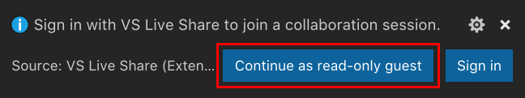
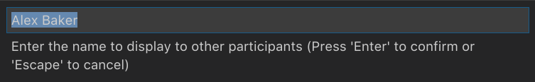
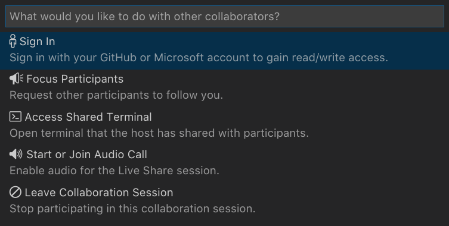

# Quickstart: Join your first collaboration session

Welcome to Visual Studio Live Share! Live Share enables you to collaboratively edit and debug with others in real time, regardless what programming languages you're using or app types you're building. It allows you to instantly and  securely join a teammate's current project, and then as needed, enter into debugging sessions, view and edit terminal instances, see localhost web apps, join voice calls, and more!

Ready to get going? Team collaboration should be so quick and natural, that it becomes harder not to do it! For this reason, Visual Studio Live Share makes it simple to get started, so that you can seamlessly begin sharing your work and ideas.

> [!TIP]
> Did you know you can *join your own collaboration session*? This allows you to try Live Share on your own or to spin up an instance of Visual Studio or VS Code and connect to it remotely! You can even use the same identity on both instances. Check it out!

Just follow these steps to join a collaboration session.

## 1. Install the extension

Installing the extension is easy. Just follow these steps:

<table style="width: 100%; border:none;">
<tr>
    <td width="128px" style="width: 128px; text-align: center; border:none;"></td>
    <td style="border:none;">
        <strong>Visual Studio Code (1.40.0+)</strong> 
        1. Install <a href="https://code.visualstudio.com/">Visual Studio Code</a> for Windows (7, 8.1, or 10), macOS <b>(Sierra+)</b>, 64-bit Linux <b>(<a href="../use/vscode.md">details</a>)</b> 
        2. Download and install the Visual Studio Live Share extension from the marketplace.  
        3. Reload and wait for dependencies to download and install (see status bar). 
        4. <strong>Linux</strong>: If prompted to <a href="../reference/linux.md#install-linux-prerequisites">install libraries</a>, click install, enter password, restart VS Code when done. 
        
    </td>
</tr>
<tr style="border:none;">
    <td width="128px" style="width: 128px; text-align: center; border:none;"></td>
    <td  style="border:none;">
        <strong>Visual Studio 2019 </strong> 
        1. Install <a href="https://visualstudio.microsoft.com/downloads/">Visual Studio 2019</a>. 
        2. Install a <a href="../reference/platform-support.md">supported workload</a>. (e.g. ASP.NET, .NET Core, C++, Python, and/or Node.js) 
        3. Visual Studio Live Share is installed by default with these workloads.  
    </td>
</tr>
<tr style="border:none;">
    <td width="128px" style="width: 128px; text-align: center; border:none;"></td>
    <td  style="border:none;">
        <strong>Visual Studio 2017 15.9 or higher</strong> 
        1. Install the latest version of <a href="https://visualstudio.microsoft.com/vs/older-downloads/">Visual Studio 2017</a> (15.6+) on Windows (7, 8.1, or 10). 
        2. Install a <a href="../reference/platform-support.md">supported workload</a>. (e.g. ASP.NET, .NET Core, C++, and/or Node.js) 
        3. Download and install the Visual Studio Live Share extension from the marketplace.  
         
    </td>
</tr>
</table>

By downloading and using Visual Studio Live Share, you agree to the [license terms](https://aka.ms/vsls-license) and [privacy statement](https://www.microsoft.com/en-us/privacystatement/EnterpriseDev/default.aspx). See [troubleshooting](../troubleshooting.md) if you run into problems.

## 2. [Optional] Join as a read-only guest in VS Code

In VS Code, after installing the Live Share extension, restarting, and waiting for dependencies to finish installing, you can jump in and join a collaboration session as a read-only guest.

> [!NOTE]
> If you want to make edits to the code you are joining, you'll need to sign in.

Open (or re-open) the invite link in a browser, and you will get a notification that the browser wants to launch VS Code. Let it launch, and it'll start connecting to the collaboration session.

When VS Code launches, you'll get a toast notification asking to sign in. Select "Continue as read-only guest" to join the session.

You'll be asked to enter a display name to help participants identify you in the session.

Afterwards, you'll be joined into the session as read-only. You will be able to view and navigate around the code, co-debug, and view shared servers and terminals (read-only).

> [!NOTE]
> If you want to later get read/write access to the code, you can sign in. Click on your display name in the status, bar, and select the option "Sign in".

This will launch your browser, and you can choose a Microsoft or GitHub account to sign in with.

## 3. Sign in

After installing the Live Share extension, restarting, and waiting for dependencies to finish installing (VS Code), you'll want to sign in to let other participants know who you are. If you skip this step, you are asked to sign in during the join process, or can join the session as a read-only guest. Click the "Live Share" status bar item (VS Code) / "sign in" button (VS) to get started.

<table style="border: none;">
<tr style="border: none;">
    <td width="50%" style="vertical-align: top; border: none;">
        
    </td>
    <td width="50%" style="vertical-align: top; border: none;">
        
    </td>
</tr>
</table>

In **VS Code**, your browser will launch while a notification will appear launch asking you to sign in. Complete the sign in process in your browser, then simply close the browser when done.

> **Linux users:** You may be prompted to enter a user code if you are using an older version of Live Share (v0.3.295 or below). Update to the latest version of the extension or click the "Having trouble?" link after sign in to see the code. See [here for details](../use/vscode.md#sign-in-by-using-a-user-code).

In **Visual Studio**, Live Share automatically uses your [personalization account](/visualstudio/ide/signing-in-to-visual-studio). As a result, you can simply sign in as you would normally. However, if you'd prefer to use a different sign-in than your Visual Studio personalization account, go to **Tools &gt; Options &gt; Live Share &gt; User account** and select different credentials.

See [troubleshooting](../troubleshooting.md#sign-in) if you are still hitting problems.

## 4. Open/re-open the invite link in a browser

Now, simply open (or re-open) the invite link in a browser.

> **Note**: If you have not yet installed the Live Share extension, you'll be presented with links to the extension marketplace. Install the extension and restart your tool and retry.

You should be notified that the browser wants to launch a Live Share enabled tool. If you let it launch your selected tool, you'll be connected to the collaboration session once it starts.

If the host is offline, you'll be notified at this point instead. You can then contact the host and ask them to share again.

> **Troubleshooting Tip:** When using VS Code, be sure you've **started the tool at least once** after installing the extension and waited for the dependencies to finish installing (see the status bar) before opening/re-opening the invite page. Still having trouble? See [join manually](../reference/manual-join.md) for details.

## 5. Collaborate!

That's it! In a few moments, you'll be connected to your colleague's collaboration session. By default, the host auto-accepts people that join, but if the host is set up to [require guest approval](../reference/security.md#requiring-guest-approval) you will see the status bar / join dialog mention that Live Share is waiting on the host to approve your request to join.

> **Security Tip:** As a guest joining a collaboration session, it's important to understand that hosts may restrict your access to certain files or features. Want to understand the security implications of some of Live Share's features and settings? Check out the [security](../reference/security.md) article.

Here are a few things to try out:

1. Move around the project independently and make some edits
2. Check out working intellisense for JavaScript, TypeScript, and/or C# code
3. Edit something together with the host
4. Follow the host and move around with them as they navigate and make edits in different files
5. Start up a co-debugging session with the host
6. Ask the host to share a server so you can check out something like a web app running on their machine
7. Ask the host to share a terminal and run some commands

Having problems? See [troubleshooting](../troubleshooting.md) or [provide feedback](../support.md).

## Next Steps

Check out these additional articles for more information.

- [Quickstart: Share your first project](share.md)
- [How-to: Collaborate using Visual Studio Code](../use/vscode.md)
- [How-to: Collaborate using Visual Studio](../use/vs.md)

Reference

- [Connectivity requirements for Live Share](../reference/connectivity.md)
- [Security features of Live Share](../reference/security.md)
- [Language and platform support](../reference/platform-support.md)
- [Extension support](../reference/extensions.md)
