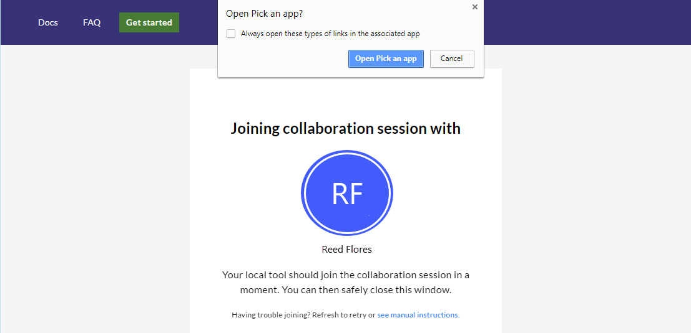

<!--
Copyright © Microsoft Corporation
All rights reserved.
Creative Commons Attribution 4.0 License (International): https://creativecommons.org/licenses/by/4.0/legalcode
-->

# Quickstart: Join your first collaboration session

> **Note: Visual Studio Live Share is currently in a public preview. Features and UX should not be considered final.**

Welcome to Visual Studio Live Share! Live Share lets you to achieve greater confidence at speed by streamlining collaborative editing, debugging, and more in real-time during development. You get real-time sharing in tools you love, can share the full context of your code, collaboratively edit while still navigating files independently, securely share local servers, and even collaboratively debug while still retaining the ability to inspect on your own.

Ready to get going? Team collaboration should be so quick and natural, that it becomes harder not to do it! For this reason, Visual Studio Live Share makes it simple to get started, so that you can seamlessly begin sharing your work and ideas.

>**Tip:** Did you know you can *join your own collaboration session*? This allows you to try Live Share on your own or to spin up a instance of VS or VS Code and connect to it remotely! You can even use the same identity on both instances. Check it out!

**Linux users: Be sure you have the needed [library prerequisites installed](../use/vscode.md#install-linux-prerequisites).**

Just follow these steps to join a collaboration session.

### 1. Install the extension

Installing the extension is easy. Just follow these steps:

<table style="width: 100%; border:none;">
<tr>
    <td width="128px" style="width: 128px; text-align: center; border:none;"></td>
    <td style="border:none;">
        <strong>Visual Studio Code (1.22.0+)</strong> 
        1. Install <a href="https://code.visualstudio.com/">Visual Studio Code</a> for Windows (7, 8.1, or 10), macOS <b>(Sierra+)</b>, 64-bit Linux <b>(<a href="../use/vscode.md#installation">details</a>)</b> 
        2. <strong>Linux users</strong>: Be sure you have installed the needed <a href="../use/vscode.md#install-linux-prerequisites">prerequisite libraries</a>. 
        3. Download and install the VS Live Share extension from the marketplace.  
        4. Reload and wait for dependencies to download and install (see status bar). 
        
    </td>
</tr>
<tr style="border:none;">
    <td width="128px" style="width: 128px; text-align: center; border:none;"></td>
    <td  style="border:none;">
        <strong>Visual Studio 2017 15.6 or higher</strong> 
        1. Install the latest version of <a href="https://www.visualstudio.com/vs/">VS 2017</a> (15.6+) on Windows (7, 8.1, or 10). 
        2. Install a supported workload. e.g. ASP.NET, .NET Core, and/or Node.js 
        3. Download and install the VS Live Share extension from the marketplace.  
         
    </td>
</tr>
</table>

By downloading and using Visual Studio Live Share, you agree to the [license terms](https://aka.ms/vsls-license) and [privacy statement](https://www.microsoft.com/en-us/privacystatement/EnterpriseDev/default.aspx). See [troubleshooting](../troubleshooting.md) if you run into problems.

### 2. Sign in

After installing the Live Share extension, restarting, and waiting for dependencies to finish installing (VS Code), you'll want to sign in to let other participants know who you are. If you skip this step, you will asked to sign in during the join process. Click the "sign in" button / status bar item to get started.

<table style="border: none;">
<tr style="border: none;">
    <td width="50%" style="vertical-align: top; border: none;">
        
    </td>
    <td width="50%" style="vertical-align: top; border: none;">
        
    </td>
</tr>
</table>

In **VS Code**, a browser will appear for you to use to complete the sign in process. Simply close the browser when done.

> **Linux users:** VS Code will also [prompt you to enter a user code](../use/vscode.md#sign-in-using-a-user-code) when opening the browser window. The code can be found by clicking on the "Having trouble? Click here for user code directions" link that appears in the "Ready to collaborate!" page after you've signed into Live Share via the browser. Simply paste this user code in the prompt's input field in VS Code and hit enter to finish.

If you are using **Visual Studio** and have already signed into the tool, Visual Studio Live Share will automatically use your [personalization account](https://docs.microsoft.com/en-us/visualstudio/ide/signing-in-to-visual-studio) so you can skip this step or simply sign in as you would normally. If you'd prefer to use a different sign-in than your VS personalization account, go to **Tools &gt; Options &gt; Live Share &gt; User account** to switch credentials.

### 3. Open/re-open the invite link in a browser

> **Linux users:** Be sure to run the browser integration terminal command when prompted before executing this step. See [here](../use/vscode.md#linux-browser-integration) for additional details.

Simply open (or re-open) the invite link in a browser. Note: If you have not yet installed the Live Share extension, you'll be prompted to do so at this point and be presented with links to the extension marketplace. Install the extension and restart your tool and browser.

You should be notified that your browser wants to launching a Visual Studio Live Share enabled tool. Accept this and a new window for your tool will launch and connect you to the session.

If the host is offline, the browser will instead telling you this is the case. You can then contact the host and ask them to share again.

> **Troubleshooting Tip:** When using VS Code, be sure you've **started the tool at least once** after installing the extension and waited for the dependencies to finish installing (see the status bar) before opening/re-opening the invite page. Still having trouble? See [join manually](../reference/manual-join.md) for details.

### 5. Collaborate!

That's it!! In a few moments you'll be connected to your colleague's collaboration session. By default the host will auto-accept people that join, but if the host is setup to [require guest approval](../reference/security.md#requiring-guest-approval) you will see the status bar / join dialog mention that Live Share is waiting on the host to approve your request to join.

> **Security Tip:** As a guest joining a collaboration session, it's important to understand that hosts may restrict your access to certain files or features. Want to understand the security implications of some of Live Share's features and settings? Check out the [security](../reference/security.md) article.

Here's a few things to try out:

1. Move around the project independently and make some edits
2. Check out working intellisense for JavaScript, TypeScript, and/or C# code
3. Jump to the host's location and edit something together
4. Pin to the host and follow as they make edits in different files
5. Ask the host to start up a co-debugging session with you
6. Ask the host to share a local server so you can check out something like a web app running on their machine

Having problems? See [troubleshooting](../troubleshooting.md) or [provide feedback](../support.md).

## Next Steps

Check out these additional articles for more information.

- [Quickstart: Share your first project](share.md)
- [How-to: Collaborate using Visual Studio Code](../use/vscode.md)
- [How-to: Collaborate using Visual Studio](../use/vs.md)

Reference

- [Connectivity requirements for Live Share](../reference/connectivity.md)
- [Security features of Live Share](../reference/security.md)
- [Language and platform support](../reference/platform-support.md)
- [Extension support](../reference/extensions.md)
