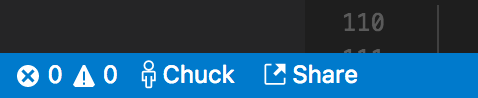
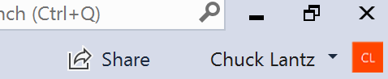

<!--
Copyright © Microsoft Corporation
All rights reserved.
Creative Commons Attribution 4.0 License (International): https://creativecommons.org/licenses/by/4.0/legalcode
-->

# Quickstart: Share your first project

> **Note: Visual Studio Live Share is currently in preview. Features and UX are not final.**

Welcome to Visual Studio Live Share! Live Share lets you achieve greater confidence at speed by streamlining collaborative editing, debugging, and more in real-time during development. You get real-time sharing in tools you love. You can share the full context of your code, collaboratively edit while still navigating files independently, securely share local servers, and even collaboratively debug while still retaining the ability to inspect on your own.

Ready to get going?  Team collaboration should be so quick and natural, that it becomes harder not to do it! For this reason, Visual Studio Live Share makes it simple to get started, so that you can seamlessly begin sharing your work and ideas.

>**Tip:** Did you know you can *join your own collaboration session*? This allows you to try Live Share on your own or to spin up a instance of VS or VS Code and connect to it remotely! You can even use the same identity on both instances. Check it out!

Just follow these steps to start sharing.

### 1. Install the extension

Installing the extension is easy. Just follow these steps:

<table style="width: 100%; border:none;">
<tr>
    <td width="128px" style="width: 128px; text-align: center; border:none;"></td>
    <td style="border:none;">
        <strong>Visual Studio Code (1.22.0+)</strong> 
        1. Install <a href="https://code.visualstudio.com/">Visual Studio Code</a> for Windows (7, 8.1, or 10), macOS <b>(Sierra+)</b>, 64-bit Linux <b>(<a href="../use/vscode.md#installation">details</a>)</b> 
        2. Download and install the VS Live Share extension from the marketplace.  
        3. Reload and wait for dependencies to download and install (see status bar). 
        4. <strong>Linux</strong>: If prompted to <a href="../reference/linux.md#install-linux-prerequisites">install libraries</a>, click install, enter password, restart VS Code when done.         
        
    </td>
</tr>
<tr style="border:none;">
    <td width="128px" style="width: 128px; text-align: center; border:none;"></td>
    <td style="border:none;">
        <strong>Visual Studio 2017 15.6 or higher</strong> 
        1. Install the latest version of <a href="https://www.visualstudio.com/vs/">VS 2017</a> (15.6+) on Windows (7, 8.1, or 10). 
        2. Install a supported workload. e.g. ASP.NET, .NET Core, and/or Node.js 
        3. Download and install the VS Live Share extension from the marketplace.  
         
    </td>
</tr>
</table>

By downloading and using Visual Studio Live Share, you agree to the [license terms](https://aka.ms/vsls-license) and [privacy statement](https://www.microsoft.com/en-us/privacystatement/EnterpriseDev/default.aspx). See [troubleshooting](../troubleshooting.md) if you run into problems.

### 2. Sign in

After installing the Live Share extension, restarting, and waiting for dependencies to finish installing (VS Code), you'll want to sign in to let other participants know who you are. Simply click the "sign in" button / status bar item to get started.

<table style="border: none;">
<tr style="border: none;">
    <td width="50%" style="vertical-align: top; border: none;">
        
    </td>
    <td width="50%" style="vertical-align: top; border: none;">
        
    </td>
</tr>
</table>

In **VS Code**, a browser will appear for you to use to complete the sign in process. Simply close the browser when done.

> **Linux users:** VS Code will also [prompt you to enter a user code](../use/vscode.md#sign-in-using-a-user-code) when opening the browser window. The code can be found by clicking on the "Having trouble? Click here for user code directions" link that appears in the "Ready to collaborate!" page after you've signed into Live Share via the browser. Simply paste this user code in the prompt's input field in VS Code and hit enter to finish.

In **Visual Studio**, Live Share automatically uses your [personalization account](https://docs.microsoft.com/en-us/visualstudio/ide/signing-in-to-visual-studio). As a result, you can simply sign in as you would normally. However, if you'd prefer to use a different sign-in than your VS personalization account, go to **Tools &gt; Options &gt; Live Share &gt; User account** and select different credentials.

See [troubleshooting](../troubleshooting.md#sign-in) if you are still hitting problems.

### 3. Open a folder, project, or solution

Use your normal workflow to open a folder, project, or solution you would like to share in Visual Studio or Visual Studio Code.

### 4. [Optional] Hide or exclude files

If you would prefer to hide or completely exclude certain files or folders from the collaboration session, a **.vsls.json** file can be added to your project with these settings. See [controlling file access and visibility](../reference/security.md#controlling-file-access-and-visibility) for details.

> **WARNING:** This feature is still in development and works reliably on Windows and macOS when the host's filesystem is **not case sensitive**. When hosting from case sensitive filesystems, there is **bug** where capitalization somewhere in the path can cause files that should be hidden or excluded to appear. (The guest's filesystem has no effect on this issue.) Windows is rarely case sensitive. Installs of **macOS** are **case insenstive by default** and therefore not impacted, but you may want to verify. Unfortunatley, **Linux** is usually **case sensitive**. [Upvote (👍) here](https://github.com/MicrosoftDocs/live-share/issues/XX).

### 5. Start a collaboration session

Next, simply click "Share" within your tool and an invite link will be automatically copied to your clipboard.

<table style="border: none;">
<tr style="border: none;">
    <td width="50%" style="vertical-align: top; border: none;">
        
    </td>
    <td width="50%" style="vertical-align: top; border: none;">
        
    </td>
</tr>
</table>

> **Note:** You may be asked by your desktop firewall software to allow the Live Share agent to open a port the first time you share. Accepting this is entirely optional but enables a secured "direct mode" to improve performance when the person you are working with is on the same network as you are. See [change the connection mode](../reference/connectivity.md#changing-the-connection-mode) for details.

### 6. Send someone the invite link

Send the link over e-mail, Slack, Skype, etc. to those you want to invite. Opening the link in a browser will allow them to join the collaboration session that is sharing the contents of the folder, project, or solution you opened. Note that, given the level of access Live Share sessions can provide to guests, **you should only share with people you trust** and think through the implications of what you are sharing.

> **Security Tip:** Want to understand the security implications of some of Live Share's features? Check out the [security](../reference/security.md) article.

If the guest you invited has questions, the "[Quickstart: Join your first session](join.md)" article provides some more information on getting up and running as a guest.

### 7. [Optional] Approve the guest

By default, guests will automatically join your collaboration session and you'll be notified when they're ready to work with you.

<table style="border: none;">
<tr style="border: none;">
    <td width="50%" style="vertical-align: top; border: none;">
        
    </td>
    <td width="50%" style="vertical-align: top; border: none;">
        
    </td>
</tr>
</table>

While this notification gives you the option to remove them from the collaboration session, you can also opt to require an explicit "approval" for anyone joining instead. If you have this setting turned on, a notification will prompt you to approve the guest when they try to join your session.

See [requiring guest approval](../reference/security.md#requiring-guest-approval) for details on how to turn this feature on.

### 6. Collaborate!

That's it!! Here's a few things to try out once a guest has joined you:

1. Move around to different files in the project independently and make some edits
2. Jump to the guest's location and edit something together
3. Pin to the guest and follow as they make edits in different files
4. Start up a co-debugging session with them
5. Share a server so you can check out something like a web app running on their machine
6. Share a terminal and run some commands

Check out the [Visual Studio Code](../use/vscode.md) and [Visual Studio](../use/vs.md) extension docs for information on how to do these actions and more.

Having problems? See [troubleshooting](../troubleshooting.md) or [provide feedback](../support.md).

## Next Steps

Check out these additional articles for more information.

- [Quickstart: Join your first collaboration session](join.md)
- [How-to: Collaborate using Visual Studio Code](../use/vscode.md)
- [How-to: Collaborate using Visual Studio](../use/vs.md)

Reference

- [Connectivity requirements for Live Share](../reference/connectivity.md)
- [Security features of Live Share](../reference/security.md)
- [Language and platform support](../reference/platform-support.md)
- [Extension support](../reference/extensions.md)
