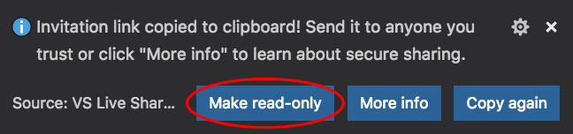
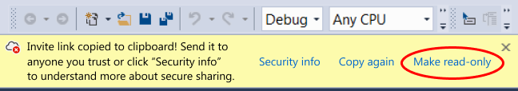
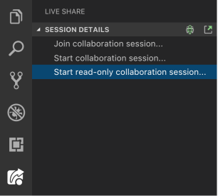

# Quickstart: Share your first project

Welcome to Visual Studio Live Share! Live Share enables you to collaboratively edit and debug with others in real time, regardless what programming languages you're using or app types you're building. It allows you to instantly and securely share your current project, and then as needed, share debugging sessions, terminal instances, localhost web apps, voice calls, and more!

Ready to get going?  Team collaboration should be so quick and natural, that it becomes harder not to do it! For this reason, Visual Studio Live Share makes it simple to get started, so that you can seamlessly begin sharing your work and ideas.

> [!TIP]
> Did you know you can *join your own collaboration session*? This allows you to try Live Share on your own or to spin up an instance of Visual Studio or VS Code and connect to it remotely! You can even use the same identity in both instances. Check it out!

Just follow these steps to start sharing.
<!--
Change the instructions to Install extension for VS Code and in-tool for VS?
-->
## 1. Install the extension

Installing the extension is easy. Just follow these steps:

[!INCLUDE [installation](../includes/installation.md)]

## 2. Sign in

<!--
Re-write the grammar here- run on sentence does not make sense. Change screen shots. There is another way of signing in as well- what if a user goes directly to the start collaboration. 
-->
After installing the Live Share extension, restarting, and waiting for dependencies to finish installing (VS Code), you'll want to sign in to let other participants know who you are. Simply click the "Live Share" status bar item (VS Code) or "Sign in" button (VS) to get started.

In Visual Studio Code:

In Visual Studio:

In **VS Code**, your browser will launch while a notification will appear launch asking you to sign in. Complete the sign in process in your browser, then simply close the browser when done.

> **Linux users:** You may be prompted to enter a user code if you are using an older version of Live Share (v0.3.295 or below). Update to the latest version of the extension or click the "Having trouble?" link after sign in to see the code. See [here for details](../use/vscode.md#sign-in-by-using-a-user-code).

In **Visual Studio**, Live Share automatically uses your [personalization account](/visualstudio/ide/signing-in-to-visual-studio). As a result, you can simply sign in as you would normally. However, if you prefer to use a different sign-in than your Visual Studio personalization account, go to **Tools &gt; Options &gt; Live Share &gt; User account** and select different credentials.

See [troubleshooting](../troubleshooting.md#sign-in) if you are still hitting problems.

## 3. Open a folder, project, or solution

Use your normal workflow to open a folder, project, or solution that you would like to share in Visual Studio or Visual Studio Code.

## 4. [Optional] Update hidden or excluded files

By default, Live Share **hides** any files/folders referenced in .gitignore files in your shared folders from guests. **Hiding** a file prevents it from appearing in the guest's file tree. **Excluding** a file applies a stricter rule that prevents Live Share from opening it for the guest in situations like go to definition or if you step into the file while debugging or being "followed". If you want to hide/exclude different files, a **.vsls.json** file can be added to your project with these settings. See [controlling file access and visibility](../reference/security.md#controlling-file-access-and-visibility) for details.

## 5. Start a collaboration session

<!--
-->
Next, simply click "Live Share" within your tool and an invite link is automatically copied to your clipboard.

In Visual Studio Code:

In Visual Studio:

> [!NOTE]
> You may be asked by your desktop firewall software to allow the Live Share agent to open a port the first time you share. Accepting this is entirely optional but enables a secured "direct mode" to improve performance when the person you are working with is on the same network as you are. See [change the connection mode](../reference/connectivity.md#changing-the-connection-mode) for details.

## 6. [Optional] Enable read-only mode

Once you start your collaboration session, you can set the session to be read-only to prevent guests from making edits to the code being shared.

After sharing, you will get a notification that the invite link has been copied to your clipboard. You can then select the option to make the session read-only.

In Visual Studio Code:

In Visual Studio:

In **VS Code**, you can also start a read-only session from the Live Share viewlet tab.

## 7. Send someone the invite link

Send the link over e-mail, Slack, Skype, etc. to those you want to invite. Opening the link in a browser allows them to join the collaboration session that is sharing the contents of the folder, project, or solution that you opened. Note that, given the level of access Live Share sessions can provide to guests, **you should only share with people you trust** and think through the implications of what you are sharing.

> **Security Tip:** Want to understand the security implications of some of Live Share's features? Check out the [security](../reference/security.md) article.

If the guest you invited has questions, the [Quickstart: Join your first session](join.md) article provides some more information on getting up and running as a guest.

## 8. [Optional] Approve the guest

By default, guests automatically join your collaboration session and you are notified when they're ready to work with you.

In Visual Studio Code:

In Visual Studio:

You can opt to require an explicit "approval" for anyone joining instead. If you have this setting turned on, a notification prompts you to approve the guest when they try to join your session.

See [requiring guest approval](../reference/security.md#requiring-guest-approval) for details on how to turn this feature on.

## 9. Collaborate!

That's it! Here are a few things to try out once a guest has joined you:

1. Move around to different files in the project independently and make some edits
1. Follow the guest and observe as they scroll, make edits, and navigate to different files
1. Start up a co-debugging session with them
1. Share a server so you can check out something like a web app running on their machine
1. Share a terminal and run some commands

Check out the [Visual Studio Code](../use/vscode.md) and [Visual Studio](../use/vs.md) extension docs for information on how to do these actions and more.

Having problems? See [troubleshooting](../troubleshooting.md) or [provide feedback](../support.md).

## Next Steps

Check out these additional articles for more information.

- [Quickstart: Join your first collaboration session](join.md)
- [How-to: Collaborate using Visual Studio Code](../use/vscode.md)
- [How-to: Collaborate using Visual Studio](../use/vs.md)

Reference

- [Connectivity requirements for Live Share](../reference/connectivity.md)
- [Security features of Live Share](../reference/security.md)
- [Language and platform support](../reference/platform-support.md)
- [Extension support](../reference/extensions.md)
