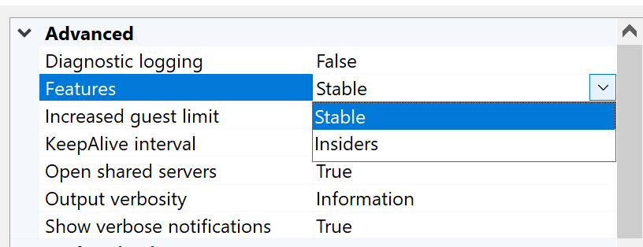
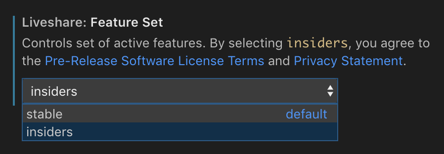

# Insiders

The Visual Studio Live Share team is all about iterating rapidly, trying out new ideas, and listening to our customers! Insiders offers our users the opportunity to try out all our new features first and give their valuable feedback! 
Learn how to [become an insider](#BecomeanInsider) below, and help us shape the future of developer collaboration. 

## ✨New to Insiders✨

### **Planned Sessions (VS Code)**

Reusable sessions now have a place in the Live Share viewlet. Planned Sessions allows you as the host of a Live Share session to create a Live Share session link in advance. 

*Image showing creation of a new planned session from the viewlet*

Doing so enables you to share this link as a part of your regularly scheduled meetings with your teams, your interviews or your pairing sessions.
Once such a session in planned in advance, you're able access it from the Live Share viewlet directly. 

*Image showing 'Planned Sessions' in the Live Share viewlet

>[!TIP]
>Turn on Insiders for Live Share in VS Code to use 'Planned >Sessions'. Learn how to become an insider below. 

'Planned Sessions' in Visual Studio is currently an internal feature only. Please check back for updates on when it advances to the insider stage. 

## Pushed to Public

The following Insider features have been pushed to public.

### **Reusable Sessions (VS Code)**

Live Share can now host Reusable Sessions! Reusable Sessions provide you the ability to reuse a Live Share Session for various scenarios.This means you can schedule a Live Share session in advance for your technical interviews, weekly mob-programming session, use the same session while mentoring a friend, and much more!

To create a Reusable Session do the following:

1. Go to the `Command Palette` using `Ctrl+Shift+P`

2. Type "Live Sha..." and click the '**_Live Share: Create Reusable Session link_**' command.

   

3. This will create a Reusable Session and a link to it will be copied to your clipboard. You will see a notification pop-up on the lower-right corner of your editor.

   

4. Your Reusable Session has been created! Share the link with your session mate and use it each time to access the session!

> [!TIP]
> A Reusable Session link is persistent and lasts for 30 days from its date of creation, or date of last use. This means if you keep using your session at least once every 30 days, you don't have to worry about it expiring. Just save the link in a safe place where you can access it easily!

## Become an Insider 

By default, after installing the Visual Studio Live Share extension, you're using the `Stable` feature set, which includes all of the production-ready capabilities (e.g. co-editing, shared debugging, terminals). However, if you'd like to get early access to feature we're working on, you can opt-in to the `Insiders` feature set by changing the following setting in your IDE:

* Visual Studio

    

* Visual Studio Code

    

The following sections describe the set of capabilities that are currently within the `Insiders` feature set, and therefore, are ready to evaluate once you change the aforementioned setting:

## See also

- [Language and platform support](platform-support.md)
- [Connectivity requirements for Live Share](connectivity.md)
- [Security features of Live Share](security.md)
- [All major bugs, feature requests, and limitations](https://aka.ms/vsls-issues)
- [All feature requests and limitations](https://aka.ms/vsls-feature-requests)

Having problems? See [troubleshooting](../troubleshooting.md) or [provide feedback](../support.md).
