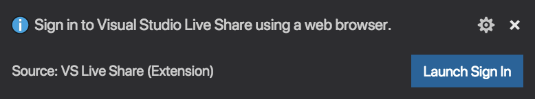
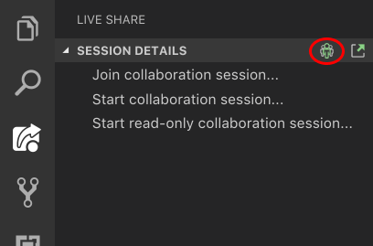
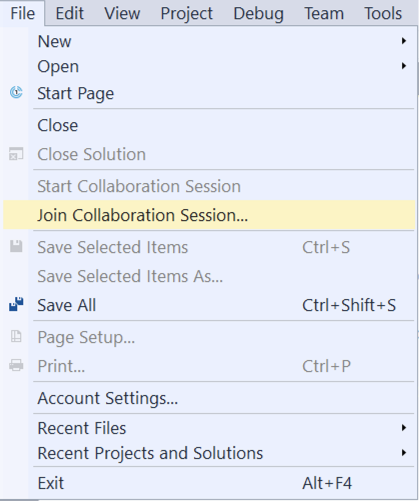

# Join a session manually

In addition to opening a link in a browser to join a collaboration session, you can manually join by pasting the link into an already running tool. This can be useful if you want to use a different tool than you usually do or if you are having trouble with getting invite links to work for some reason.

The exact instructions vary between [Visual Studio](#join-from-visual-studio) and [Visual Studio Code](#join-from-visual-studio-code), so pick the tool you intend to use for more information.

## Join from Visual Studio Code

### 1. Sign in

>**Note:** If you want to join a collaboration session as a read-only guesasdsat, you can skip signing in. You will have access to viewing and navigating around the code that is shared but not be able to make edits.

In order to collaborate, you'll need sign into Visual Studio Live Share so everyone knows who you are. **Click** on the "Live Share" status bar item or press **Ctrl+Shift+P / Cmd+Shift+P** and select the "Live Share: Sign In With Browser" command.

Your browser will launch while a notification will appear launch asking you to sign in. Complete the sign in process in your browser, then simply close the browser when done.

If you are running into problems with VS Code not picking up a successful sign-in, click on the "Having trouble" link on the success screen in the browser and follow the directions. Check out [troubleshooting](../troubleshooting.md#sign-in) for more tips.

### 2. Use the join command

Open the Live Share viewlet in the VS Code activity bar, and select the "Join collaboration session..." icon or entry.

>**Note:** If you are joining as a read-only guest, you will then be asked to enter a display name to help participants identify you in the session.

### 3. Paste the invite link

Paste in the invite URL you were sent and hit 'Enter' to confirm.

That's it! You should be connected to the collaboration session momentarily.

## Join from Visual Studio

### 1. Sign in

Once installed, start Visual Studio and sign in if you have not already. If you need to use a different sign-in for Visual Studio than your [personalization account](https://docs.microsoft.com/en-us/visualstudio/ide/signing-in-to-visual-studio), go to **Tools &gt; Options &gt; Live Share &gt; User account**.

Still having trouble? See [troubleshooting](../troubleshooting.md#sign-in).

### 2. Use the join command

Simply go to **File > Join Collaboration Session**.

### 3. Paste the invite link

Paste in the invite URL you were sent and hit 'Enter' to confirm.

That's it! You should be connected to the collaboration session momentarily.

## See also

Quickstarts

- [Quickstart: Share your first project](../quickstart/share.md)
- [Quickstart: Join your first session](../quickstart/join.md)

How-tos

- [How-to: Collaborate using Visual Studio Code](../use/vscode.md)
- [How-to: Collaborate using Visual Studio](../use/vs.md)
- [How-to: Provide feedback](../support.md)

Reference

- [Connectivity requirements for Live Share](connectivity.md)
- [Security features of Live Share](security.md)
- [Linux install details](linux.md)
- [Language and platform support](platform-support.md)
- [Extension support](extensions.md)

Having problems? See [troubleshooting](../troubleshooting.md) or [provide feedback](../support.md).
