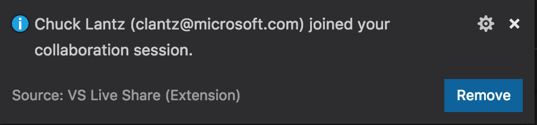
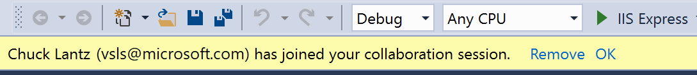
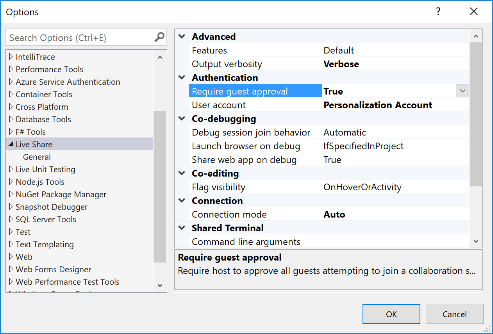
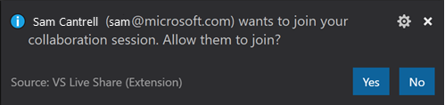
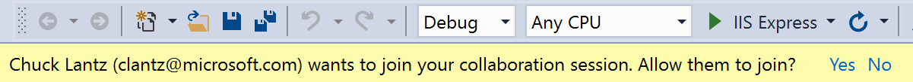

<!--
Copyright © Microsoft Corporation
All rights reserved.
Creative Commons Attribution 4.0 License (International): https://creativecommons.org/licenses/by/4.0/legalcode
-->

# Security features of Live Share

Collaboration sessions in Visual Studio Live Share are powerful in that they allow any number of people to join in a session and collaboratively edit, debug, share terminals, and more. However, given this level of access, you undoubtedly will want to learn to more about the security features Live Share provides. This article will provide you with information about the different options you have for securing your environment and cautions for when you should and should not use certain features.

**As with any collaboration tool, remember that you should only share your code, content, and applications with people you trust.**

## Connectivity

All connections in Visual Studio Live Share are SSH or SSL encrypted and authenticated against a central service to ensure that only those in the collaboration session can gain access to its content. By default, Live Share attempts a direct connection and falls back on a cloud relay if a direct connection between a given guest and the host cannot be established. In addition, Live Share's cloud relay does not persist any traffic routed through it and does not "snoop" the traffic in any way.

To find out more about how to tweak these behaviors and Live Share's connectivity requirements, see the **[connectivity requirements for Live Share](connectivity.md)** article.

## Invitations and join access

Each time you start a new collaboration session, Live Share generates a new unique identifier that is placed in the invitation link. These links provide a solid, secure foundation to invite those you trust since the identifier in the link is "non-guessable" and is only valid for the duration of a single collaboration session.

As a host, you are also notified whenever a guest joins the collaboration session and the fact that each participant needs to sign in using an existing Microsoft work or school account (AAD), personal Microsoft account, or a GitHub account means that you can feel confident that the person who has joined is in fact who they say they are.

<table style="border: none;">
<tr style="border: none;">
    <td width="50%" style="vertical-align: top; border: none;">
        
    </td>
    <td width="50%" style="vertical-align: top; border: none;">
        
    </td>
</tr>
</table>

Better still, the notification gives you the ability to remove a guest that has joined if for some reason you do not know them. (For example, if you accidentally posted your link on a company-wide chat system and a random employee joined.) Simply click on the "Remove" button in the notification that appears and they will be ejected from the collaboration session.

### Requiring guest approval

> **NOTE: This section describes an experimental feature.** To use it, you need to enable experimental features in both the host and guest's tool settings. In VS Code, set `"liveshare.features":"experimental"` to **settings.json**. In Visual Studio, set **Tools > Options > Features** to **Experimental**. Be aware that these features are still in flight and subject to change.

While this default provides a good mix of speed and control, you may want to lock things down a bit more if you are doing something sensitive. Fortunately, by updating a setting, you can prevent guests from joining the collaboration session until you have explicitly "approved" them. Enabling this behavior is easy.

* In **VS Code**, add the following to settings.json (File > Preferences > Settings):

        "liveshare.guestApprovalRequired": true

* In **Visual Studio**, set Tools > Options > Live Share > "Require guest approval" to True.

    

From this point forward you'll be asked to approve each guest that joins.

<table style="border: none;">
<tr style="border: none;">
    <td width="50%" style="vertical-align: top; border: none;">
        
    </td>
    <td width="50%" style="vertical-align: top; border: none;">
        
    </td>
</tr>
</table>

As a guest, if you join a session where the host has this setting enabled, you'll be notified in the status bar or join dialog that Live Share is waiting on the host to approve.

**Regardless, remember that you should only send Live Share invitation links to people you trust.**

## Controlling file access and visibility

> **NOTE: This section describes an experimental feature.** To use it, you need to enable experimental features in both the host and guest's tool settings. In VS Code, set `"liveshare.features":"experimental"` to **settings.json**. In Visual Studio, set **Tools > Options > Features** to **Experimental**. Be aware that these features are still in flight and subject to change.

As a guest, Live Share's remote model gives you quick read/write access to files and folders the host has shared with you without having to sync the entire contents of a project. You can therefore independently navigate and edit files in the entire shared file tree. **However, this freedom does pose some risks to the host.** In concept, a developer could opt to go in and modify source code without your knowledge or see sensitive source code or "secrets" located somewhere in the shared file tree. Consequently, as a host, you may not always want the guest to have access to the entirety of a project you are sharing. Thankfully, an added advantage of this remote model is that you can opt to "exclude" files you do not want to share with anyone without sacrificing on functionality. Your guests can still participate in things like debuging sessions that would normally require access to these files if they wanted to do so on their own.

You can accomplish this by adding a **.vsls.json** file to the folder or project you are sharing. Any settings you add to this json formatted file changes how Live Share processes files. In addition to providing you direct control, these files can also be committed to source control so anyone cloning a project will be able to take advantage of these rules with no additional effort on their part.

Here's an example .vsls.json file:

    {
        "gitignore":"none",
        "excludeFiles":[
            "*.p12",
            "*.cer",
            "token",
            ".gitignore"
        ],
        hideFiles: [
            "bin",
            "obj"
        ]
    }

> **Note:** While not supported today, we intend to expand the concepts described here to include marking files or folders read-only. [Upvote (👍) here](https://github.com/MicrosoftDocs/live-share/issues/55).

Let's walk through how these properties change what guests can do.

### Properties

The **excludeFiles** property allows you to specify a list of glob file patterns (very much like those found .gitignore files) that prevents Live Share from ever transmitting certain files or folders to guests. Be aware that this is inclusive of scenarios like a guest *following or jumping to your edit location, stepping into a file during collaborative debugging, any code navigation features like go to definition, and more.* It is intended for files you never want to share under any circumstances like those containing secrets, certificates, or passwords. For example, since they control security, .vsls.json files are always excluded.

The **hideFiles** property is similar, but not quite as strict. These files are simply hidden from the file tree. For example, if you happened to step into one of these files during debugging, it is still opened in the editor. This property is primarily useful if you do not have a .gitignore file setup (as would be the case if you are using a different source control system) or if you simply want augment what is already there to avoid clutter or confusion.

The **gitignore** setting establishes how Live Share should process the contents of .gitignore files in shared folders. By default, any globs found in .gitignore files are treated as if they were specified in the "hideFiles" properties. However, you can choose a different behavior by setting this property to one of the following:

| Option | Result |
|--------|--------|
| `none` | .gitignore contents are visible to guests in the file tree (assuming they are not filtered by a guest editor setting). |
| `hide` | **The default.** Globs inside .gitignores are processed as if they were in the "hideFiles" property. |
| `exclude` | Globs inside .gitignores are processed as if they were in the "excludeFiles" property. |

A downside of the `exclude` setting is that the contents of folders like node_modules are frequently in .gitignore but can be useful to step into during debugging. Consequently, Live Share supports the ability reverse a rule using "!" in the excludeFiles property. For example, this .vsls.json file would exclude everything in ".gitignore" except for node_modules:

    {
        "gitignore":"exclude",
        "excludeFiles":[
            "!node_modules
        ]
    }

The hide and exclude rules are processed separately, so if you still wanted to hide node_modules to reduce clutter without actually excluding it, you can simply edit the file as follows:

    {
        "gitignore":"exclude",
        "excludeFiles":[
            "!node_modules
        ],
        "hideFiles":[
            "node_modules"
        ]
    }

### .vsls.json files in sub-folders

Finally, just like .gitignore, .vsls.json files can be placed in sub-folders. Hide/exclude rules are determined by starting with the .vsls.json file in the root folder you have shared (if present) and then walking through at each sub-folder from there leading to look for .vsls.json files to process. The contents of .vsls.json files in folders farther down the file tree then supplement (or override) rules established at higher levels.

## Co-debugging

When you're tackling tough coding problems or bugs, having an extra pair of eyes when debugging can be really useful. Visual Studio Live Share enables "collaborative debugging" or "co-debugging" by sharing the debugging session with all guests whenever the host starts debugging.

As a host, you are in complete control over when a debugging session starts or stops, but co-debugging does pose some risks if you are sharing with someone you do not trust. Live Share allows guests you invite to run console/REPL commands and there is therefore **a risk of a malicious actor running a command you would not want them to run**.

Consequently, you should **only co-debug with those you trust.**

Learn more:  

## Sharing a local server

When co-debugging, it can be really useful to get access to different parts of the application being served up by the host for the debugging session. You  may want to access the app in a browser, access a local database, or hit a REST endpoint from your tools. Live Share lets you "share a local server" which maps a local port on the host's machine to the exact same port on guest's machine. As a guest, you can then interact with the application exactly as if it was running locally on your machine (e.g. the host and guest can both access a web app running on http://localhost:3000).

However, as a host, you should **be very selective with the ports you share** with guests and only share application ports rather system ports. For guests, shared ports will behave exactly like they would if the server/service was running on their own machine. This is very useful, but if the wrong port is shared can also be risky. For this reason, Live Share does not make any assumptions about what should or should not be shared without a configuration setting and the host performing an action.

Visual Studio, the web application port specified in ASP.NET projects is **automatically shared during debugging only** to facilitate guest access to the web app when running.  However, you can turn off this automation by setting *Tools > Options > Live Share > Share web app on debug* to "False" if you prefer. In Visual Studio Code, **no ports** are shared unless you decide to share them via the command palette / scoped command menu. In either case, exercise care when sharing additional ports.

You can learn more about configuring the feature here:  

## Sharing a terminal

> **NOTE: This section describes an experimental feature.** To use it, you need to enable experimental features in both the host and guest's tool settings. In VS Code, set `"liveshare.features":"experimental"` to **settings.json**. In Visual Studio, set **Tools > Options > Features** to **Experimental**. Be aware that these features are still in flight and subject to change.

Modern development makes frequent use of a wide array of command line tools. Fortunately, Live Share allows you as a host to optionally "share a terminal" with guests. The shared terminal can be read-only or fully collaborative so both you and the guests can run commands and see the results. As the host, you're able to allow other collaborators to either just see the output or to use any number of command line tools to run tests, builds, or even triage environment specific problems.

However, terminals are **not** shared by default since they give guests at least read-only access to the output of commands you run (if not the ability to run commands themselves). This way if you can freely run commands in local terminals without risk and only share them when you actually need to do so. In addition, only hosts can start shared terminals to prevent guests from starting one up and doing something you are not expecting or watching.

When you start a shared terminal as a host, you can specify whether it should be read-only or read/write. When the terminal is read/write, everyone can type in the terminal including the host which makes it easy to intervene if a guest is doing something you do not like.  However, to be safe, you should **only give read/write access to guests when you know they actually need it** and stick with read-only terminals for scenarios where you just want the guest to see the output of any commands you run.

## See also

- [How-to: Collaborate using Visual Studio Code](../use/vscode.md)
- [How-to: Collaborate using Visual Studio](../use/vs.md)
- [Connectivity requirements for Live Share](connectivity.md)

Having problems? See [troubleshooting](../troubleshooting.md) or [provide feedback](../support.md).
