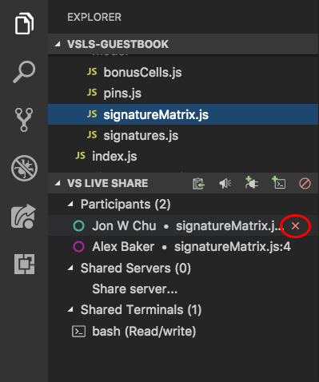
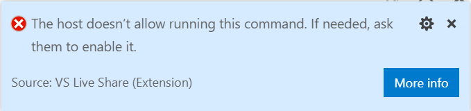

# Security features of Live Share

Collaboration sessions in Visual Studio Live Share are powerful in that they allow any number of people to join in a session and collaboratively edit, debug and more. However, given this level of access, you undoubtedly will be interested in the security features Live Share provides. In this article, we'll provide some recommendations and options for securing your environment as needed.

**As with any collaboration tool, remember that you should only share your code, content, and applications with people you trust.**

## Connectivity

When initiating a session between peers, Live Share attempts to establish a peer-to-peer connection, and only if that isn't possible (e.g. due to firewalls/NATs), does it fall back to using a cloud relay. However, in both connection types (P2P or relay), all data transmitted between peers is end-to-end encrypted using the SSH protocol. In the case of a relay connection, the SSH encryption is layered on top of TLS-encrypted WebSockets. This means that Live Share doesn't depend on the cloud relay service for security. Even if the relay was compromised, it could not decrypt any of the Live Share communication.

The role of the Live Share service is limited to user authentication and session discovery. The service itself does not store or ever have access any of the content of a session. All user content in Live Share is transmitted over the SSH session. That includes code, terminals, shared servers, and any other collaboration features provided by Live Share or extensions that build on it.

To find out more about altering these behaviors and Live Share's connectivity requirements, see **[connectivity requirements for Live Share](connectivity.md)**.

### Wire Encryption 

The SSH protocol uses a Diffie-Hellman key-exchange to establish a shared secret for the session, and derives from that a key for AES symmetric encryption. The encryption key is rotated periodically throughout the duration of the session. The shared session secret and all encryption keys are only maintained in-memory by both sides, and are only valid for the duration of the session. They are never written to disk or sent to any service (including Live Share).

### Peer Authentication

The SSH session is also two-way authenticated. The host (SSH server role) uses public/private key authentication as is standard for the SSH protocol. When a host shares a Live Share session, it generates a unique RSA public/private key-pair for the session. The host private key is kept only in memory in the host process; it is never written to disk or sent to any service including the Live Share service. The host public key is published to the Live Share service along with the session connection information (IP address and/or relay endpoint) where guests can access it via the invitation link. When a guest connects to the host's SSH session, the guest uses the SSH host authentication protocol to validate that the host holds the private key corresponding to the published public key (without the guest actually getting to see the private key).

The guest uses a Live Share token to authenticate itself with the host. The token is a signed JWT issued by the Live Share service that includes claims about the user identity (obtained via MSA, AAD, or GitHub sign-in). The token also has claims that indicate the guest is allowed to access that specific Live Share session (because they had the invitation link and/or they were specifically invited by the host). The host validates that token and checks the claims (and depending on options may prompt the host user) before allowing the guest to join the session.

## Invitations and join access

Each time you start a new collaboration session, Live Share generates a **new unique identifier** that is placed in the invitation link. These links provide a solid, secure foundation to invite those you trust since the identifier in the link is "non-guessable" and is _only valid for the duration of a single collaboration session_.

### Removing an unexpected guest

As a host, you are automatically notified whenever a guest joins the collaboration session.

In Visual Studio Code:


In Visual Studio:


Better still, the notification gives you the ability to remove a guest that has joined if for some reason you do not know them. (For example, if you accidentally posted your link on a company-wide chat system and a random employee joined.) Simply click on the "Remove" button in the notification that appears and they will be ejected from the collaboration session.

In **VS Code**, even if you have dismissed a join notification, you also have the ability to remove a participant after that. By opening the Live Share view in the Explorer or the custom tab in the VS Code activity bar, you can hover over or right-click a participant's name and select the "Remove participant" icon or option.



### Requiring guest approval

Typically, participants that join a collaboration session will be **signed into Live Share** using a Microsoft work or school account (AAD), personal Microsoft account, or GitHub account. While the "notification + remove" default for signed in users provides a good mix of speed and control for these guests, you may want to **lock things down** a bit more if you are doing something sensitive.

In addition, in certain circumstances forcing all guests to sign in to join a collaboration session can be problematic. Examples include asking someone new to Live Share to join as a guest, classroom/learning scenarios, or when collaborating with someone who does not have one of the supported account types. For these reasons, Live Share can allow users that are **not signed in** to join collaboration sessions as **read-only** guests. While the host needs to **approve** these guests before they can join by default, you may want to either disallow these "anonymous" guests or always approve them instead.

#### Requiring guest approval for signed in users

If you would like to prevent signed in guests from joining your collaboration sessions until you have "approved" them, change the following setting:

* In **VS Code**, add the following to settings.json (File > Preferences > Settings):

    ```json
    "liveshare.guestApprovalRequired": true
    ```

* In **Visual Studio**, set Tools > Options > Live Share > "Require guest approval" to True.

    

From this point forward, you'll be asked to approve each guest that joins.

 In Visual Studio Code:


In Visual Studio:


As a guest, if you join a session where the host has this setting enabled, you'll be notified in the status bar or join dialog that Live Share is waiting on the host to approve.

#### Auto-rejecting or accepting users that are not signed in (anonymous)

As described above, Live Share can be configured to allow **users that are not signed in** to join a collaboration session as **read-only** guests.  While these **"anonymous" guests must enter a name** when joining, a simple name does not provide the same level of assurance as a real sign-in. Therefore, **by default, the host is prompted to approve** any anonymous guest regardless of the "require guest approval" setting described above.

You can **always reject** (disable anonymous guests) or **always accept** anonymous users instead as follows:

* In **VS Code**, set `liveshare.anonymousGuestApproval` in settings.json (File > Preferences > Settings) to `accept`, `reject`, or `prompt` (the default) as appropriate.

* In **Visual Studio**, set Tools > Options > Live Share > "Anonymous guest approval" to Accept, Reject, or Prompt (the default) as appropriate.

 **Regardless, remember that you should only send Live Share invitation links to people you trust.**

### Allowing guest command control



To allow guests to run arbitrary commands via Code Actions (“Quick Fixes”) and CodeLens set the following setting:

* In **VS Code**, set `liveshare.languages.allowGuestCommandControl` in settings.json (File > Preferences > Settings) to `true` or `false` (the default).


## Controlling file access and visibility

As a guest, Live Share's remote model gives you quick read/write access to files and folders the host has shared with you without having to sync the entire contents of a project. You can therefore independently navigate and edit files in the entire shared file tree. **However, this freedom does pose some risks to the host.** In concept, a developer could opt to go in and modify source code without your knowledge or see sensitive source code or "secrets" located somewhere in the shared file tree. Consequently, as a host, you may not always want the guest to have access to the entirety of a project you are sharing. Thankfully, an added advantage of this remote model is that you can opt to "exclude" files you do not want to share with anyone without sacrificing on functionality. Your guests can still participate in things like debugging sessions that would normally require access to these files if they wanted to do so on their own.

You can accomplish this by adding a **.vsls.json** file to the folder or project you are sharing. Any settings you add to this json formatted file changes how Live Share processes files. In addition to providing you direct control, these files can also be committed to source control so anyone cloning a project will be able to take advantage of these rules with no additional effort on their part.

Here's an example .vsls.json file:

```json
{
    "$schema": "http://json.schemastore.org/vsls",
    "gitignore":"none",
    "excludeFiles":[
        "*.p12",
        "*.cer",
        "token",
        ".gitignore"
    ],
    "hideFiles": [
        "bin",
        "obj"
    ]
}
```

> [!NOTE]
> You can also make the all files/folders you share **read-only** when you start a collaboration session. See [below](#read-only-mode) for details.

Let's walk through how these properties change what guests can do.

### Properties

The **excludeFiles** property allows you to specify a list of glob file patterns (very much like those found .gitignore files) that prevents Live Share from opening certain files or folders for guests. Be aware that this is inclusive of scenarios like a guest _following or jumping to your edit location, stepping into a file during collaborative debugging, any code navigation features like go to definition, and more._ It is intended for files you never want to share under any circumstances like those containing secrets, certificates, or passwords. For example, since they control security, .vsls.json files are always excluded.

The **hideFiles** property is similar, but not quite as strict. These files are simply hidden from the file tree. For example, if you happened to step into one of these files during debugging, it is still opened in the editor. This property is primarily useful if you do not have a .gitignore file setup (as would be the case if you are using a different source control system) or if you simply want to augment what is already there to avoid clutter or confusion.

The **gitignore** setting establishes how Live Share should process the contents of .gitignore files in shared folders. By default, any globs found in .gitignore files are treated as if they were specified in the "hideFiles" property. However, you can choose a different behavior using one of the following values:

| Option    | Result                                                                                                                 |
| --------- | ---------------------------------------------------------------------------------------------------------------------- |
| `none`    | .gitignore contents are visible to guests in the file tree (assuming they are not filtered by a guest editor setting). |
| `hide`    | **The default.** Globs inside .gitignore are processed as if they were in the "hideFiles" property.                   |
| `exclude` | Globs inside .gitignore are processed as if they were in the "excludeFiles" property.                                 |

A downside of the `exclude` setting is that the contents of folders like node_modules are frequently in .gitignore but can be useful to step into during debugging. Consequently, Live Share supports the ability to reverse a rule using "!" in the excludeFiles property. For example, this .vsls.json file would exclude everything in ".gitignore" except for node_modules:

```json
{
    "$schema": "http://json.schemastore.org/vsls",
    "gitignore":"exclude",
    "excludeFiles":[
        "!node_modules"
    ]
}
```

The hide and exclude rules are processed separately, so if you still wanted to hide node_modules to reduce clutter without actually excluding it, you can simply edit the file as follows:

```json
{
    "$schema": "http://json.schemastore.org/vsls",
    "gitignore":"exclude",
    "excludeFiles":[
        "!node_modules"
    ],
    "hideFiles":[
        "node_modules"
    ]
}
```

### .vsls.json files in sub-folders

Finally, just like .gitignore, .vsls.json files can be placed in sub-folders. Hide/exclude rules are determined by starting with the .vsls.json file in the root folder you have shared (if present) and then walking through at each sub-folder from there leading to a given file to look for .vsls.json files to process. The contents of .vsls.json files in folders farther down the file tree then supplement (or override) rules established at higher levels.

Note: it is not possible to re-include (!) a file if a parent directory of that file is excluded. Similar to .gitignore, when re-including a file, you'll also need to re-include every parent directory of the file.

### Disabling external file sharing

By default, Live Share will also share any files the host opens that are external to the shared folder / solution. This makes it easy to quickly open up other related files without having to re-share.

If you would prefer to disable this feature:

* In **VS Code**, add the following to settings.json:

    ```json
    "liveshare.shareExternalFiles": false
    ```

* In **Visual Studio**, set Tools &gt; Options &gt; Live Share &gt; "Share External Files" to False

## Read-only mode

Sometimes when you share your code as a host, you don't want your guests to make edits. You might need your guest to take a look at some of your code, or you are showing your project to a large number of guests and do not want any unnecessary or accidental edits to be made. Live Share offers the ability to share projects in read-only mode.

As a host, when sharing, you have the option to enable read-only mode for a collaboration session. When a guest joins, they will not be able to make edits to the code, though you can still see each other's cursors and highlights as well as navigate through the project.

You can still co-debug with guests while in read-only mode. Guests will not have the ability to step through the debugging process, but can still add or remove breakpoints, and inspect variables. Additionally, you can still share servers and terminals (read-only) with guests.

You can learn more about starting a read-only collaboration session: [](../use/share-project-join-session-visual-studio-code.md#start-a-session) [](../use/share-project-join-session-visual-studio.md#share-a-project)

## Co-debugging

When you're tackling tough coding problems or bugs, having an extra pair of eyes when debugging can be really useful. Visual Studio Live Share enables "collaborative debugging" or "co-debugging" by sharing the debugging session with all guests whenever the host starts debugging.

As a host, you are in complete control over when a debugging session starts or stops, but co-debugging does pose some risks if you are sharing with someone you do not trust. Live Share allows guests you invite to run console/REPL commands and there is therefore **a risk of a malicious actor running a command you would not want them to run**.

Consequently, you should **only co-debug with those you trust.**

Learn more: [](../use/codebug-visual-studio-code.md) [](../use/codebug-visual-studio.md)

## Sharing a local server

When co-debugging, it can be really useful to get access to different parts of the application being served up by the host for the debugging session. You may want to access the app in a browser, access a local database, or hit a REST endpoint from your tools. Live Share lets you "share a server" which maps a local port on the host's machine to the exact same port on guest's machine. As a guest, you can then interact with the application exactly as if it was running locally on your machine (e.g. the host and guest can both access a web app running on http://localhost:3000).

However, as a host, you should **be very selective with the ports you share** with guests and only share application ports rather system ports. For guests, shared ports will behave exactly like they would if the server/service was running on their own machine. This is very useful, but if the wrong port is shared can also be risky. For this reason, Live Share does not make any assumptions about what should or should not be shared without a configuration setting and the host performing an action.

In Visual Studio, the **web application port** specified in ASP.NET projects is **automatically shared during debugging only** to facilitate guest access to the web app when running. However, you can turn off this automation by setting Tools > Options > Live Share > "Share web app on debug" to "False" if you prefer.

In Visual Studio Code, Live Share attempts to **detect the proper application ports** and share them. However, you can disable this by adding the following to settings.json:

```json
"liveshare.autoShareServers": false
```

In either case, exercise care when sharing additional ports.

You can learn more about configuring the feature here: [](../use/share-server-visual-studio-code.md) [](../use/share-server-visual-studio.md)

## Sharing a terminal

Modern development makes frequent use of a wide array of command line tools. Fortunately, Live Share allows you as a host to optionally "share a terminal" with guests. The shared terminal can be read-only or fully collaborative so both you and the guests can run commands and see the results. As the host, you're able to allow other collaborators to either just see the output or to use any number of command line tools to run tests, builds, or even triage environment-specific problems.

Only hosts can start shared terminals to prevent guests from starting one up and doing something you are not expecting or watching. When you start a shared terminal as a host, you can specify whether it should be read-only or read/write. When the terminal is read/write, everyone can type in the terminal including the host which makes it easy to intervene if a guest is doing something you do not like. However, to be safe, you should **only give read/write access to guests when you know they actually need it** and stick with read-only terminals for scenarios where you just want the guest to see the output of any commands you run.

In Visual Studio, terminals are not shared by default. In VS Code, terminals are automatically shared **read-only** by default. However, you can disable this by adding the following to settings.json:

```json
"liveshare.autoShareTerminals": false
```

Learn more: [](../use/share-server-visual-studio-code.md#share-a-terminal) [](../use/share-server-visual-studio.md#share-a-terminal)

## AAD Admin Consent

When signing in using a Microsoft backed **work or school email address** you may see a message saying **"Need admin approval"** when signing in. This is because Live Share requires read access to user information for its security features and your Azure AD tenant is set up to require “admin consent” for new applications accessing the contents of the directory.

Your AD admin would need to resolve this for you using the following information:

* **Application Name**: Visual Studio Live Share (Insiders)
* **Application Type**: Web App
* **Applications Status**: Production
* **Delegated Permissions**: User.Read
* **Application URL**: https://visualstudio.microsoft.com/services/live-share/
* **Reply URL**: https://insiders.liveshare.vsengsaas.visualstudio.com/auth/redirect/windowslive/

This would only need to be done once for anyone using Live Share. See [here](/azure/active-directory/develop/active-directory-v2-scopes#admin-restricted-scopes) and [here](https://stackoverflow.com/questions/39861830/azure-ad-admin-consent-from-the-azure-portal) for details.

## See also

* [Install and sign in to Live Share in Visual Studio Code](../use/install-live-share-visual-studio-code.md)
* [Install and sign in to Live Share in Visual Studio](../use/install-live-share-visual-studio.md)
* [Connectivity requirements for Live Share](connectivity.md)

Having problems? See [troubleshooting](../troubleshooting.md) or [provide feedback](../support.md).
