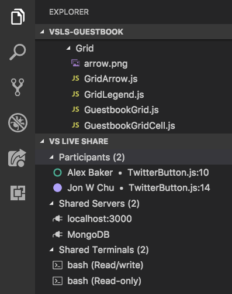
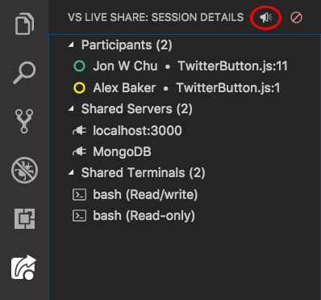
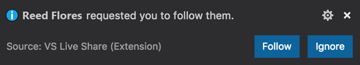
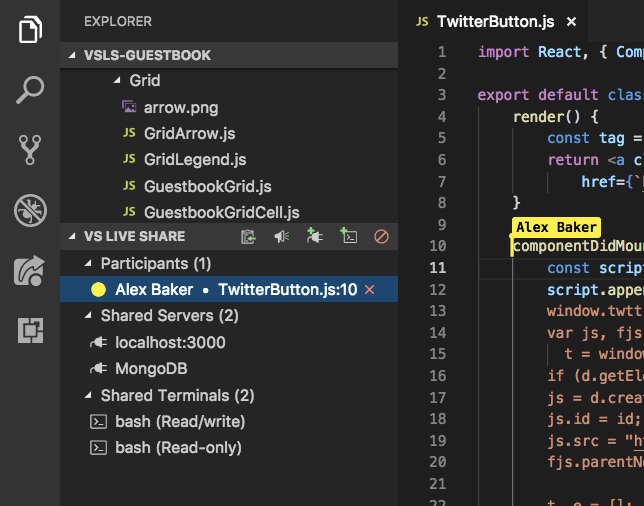
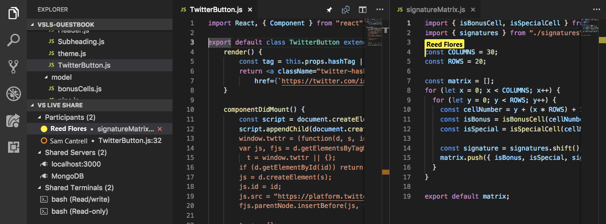

<!--
Copyright © Microsoft Corporation
All rights reserved.
Creative Commons Attribution 4.0 License (International): https://creativecommons.org/licenses/by/4.0/legalcode
-->

# Co-edit, follow, and focus in a collaboration session in Visual Studio Code

Once you're in a collaboration session, you can co-edit with a guest or follow a colleague. You can also use a notification to focus attention on your work.

## Co-editing

> [!NOTE]
> Co-editing has limitations in certain languages. See [Platform support](../reference/platform-support.md) for information about language-specific features.

When a guest joins a collaboration session, all collaborators will immediately be able to see each other's edits and selections in real-time. All you need to do is pick a file from the file explorer and start editing. Hosts and guests will see edits as you make them and can contribute themselves, which makes it easy iterate and rapidly solve problems.

> [!NOTE]
> Guests who join a read-only collaboration session can't make edits to files. Hosts can [enable read-only mode when they share a session](share-project-join-session-visual-studio-code.md#start-a-session). As a guest, you can tell if you've joined a read-only session by looking at the [session state](share-project-join-session-visual-studio-code.md#session-states-and-limitations).

Participants can see cursors and edits. They can also see selections you make. That makes it easy to highlight where problems might exist or to convey ideas.

You and other participants can go to any file in the shared project. You can edit either together or independently, so you can seamlessly switch from investigation to making small changes to full collaborative editing.

The resulting edits are persisted on the host's computer when they're saved. So there's no need to synchronize, push, or send files around when you're done editing.

> **Security tip:** Because all participants can independently go to and edit files, as a host, you might want to restrict which files guests are able to access in your project via a .vsls.json file. As a guest, you should realize that you might not see certain files as a result of these settings. For more information, see [Controlling file access and visibility](../reference/security.md#controlling-file-access-and-visibility).

### Change participant flag behavior

By default, Visual Studio Live Share automatically displays a flag next to a participant's cursor on hover or when the participant makes edits, highlights something, or moves the cursor. In some cases, you might want to change this behavior.

To change the behavior, open settings.json (**File** > **Preferences** > **Settings**), add one of the following lines, and then restart Visual Studio Code.

| Setting | Behavior |
|---------|----------|
| ``"liveshare.nameTagVisibility":"Never"`` | The flag is visible only when you hover over the cursor. |
| ``"liveshare.nameTagVisibility":"Activity"`` | This is the default. The flag is visible on hover or if the participant edits, highlights, or moves the cursor. |
| ``"liveshare.nameTagVisibility":"Always"`` | The flag is always visible. |

### Find and list participants

To quickly see who's in the collaboration session, look at the participants list on the Live Share **Explorer** tab or on the **VS Live Share** tab:

To follow any participant in this list in your active editor group, select the participant.

Alternatively, you can select **Ctrl+Shift+P** or **Cmd+Shift+P** and then select **Live Share: List Participants** or select the status bar item that shows the number of participants in your session:

A list of all participants in the session will appear. The behavior here differs from that of the pushpin button. This list appears even if there's only one other person in the session with you, so you can always quickly see where someone else is located. As with the pushpin button, you can pick participants in the list to follow them. Select **Esc** if you want to exit instead.

### Follow along with a collaborator

Sometimes you need to explain a problem or design that spans multiple files or locations in code. In these situations, it can be useful to temporarily follow your colleagues as they move throughout a project. For this reason, when you join a collaboration session, you'll automatically follow the host. When you're following someone, your editor will stay in sync with that person's currently open file and scroll position.

> [!NOTE]
> By default, Live Share shares opened files that are outside of the shared folder. If you want to change this behavior, change `liveshare.shareExternalFiles` to `false` in settings.json.

### Request focus

You might sometimes want everyone in a collaboration session to take a look at something you're doing. Live Share lets you ask that everyone focus their attention on you with a notification that makes it easy for them to follow you.

Open the **VS Live Share** tab in the Visual Studio Code Activity Bar or the Live Share **Explorer** tab, and then select the **Focus participants** button:

Everyone in the collaboration session will get a notification that you've requested their attention:

They can then select **Follow** in the notification when they're ready to focus on your actions.

## Start and stop following collaborators

To start following a participant (as either a host or a guest), select the participant's name in the participants list on the Live Share **Explorer** tab or on the **VS Live Share** tab. The circle next to the name will become solid to indicate that you're following them:

Alternatively, you can select the pushpin button in the upper-right corner of the editor group or select **Ctrl+Alt+F** or **Cmd+Alt+F**.

> [!NOTE]
> If more than one other person is in the collaboration session, you'll be prompted to select the participant who you want to follow:
>
>

Because following is linked to an editor group, you can use split view or grid layout to create a group that's following a participant and a group that's not. This layout allows you to passively follow someone while also working on something independently. When you have an editor group selected, you can select a participant in the participants list to have the group follow the participant.

To make it easy to switch out of follow mode and start editing on your own, you'll automatically stop following if one of these actions occurs:
- You open a different file.
- You close the currently active file.

Additionally, you can explicitly stop following someone by selecting the pushpin button again or by selecting **Ctrl+Alt+F** or **Cmd+Alt+F**.

## Next steps

> [!div class="nextstepaction"]
> [Co-debug](codebug-visual-studio-code.md)
