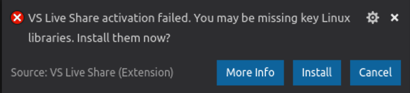

<!--
Copyright © Microsoft Corporation
All rights reserved.
Creative Commons Attribution 4.0 License (International): https://creativecommons.org/licenses/by/4.0/legalcode
-->

# Install and sign in to Live Share in Visual Studio Code

Ready to start collaborating with Live Share in Visual Studio Code? In this article, we'll walk you through setting up a collaboration session in Visual Studio Code by using the Live Share Extension.

The collaboration activities described here involve a single collaboration session host and one or more guests. The host is the person who started the collaboration session, and anyone that joins is a guest.

*Looking for an abridged summary? Check out the [share](../quickstart/share.md) or [join](../quickstart/join.md) quickstarts.*

> [!TIP]
> Did you know that you can join your own collaboration session? Doing so allows you to try Live Share on your own or to spin up an instance of Visual Studio or Visual Studio Code and connect to it remotely. You can even use the same identity in both instances. Check it out!

## Prerequisites

Before you start, you'll need a supported version of Visual Studio Code for the Live Share core requirements. 

You'll need Visual Studio Code (1.22.0 or later) running on one of the following operating systems:

- **Windows**: 7, 8.1, or 10.

- **macOS**: Sierra (10.12) and later. Because of [.NET Core 2.0 requirements](https://go.microsoft.com/fwlink/?linkid=872315), El Capitan (10.11) and earlier aren't currently supported.

- **Linux**: 64-bit Ubuntu Desktop 16.04 and later, Fedora Workstation 27 and later, or CentOS 7.
    - Live Share requires several [prerequisites for Linux](#linux-installation-steps). You might be prompted to install these items.
    - Because of [.NET Core 2.0 requirements](https://go.microsoft.com/fwlink/?linkid=872314), 32-bit Linux isn't supported.
    - ARM is currently not supported.
    - See [Linux installation details](../reference/linux.md) for information on using downstream distributions and other distributions.

## Install the Live Share Extension Pack

When you download and use Visual Studio Live Share, you agree to the [license terms](https://aka.ms/vsls-license) and [privacy statement](https://www.microsoft.com/en-us/privacystatement/EnterpriseDev/default.aspx). See [troubleshooting](../troubleshooting.md) if you run into problems.

1. Install <a href="https://code.visualstudio.com/">Visual Studio Code</a>.
2. [Download](https://aka.ms/vsls-dl/vscode) and install the Visual Studio Live Share Extension Pack from Marketplace.
3. Reload Visual Studio Code.
4. Wait for dependencies to download and install. (See the status bar.)<br/>
    
5. *Linux only*: If you see a notification about installing missing libraries:
    1. Select **Install** in the notification.
    2. Enter your admin (sudo) password when prompted.
    3. Restart Visual Studio Code when the installation is done.

[](https://aka.ms/vsls-dl/vscode)

### Linux installation steps

Linux is a highly variable environment. Given the number of desktop environments and distributions, getting Live Share installed can be complicated. The process should be straightforward if you use official distributions of Visual Studio Code and:

- Ubuntu Desktop version 16.04 and up.
- Fedora Workstation version 27 and up.
- CentOS 7.

If you're using a nonstandard configuration or downstream distribution, you might have complications. For more information, see [Linux installation details](../reference/linux.md).

#### Install Linux prerequisites

Some distributions of Linux are missing libraries that Live Share needs. By default, Live Share attempts to detect and install Linux prerequisites. You'll see a notification prompting you to install libraries when Live Share comes across a problem that can be caused by missing libraries:



When you select **Install**, a terminal window will open. Enter your admin (sudo) password to continue. If the installation completes successfully, restart Visual Studio Code. You should be all set. You might also want to check out [Tips by distribution](../reference/linux.md#tips-by-distribution) for other hints and workarounds.

If you see a message stating that the script doesn't support your distribution, see [Tips for community-supported distributions](../reference/linux.md#tips-for-community-supported-distros) for information the community has shared with us.

You might not want Visual Studio Code to run the command for you. You can rerun the latest version of this script at any time by running this command from a terminal window:

```bash
wget -O ~/vsls-reqs https://aka.ms/vsls-linux-prereq-script && chmod +x ~/vsls-reqs && ~/vsls-reqs
```

#### Linux browser integration

Visual Studio Live Share doesn't typically require extra installation steps to enable browser integration on Linux.

On certain rare distributions, you might be notified that your admin (sudo) password is required to complete the installation. A terminal window noting where the browser launcher will be installed will appear. Enter your password when prompted, and select **Enter** when the installation completes to close the terminal window.

For information about why the password is required and where Live Share puts files, see [Linux browser integration](../reference/linux.md#linux-browser-integration). If you can't get browser integration to work, you can still [join collaboration sessions manually](share-project-join-session-visual-studio-code.md#join-manually).

## Sign in to Live Share

To collaborate, you'll need to sign in to Visual Studio Live Share so everyone knows who you are. This sign-in is a security measure and doesn't add you to marketing activities or other research activities. You can sign in by using a Microsoft personal account (for example, @outlook.com), a Microsoft-backed work or school account (Azure Active Directory), or a GitHub account. Signing in is easy.

Select **Live Share** on the status bar or select **Ctrl+Shift+P** or **Cmd+Shift+P** and then select **Live Share: Sign In**.

:::image type="content" source="../media/install-live-share-visual-studio-code/live-share-button-status-bar.png" alt-text="Screenshot that shows the Visual Studio Code Live Share button.":::

A prompt to sign in displays. When you select your sign-in preference, a browser opens so you can complete the sign-in process. Close the browser when you're done.

:::image type="content" source="../media/install-live-share-visual-studio-code/live-share-sign-in-options.png" alt-text="Screenshot that shows the Live Share sign in options.":::

> [!TIP]
> The `liveshare.account` and `liveshare.accountProvider` settings enable you to select the account used for automatic sign-in if you have cached credentials for multiple accounts.
For example, imagine you work on two projects and you want to sign in to them by using different identities. In your Visual Studio Code workspace settings, you could set `liveshare.account` to a different email address in each project directory. The projects will then automatically sign in with the correct account. You can set the `liveshare.accountProvider` setting to either `"microsoft"` or `"github"` if you use the same email address with multiple providers.

If Visual Studio Code isn't picking up your sign-in after you complete the sign-in process in the browser, see [troubleshooting](../troubleshooting.md#sign-in) for more tips.

## Next steps

> [!div class="nextstepaction"]
> [Share a project and join a session](share-project-join-session-visual-studio-code.md)
