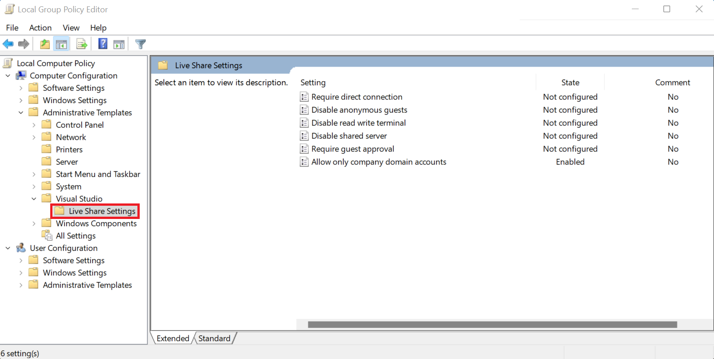
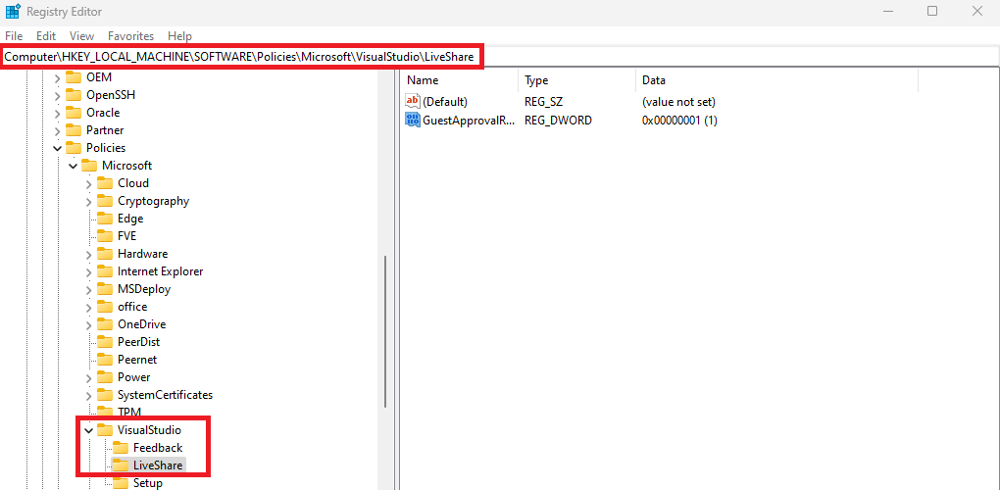

<!--
Copyright © Microsoft Corporation
All rights reserved.
Creative Commons Attribution 4.0 License (International): https://creativecommons.org/licenses/by/4.0/legalcode
-->

# Configure Visual Studio using Group Policy Administrative Templates

To control certain aspects of Visual Studio Live Share behavior to achieve consistency or compliance across your organization, you can now use [Group Policy Administrative Templates (ADMX/ADML files)](https://aka.ms/vs/admx/details). To configure and deploy these policies, you can use [Microsoft Intune](https://learn.microsoft.com/visualstudio/install/administrative-templates?view=vs-2022#deploying-the-policies) or the Local Group Policy Editor directly on the client machine.

With these policies, your organization will be able to add an extra layer of protection to prevent accidents on Visual Studio Live Share and increase productivity.

To get started with enabling policies, you’ll need to [download](https://marketplace.visualstudio.com/items?itemName=MS-vsliveshare.vsls-vs-2022) the latest Visual Studio Live Share version from the Visual Studio Marketplace.

## Policies Supported

**Allow only domain accounts:** Prevents users from being able to share their session with any guests who are not part of the domain that the organization allows via policy. Users must also be [signed in](install-live-share-visual-studio.md#sign-in) with the domain account that the organization allows via this policy to share a session. When enabling this policy, multiple domains can be added by using a semicolon to separate each domain.

**Disable read-write terminals:** Prevent the host from being able to explicitly share a new [writeable terminal](share-server-visual-studio.md#share-a-terminal). This policy also suppresses the option for the guest to request write access to a terminal. This would effectively look like the experience you see today in a read-only session (you can’t share writeable terminals) but would apply to read/write sessions too.

**Disable shared servers:** Prevent the host from being able to explicitly share a new [server](share-server-visual-studio.md#share-a-server), as well as auto-sharing of servers from the terminal. In this mode, the “Shared Servers” node in the “Session Details” tree view will be hidden, along with all associated commands.

**Require direct connection:** Prevents hosts from allowing [relay-based guests](../overview/features.md#flexible-connection-modes) from joining their session. Live Share already supports the “Live Share: Connection Mode” setting, and so this policy is effectively just enforcing it to “direct”.

**Disable anonymous guests:** Disallow anonymous guests from joining a session. We already have the [“Live Share: Anonymous Guest Approval”](../reference/security.md#auto-rejecting-or-accepting-users-that-are-not-signed-in-anonymous) setting, and so this policy is effectively just enforcing that to “reject”.

**Enforce accepting/rejecting a guest:** Requires the host to individually accept each guest that attempts to join a session. We already have the ["Live Share: Guest Approval Required"](../reference/security.md#requiring-guest-approval-for-signed-in-users) setting, so this policy is effectively just enforcing that to "true".

**Disable chat:** Prevents the host and guest from using chat within the session.

## Configure policies with Microsoft Endpoint Manager (Intune) settings

Visual Studio global policies are included in the [Microsoft Endpoint Manager (Intune) settings](https://learn.microsoft.com/mem/intune/configuration/settings-catalog). This makes it easier for administrators to configure their organization's devices now that the Visual Studio software policies are readily accessible in the Device Configuration Profile UI. Since Visual Studio will be keeping the policies up to date in Intune's settings catalog, administrators will be able to always access the most current Visual Studio Live Share configuration options without having to do manual imports.

To take advantage of Visual Studio's built-in configuration policy settings in Intune, simply create a Device Configuration Profile, choose "Settings catalog", and then add the desired polices that you want configured on your devices.

## Configure policies with Local Group Policy Editor

### Step 1: Download the templates

Head over to the Microsoft Download Center and grab the [Visual Studio Group Policy Administrative Template files (ADMX/ADML)](https://aka.ms/vs/admx/details). It’ll ask you where you want the files to be downloaded, please ensure the location is ‘C:\Windows\PolicyDefinitions\'.

### Step 2: Test using the Local Group Policy Editor

- Open the Windows Local Group Policy Editor
- Navigate to Computer Configuration > Administrative Templates > Visual Studio > Live Share Settings
- Apply the desired policy changes to Visual Studio Live Share
- [Optional] Ensure the new group policy changes are applied to the respective product's path in the Registry Editor:
  Computer\HKEY_LOCAL_MACHINE\SOFTWARE\Policies\Microsoft\VisualStudio\LiveShare
  
- Restart your Visual Studio instance to pick up the new policy changes

**Note**: Depending on your organization’s policy, you might need to force a group policy update via gpupdate.exe to apply the change.

After all desired policies are set, teams across your organization can confidently collaborate with Visual Studio Live Share.

## Frequently Asked Questions

### Which version of Live Share is needed?

The [latest version](https://marketplace.visualstudio.com/items?itemName=MS-vsliveshare.vsls-vs-2022) of Visual Studio Live Share is needed to get started.

### Do these policies apply to Visual Studio Code?

No, these policies only apply to Visual Studio.

### Why isn't the policy I enabled working?

To use the new Live Share policies, you need to have the [latest version](https://marketplace.visualstudio.com/items?itemName=MS-vsliveshare.vsls-vs-2022) of Visual Studio Live Share. If the issue still persists after updating Live Share, please contact us at vsls-feedback@microsoft.com.

## Contact us

Please share with us any feedback you have about Live Share. You can email us at vsls-feedback@microsoft.com or submit feedback [here](https://aka.ms/vs/admx/feedback). We look forward to hearing from you!
