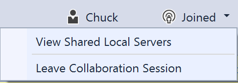
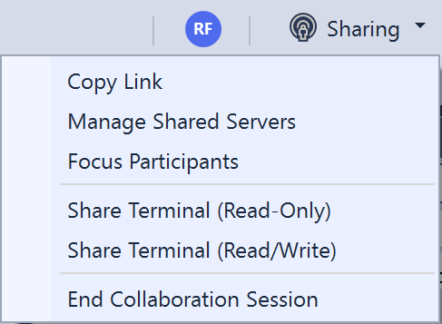
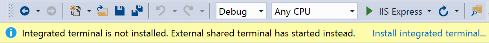

<!--
Copyright © Microsoft Corporation
All rights reserved.
Creative Commons Attribution 4.0 License (International): https://creativecommons.org/licenses/by/4.0/legalcode
-->

# Share a server or terminal in Visual Studio

Share a server or terminal as a collaboration session host in Visual Studio.

## Share a server

As a collaboration session host, you might want to share more local servers or services with guests. Sharing can range from other RESTful end-points to databases or other servers. With Visual Studio Live Share, you can specify a local port number, give it a name, and then share it with guests.

Guests can access the server you shared on that port from their own local machine on the exact same port. For example, if you share a web server *running on port 3000*, the guest accesses that same running web server on their *own machine* at http://localhost:3000. This access happens via a secure SSH or SSL tunnel between the host and guests and authenticated via the service. So you can be sure only people in the collaboration session have access.

> [!TIP]
> As a host, you should be very selective with the ports you share with guests and stick to application ports (rather than sharing a system port). For guests, shared ports will behave exactly like they would if the server/service was running on their own machine. This is very useful, but if the wrong port is shared can also be risky.

For security purposes, only servers running on ports you specify are available to other guests. Fortunately, it's easy to add one as the collaboration session *host*.

1. Click on the share/session state button in the upper right corner and select **Manage Shared Servers**.

    :::image type="content" source="../media/share-server-visual-studio/manage-shared-local-servers-visual-studio.png" alt-text="Screenshot that shows the share session drop-down list with Manage Shared Servers selected.":::

2. In the dialog that appears, select **Add** and enter the port number the server is running on locally, enter a name, then select **OK**.

    :::image type="content" source="../media/share-server-visual-studio/shared-server-visual-studio.png" alt-text="Screenshot that shows the Shared Local Servers window with Add and Ok selected.":::

That's it! The server on the port you specified is mapped to each guest's localhost on the same port, unless that port was already occupied.

If the port is already in use on a guest's machine, a different one is automatically selected. Guests can see a list of currently shared ports, by name if specified, by selecting the session state button in the upper right corner and selecting **View Shared Local Servers**.

Guests *can't* control which ports on the host's machine are shared for security reasons.

To stop sharing a local server, the host simply needs to click the share / session state button in the upper right corner as above, select **Manage Shared Local Servers**, and select the appropriate port, and click "Remove".

## Share a terminal

Modern development makes frequent use of a wide array of command-line tools. Fortunately, Live Share allows you, as a host, to optionally "share a terminal" with guests. The shared terminal can be read-only or fully collaborative. Fully collaborative means you and your guests can run commands and see the results. You might give guests visibility to terminal output or let them get hands on. Guests can run tests, builds, or even triage environment specific problems that only happen on your machine.

However, terminals are **not** shared by default since they give guests at least read-only access to the output of commands you run (if not the ability to run commands themselves). This way you can freely run commands in local terminals without risk and only share when actually need to do so. Also, only hosts can start shared terminals to prevent guests from starting one up and doing something you aren't expecting or watching.

As a host, you can share a terminal by clicking on the session state / share button in the upper right-hand corner and selecting one of the **Share Terminal** menu items.

At this point, you can select a read-only or read/write terminal from the menu. When the terminal is read/write, everyone can type in the terminal, making it easy to intervene if a guest is doing something you don't like. However, *only* give read/write access to guests when you know they actually need it. Stick with read-only terminals for scenarios where you just want the guest to see the output of any commands you run.

> [!NOTE]
> If the collaboration session is in read-only mode, only read-only terminals can be shared by the host.

Select the kind of shared terminal you want to start. A new shared terminal displays for all participants with the correct permissions.

To end your terminal session, simply type exit or close the terminal window and everyone will be disconnected.

## Next Steps

Check out these articles for more information.

- [Quickstart: Share your first project](../quickstart/share.md)
- [Quickstart: Join your first session](../quickstart/join.md)
- [Install and sign in to Live Share in Visual Studio Code](install-live-share-visual-studio-code.md)
- [Connectivity requirements for Live Share](../reference/connectivity.md)
- [Security features of Live Share](../reference/security.md)

Having problems? See [troubleshooting](../troubleshooting.md) or [provide feedback](../support.md).
