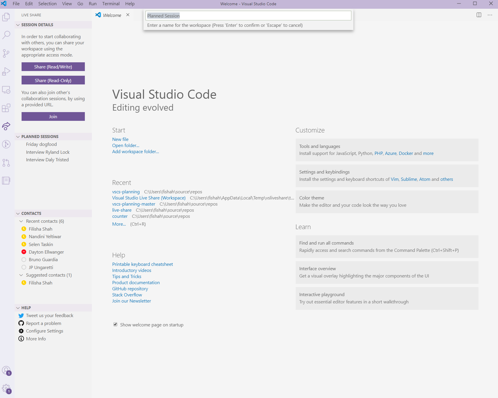
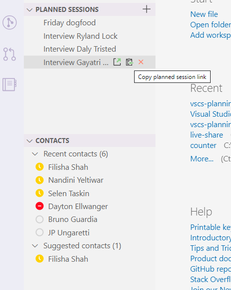

# How-to: Do Technical Interviews using Live Share

Before you begin using Live Share for Technical Interviews, you must complete one integral step: **Download Visual Studio Code and the Live Share extension pack from its marketplace** by following [these steps](../use/vscode.md).

Using Live Share for interviews, allows the interviewer and candidate to have a fast and reliable interview session, with a full-fidelity IDE or editor. 
This tutorial will focus on using ['Planned Sessions'](../reference/insiders.md) and [Live Share web join](../quickstart/browser-join.md) for the interview experience. 

## Setup for interviewer (VS Code)

Install [Visual Studio Code](../use/vscode.md) and download the [Live Share extension pack](https://marketplace.visualstudio.com/items?itemName=MS-vsliveshare.vsliveshare-pack) from the marketplace. The extension pack will provide you with our audio support for interviews.

>[!TIP]
>To have the best experience of interviewing using Live Share in VS Code, make sure to turn on the Live Share insiders feature flag. *Preferences:UserSettings > Extensions > Visual Studio Live Share > Feature Set: Insiders*

>[!NOTE]
> Live Share chat comes in-built with the Live Share extension in VS Code.

## Scheduling an interview

**Live Share in VS Code** provides you the ability to create Live Share sessions in advance. You can use the following steps to create a session in advance:

### Option A (Insider)

1. Go to the `Planned Sessions` in the viewlet and create new session. This has now created a Live Share session in advance for you, which will be available from the viewlet for you at the time of the interview.

   

2. Copy link from viewlet and send it to the candidate. The link you send to the candidate can be used by them at the time of the interview to join the session.

   

### Option B (Not an Insider)

1. Go to the `Command Palette` using `Ctrl+Shift+P`

2. Type "Live Sha..." and click the '_Live Share: Create Reusable Session link_' command.

   

3. This will create a Reusable Session and a link to it will be copied to your clipboard. You will see a notification pop-up on the lower-right corner of your editor.

   

4. Send the link.

Once you have this link, just share it with the interviewee via email or your choice of scheduling mechanism. All they have to do is click on that link at the time of the interview and they will be in a Live Share session.

> [!TIP]
>A Reusable Session link is persistent and lasts for 30 days from its date of creation, or date of last use. While generating a Reusable Session link for your interview make sure that the interview is within 30 days of the date of the link's creation. If the link expires, just create a new Reusable Session. (There is a a way to ensure the link never expires, but this is just easier for interviews!)

**Note:** Currently, Live Share in Visual Studio does not have the ability to create sessions in advance. For interviews you conduct using Live Share in Visual Studio, you can follow our guide on how to start an instant Live Share session [here](../quickstart/share.md)

## Setup for candidate

While a candidate can always install the either Visual Studio or Visual Studio Code to join the interview, they do not need to do so. **Live Share interview sessions can be joined by candidates without any prior setup.** They can click on the interview link at the time of the session and **join from the browser**. Learn more [here.](../quickstart/browser-join.md)

<!--
### **What to do as an Interviewer?**

As an interviewer you will act as the host of the Live Share session. If you are not familiar with Live Share, we suggest you refer to the [share a project](../use/vscode.md) section of our how-to guide
### **What to do as the Interviewee?**

If you are expecting to do a Technical Interview using Live Share, you are in luck! We want to make sure you are familiar with the basic Live Share features so you feel comfortable during your interview.

1. Before the interview, take some time and look over the [How-to guide](../use/vscode.md) so you understand how Live Share works.

1. You may want to install Visual Studio Code beforehand so that you are not waiting for the installation to complete once you start your interview

1. If you don't have the time, no worries. All you need to have a full interview is the link to a Live Share session your interviewer sends you while scheduling the interview. Just clicking on the link will automatically take you through all the steps needed.

1. At the time of the interview, just click on the link and follow the steps it takes you through. If you are early or your interviewer is late to the interview, don't worry! You will just be in the 'lobby' waiting for your interviewer to join. No other steps are required, and once your interviewer joins the session will automatically start.

>[!NOTE]
>If you find that the session has disconnected before or after the interviewer joined, don't worry. Just exit out of that session if (it isn't already closed) and re-click on the same link!

You are now all set to go with using Live Share for your interview! 
-->
