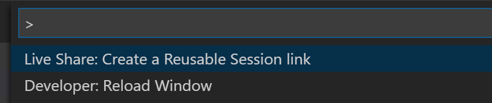
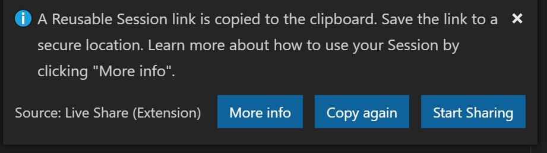

<!--
Copyright © Microsoft Corporation
All rights reserved.
Creative Commons Attribution 4.0 License (International): https://creativecommons.org/licenses/by/4.0/legalcode
-->

# How-to: Do Technical Interviews using Live Share

Before you begin using Live Share for Technical Interviews, you must complete one integral step: **Download Visual Studio Code and the Live Share extension pack from its marketplace** by following [these steps.](../use/vscode.md)

Live Share provides you the ability to host Reusable Sessions! All this means is that you can schedule a Live Share session in advance for your technical interviews and not worry about the link expiring.

> [!TIP] 
>A Reusable Session link is persistent and lasts for 30 days from its date of creation, or date of last use. While generating a Reusable Session link for your interview make sure that the interview is within 30 days of the date of the link's creation. If the link expires, just create a new Reusable Session. (There is a a way to ensure the link never expires, but this is just easier for interviews!)

### **What to do as an Interviewer?**

As an interviewer you will act as the host of the Live Share session. If you are not familiar with Live Share, we suggest you refer to the [share a project](../use/vscode.md) section of our how-to guide.

Now to create a Live Share session for your technical interview, you will create a special “reusable session” instead of the regular collaboration session. This will allow you to have a Live Share session that can be scheduled in advance and then used at any time.

To create a Reusable Session do the following:

1. Go to the `Command Palette` using `Ctrl+Shift+P`
1. Type "Live Sha..." and click the '**_Live Share: Create Reusable Session link_**' command.

3. This will create a Reusable Session and a link to it will be copied to your clipboard. You will see a notification pop-up on the lower-right corner of your editor.

4. Your Reusable Session has been created! Share the link with your session mate and use it each time to access the session!

Once you have this link, just share it with the interviewee via email or your choice of scheduling mechanism. All they have to do is click on that link at the time of the interview and they will be in a Live Share session. 

### **What to do as the Interviewee?**

If you are expecting to do a Technical Interview using Live Share, you are in luck! We want to make sure you are familiar with the basic Live Share features so you feel comfortable during your interview.

1. Before the interview, take some time and look over the [How-to guide](../use/vscode.md) so you understand how Live Share works.

1. You may want to install Visual Studio Code beforehand so that you are not waiting for the installation to complete once you start your interview

1. If you don't have the time, no worries. ALl you need to have a full interview is the link to a Live Share session your interviewer sends you while scheduling the interview. Just clicking on the link will automatically take you through all the steps needed.

1. At the time of the interview, just click on the link and follow the steps it takes you through. If you are early or your interviewer is late to the interview, don't worry! You will just be in the 'lobby' waiting for your interviewer to join. No other steps are required, and once your interviewer joins the session will automatically start.

>[!NOTE]
>If you find that the session has disconnected before or after the interviewer joined, don't worry. Just exit out of that session if (it isn't already closed) and re-click on the same link!

You are now all set to go with using Live Share for your interview! 
