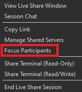

<!--
Copyright © Microsoft Corporation
All rights reserved.
Creative Commons Attribution 4.0 License (International): https://creativecommons.org/licenses/by/4.0/legalcode
-->

# How-to: Collaborate using Visual Studio

Ready to get collaborating with Live Share in Visual Studio? If so, you're in the right spot! In this article we'll walk you through how to use some of the specific features in the Visual Studio Live Share extension for Visual Studio.

Note that all collaboration activities in described here involve a single **collaboration session host** and one or more **guests**. The host is the person that started the collaboration session and anyone that joins is a guest.

*Looking for an abridged summary? Check out the [share](../quickstart/share.md) or [join](../quickstart/join.md) quickstarts instead.*

>**Tip:** Did you know you can *join your own collaboration session*? This allows you to try Live Share on your own or to spin up a instance of VS or VS Code and connect to it remotely! You can even use the same identity on both instances. Check it out!

## Installation

Before you begin, you'll need to install **Visual Studio 2017 (15.6 or higher)** on Windows 7, 8.1, or 10. Getting going is simple:

1. Install the latest version of <a href="https://www.visualstudio.com/vs/">Visual Studio 2017</a> (15.6+) 
2. Install a supported workload. e.g. ASP.NET, .NET Core, and/or Node.js
3. [Download](https://aka.ms/vsls-dl/vs) and install the VS Live Share extension from the marketplace.

By downloading and using Visual Studio Live Share, you agree to the [license terms](https://aka.ms/vsls-license) and [privacy statement](https://www.microsoft.com/en-us/privacystatement/EnterpriseDev/default.aspx). See [troubleshooting](../troubleshooting.md) if you run into problems.

## Sign in

In order to collaborate, you'll need sign into Visual Studio Live Share so everyone knows who you are. This is purely a security measure and does **not** opt you into any marketing or other research activities. You can sign in using a Microsoft personal account (e.g. @outlook.com), Microsoft-backed work or school account (AAD), or a GitHub account. Signing in is easy.

By default Visual Studio uses the your [personalization account](https://docs.microsoft.com/en-us/visualstudio/ide/signing-in-to-visual-studio) so if you're already logged into Visual Studio, you may be able to skip this step. Otherwise sign as you would normally.

If you want to use a different sign-in than your VS [personalization account](https://docs.microsoft.com/en-us/visualstudio/ide/signing-in-to-visual-studio), go to **Tools &gt; Options &gt; Live Share &gt; User account** to switch credentials.

Selecting **External Account** allows you to select an account not supported by Visual Studio's personalization feature like GitHub. A browser will automatically appear the first time you use a Live Share feature so you may complete sign in.

If you run into trouble, check out [troubleshooting](../troubleshooting.md#sign-in) for more tips.

## Share a project

After downloading and installing Visual Studio Live Share, follow these steps to start a collaboration session and invite a colleague to work with you.

1. **Sign in**

    After installing the Live Share extension, you'll want to sign in to let other collaborators know who you are. By default Visual Studio uses your personalization account, so you may be able to skip this step entirely.

    See [sign in](#sign-in) for more details.

2. **Open a solution, project, or folder**

    Use your normal workflow to open a folder, project, or solution you would like to share with your guests.

3. **[Optional] Hide or exclude files**

    If you would prefer to hide or completely exclude certain files or folders from the collaboration session, a **.vsls.json** file can be added to your project with these settings. See [controlling file access and visibility](../reference/security.md#controlling-file-access-and-visibility) for details.

4. **Start a collaboration session**

    Now, simply click the "Share" button in the upper right hand corner.

    

    > **Note:** You may be asked by your desktop firewall software to allow the Live Share agent to open a port the first time you share. Accepting this is entirely optional but enables a secured "direct mode" to improve performance when the person you are working with is on the same network as you are. See [changing the connection mode](../reference/connectivity.md#changing-the-connection-mode) for details.

    An invite link will be automatically copied to your clipboard. When opened in a browser, this link allows others to join a new collaboration session that shares contents of these folders with them.

    You will also see the "Share" button transition to convey a "Session State". See [session state](#session-states) information below on what this looks like.

    Note that if you need to get the invite link again after you've started sharing, you can access it by clicking on the share / session state button and selecting "Copy Link".

5. **Send someone the link**

    Send the link over e-mail, Slack, Skype, etc. to those you want to invite. Note that, given the level of access Live Share sessions can provide to guests, **you should only share with people you trust** and think through the implications of what you are sharing.

    > **Security Tip:** Want to understand the security implications of some of Live Share's features? Check out the [security](../reference/security.md) article.

    If the guest you invited has questions, the "[Quickstart: Join your first session](../quickstart/join.md)" article provides some more information on getting up and running as a guest.

6. **[Optional] Approve the guest**

    By default, guests will automatically join your collaboration session and you'll be notified when they've ready to work with you. While this notification gives you the option to remove them from the session, you can also opt to instead require an explicit "approval" for anyone joining.

    Simply change **Tools > Options > Live Share > Require guest approval** to True to enable the feature. Once you have this setting turned on, a notification will prompt you to approve the guest before they can join.

    

    See [invitations and join access](../reference/security.md#invitations-and-join-access) for additional details on invitation security considerations.

That's it!!

### Ending the collaboration session

As a host, you can can stop sharing completely and end the collaboration session by clicking the share / session state button (in the upper right hand corner) and selecting "End Collaboration Session".

All guests will be notified that the session has ended. Once the session has ended, guests will no longer be able to access the content and any temp files are automatically cleaned up.

Having issues with sharing? Check out [troubleshooting](../troubleshooting.md#share-and-join).

## Join a collaboration session

After downloading and installing Visual Studio Live Share, guests only need to take a couple steps to join a hosted collaboration session. There are two ways to join: [via the browser](#join-via-the-browser) and [manually](#join-manually).

> **Security Tip:** As a guest joining a collaboration session, it's important to understand that hosts may restrict your access to certain files or features. Want to understand the security implications of some of Live Share's features and settings? Check out the [security](../reference/security.md) article.

### Join via the browser

The easiest way to join a collaboration session is to simply open the invite link in a web browser. Here's what you can expect when you follow this flow.

1. **Sign in**

    After installing the Live Share extension, you'll want to sign in to let other collaborators know who you are. By default Visual Studio uses your personalization account, so you may be able to skip this step entirely.

    See [sign in](#sign-in) for more details.

2. **Click on the invite link / open the invite in your browser**

    Now, simply open (or re-open) the invite link in a browser.

    > **Note**: If you have not yet installed the Live Share extension, you'll be presented with links to the extension marketplace. Install the extension and restart your tool and retry.

    You should be notified that the browser wants to launch a Live Share enabled tool. If you let it launch your selected tool, you'll be connected to the collaboration session once it starts.

    

    If the host is offline, you'll be notified at this point instead. You can then contact the host and ask them to share again.

    > **Note:** Still having trouble? See [join manually](#join-manually).

3. **Collaborate**

    That's it!! In a few moments you'll be connected and you can start collaborating.

    You will see the "Share" button transition to convey a "Session State". See [session state](#session-states) information below for what this looks like.

    You'll then be automatically taken to the file the host is currently editing once the join is complete.

### Join manually

You can also manually join without using a web browser which can be useful in situations where the tool you want to use is already running, you want to use a different tool than you usually do, or if you are having trouble with getting invite links to work for some reason. The process is easy:

1. **Sign in**

    After installing the Live Share extension, you'll want to sign in to let other collaborators know who you are. By default Visual Studio uses your personalization account, so you may be able to skip this step entirely.

    See [sign in](#sign-in) for more details.

2. **Use the join command**

    Simply go to **File > Join Collaboration Session**

    

3. **Paste the invite link**

    Paste in the invite URL you were sent and confirm.

4. **Collaborate!**

    That's it! You should be connected to the collaboration session momentarily.

    You will see the "Share" button transition to convey a "Session State". See [session state](#session-states) information below for what this looks like.

    You'll then be automatically taken to where the host is currently editing once the join has completed.

### Leave the collaboration session

As a guest, you can leave the collaboration session without ending it for others by simply closing the tool or by clicking the share / session state button and selecting "Leave Collaboration Session".

Any temp files are automatically cleaned up so no further action is needed.

Having issues with joining? Check out [troubleshooting](../troubleshooting.md#share-and-join).

## Co-editing

Once a guest has joined a collaboration session, all collaborators will immediately be able to see each others edits and selections in real-time. All you need to do is pick a file from the file explorer and start editing. Both hosts and guests will see edits as you make them and can contribute themselves making it easy iterate and rapidly nail to down solutions.

> **Note:** Co-editing has a few limitations for certain languages. See [platform support](../reference/platform-support.md) for the state of features by language.

Beyond cursors and edits, selections you make are also visible to all participants in that same file. This makes it easy to highlight where problems might exist or convey ideas.

Better yet, you and other participants can navigate to any file in the shared project. You can can either edit together or independently meaning you can seamlessly switch between investigation, making small tweaks, and full collaborative editing.

> **Note:** Guest support for file navigation and file operations is still experimental and has some limitations. Find in files is not yet implemented [(up-vote 👍)](https://github.com/MicrosoftDocs/live-share/issues/43). Guests will always see a file view of solutions shared from VS [(up-vote 👍)](https://github.com/MicrosoftDocs/live-share/issues/43). Files outside of the solution "root" folder in VS are not shared [(up-vote 👍)](https://github.com/MicrosoftDocs/live-share/issues/46). When the host is using a case sensitive filesystem (e.g. Linux), file updates (add / rename / delete) may not propagate to guests [(up-vote 👍)](https://github.com/MicrosoftDocs/live-share/issues/XX) and if mulitple files or folders with the same name but different casing exist in the same path, only one may appear [(up-vote 👍)](https://github.com/MicrosoftDocs/live-share/issues/XX).

The resulting edits are persisted on the host's machine on save so there is no need to synchronize, push, or send files around once you're done editing. The edits are "just there."

> **Security Tip:** Given all participants can independently navigate and edit files, as a host, you may want to restrict which files guests are able to access in your project via a .vsls.json file. As a guest, it is also important to realize you may not see certain files as a result of these settings. See [controlling file access and visibility](../reference/security.md#controlling-file-access-and-visibility) for details.

### Changing participant flag behaviors

By default, Visual Studio Live Share automatically displays a "flag" next to a participant's cursor on hover, or when they edit, highlight, or move their cursor. In some cases you may prefer to change this behavior. To do so:

1. Go to **Tools > Options > Live Share**
2. Change the **Flag visibility** option to one of the following:

| Option | Behavior |
|--------|----------|
| OnHoverOnly | The flag is only visible when you hover over the cursor. |
| OnHoverOrActivity | This is the default. The flag is visible on hover or if the participant edits, highlights, or moves their cursor. |
| Always | The flag is always visible.

## Following

Whenever you are in a collaboration session, you'll be able can see each participant's initials in the upper right of the editor next to the sign in button. Hovering over the initials shows you the participant's full information.

Sometimes you may need to explain a problem or design that spans multiple files or locations in code. In these situations, it can useful to temporarily follow a colleague as they move throughout the project. For this reason, as a guest, when you join a collaboration session you will automatically "follow" the host. When following a participant, your editor will stay in sync with their currently open file, cursor, and scroll position.

> **Note:** Currently Live Share does not follow participants into files or folders outside of the shared folder root [(up-vote 👍)](https://github.com/MicrosoftDocs/live-share/issues/54).

To make it easy to switch out of "follow mode" and start editing on your own, you'll stop following if any of the following happens:

1. You edit, move your cursor, or make a selection
2. You select another file

You can also stop following at any time by clicking the initials of the person you are following in the upper right hand corner. The circle around the participant's initials that indicates you are following them will then disappear.

 

You can click on any initials in this same location to follow any host or guest in the collaboration session. Note that if you just want to jump to someone's location rather than following them, simply double-click their initials.

## Focusing

Occasionally you may want everyone in a collaboration session to come and take a look at something you are doing. Live Share lets you ask that everyone "focus" their attention on you with a notification that makes it easy for them to follow you back.

Just click on the session state / share button in the upper right hand corner and select "Focus Participants".

Everyone in the collaboration session will then get a notification that you've requested their attention

They can then just click "Follow" right from the notification when they're ready to put their focus on you.

## Co-debuging

Visual Studio Live Share's collaborative debugging feature is a powerful and unique way to debug an issue. Beyond enabling a collaborative experience to troubleshoot problems, it also you and other participants in your session the ability to investigate issues that may be environment specific by providing a shared debugging session on the host's machine.

> **Security Tip:** Given all participants can independently navigate and edit files, as a host, you may want to restrict which files guests are able to access in your project via a .vsls.json file. You should also be aware that Console/REPL access means that participants can execute commands on your machine so you should only co-debug with those you trust. As a guest, it is also important to realize you may not be able to follow the debugger as it step into certain files restricted files as a result of these settings. See [controlling file access and visibility](../reference/security.md#controlling-file-access-and-visibility) for details.

Using it simple. The collaboration session host simply needs to start debugging via the usual means in Visual Studio.

Once the debugger attaches on the host's side, all guests are also automatically attached as well. While there is one debugging "session" running on the host's machine, all participants are connected to it and have their own view.

> **Tip:** If you want to change when and how co-debugging happens, you can change the default behaviors via settings in **Tools > Options > Live Share**.

Anyone can step through the debugging process which enables seamless switching between collaborators without having to negotiate control.

> **Note:** See [platform support](../reference/platform-support.md) for the state of debugging features by language or platform.

Each collaborator can investigate different variables, jump to different files in the call stack, inspect variables, and even add or remove breakpoints. Co-editing features then allow each participant orator to track where the others are located to provide the unique ability to seamlessly switch between concurrently investigating different aspects of the problem and collaboratively debugging.

> **Tip:** You can also participate in VS Code debugging sessions from VS and vice versa! Check out the [Visual Studio instructions](vscode.md#co-debuging) on co-debugging for more information.

### Automatic web app sharing

Even better, for ASP.NET Web App projects, by default if the host's project is configured to automatically start a web browser to connect to the running web application when debugging, Live Share will automatically do the same on each guest's machine! This is done in a secure way and the remote web application is only available to the guests during the debugging session by default.

See [share a server](#share-a-server) for information on how to share server access for other project types and/or for the duration of the session.

> **Tip:** If you don't like the automated browser sharing behavior and want to change it, you can update settings in **Tools > Options > Live Share**.

### Change when VS joins debugging sessions

By default, as a guest, you'll be automatically attached to debugging sessions when they are shared by the host. However, in some cases you may find this behavior disruptive. Fortunately, you can change it as follows:

1. Go to **Tools > Options > Live Share**
2. Change the **Join debug session option** to one of the following:

| Option | Behavior |
|--------|----------|
| Automatic | The default. As a guest, you'll automatically join any shared debugging session the host starts. |
| Prompted | As a guest, you are prompted as to whether you want to join a shared debugging session when it is started by the host. |
| Manual | As a guest, you'll need to manually join any debugging sessions. See [detaching and reattaching](#detaching-and-reattaching).|

### Detaching and reattaching

As a guest, you may wish to stop debugging temporarily. Fortunately, you can simply click the "stop" icon in the debug toolbar to detach the debugger without affecting the host or other guests.

If you've updated settings so you no longer auto-attach or if you simply want to reattach later, you can simply select the desired running debugging session from the "Select Startup Item..." drop down...

...and then click it to attach.

## Share a server

From time to time, as a collaboration session host you may find that you want to share additional local servers or services with guests. This can range from other RESTful end-points to databases or other servers. Visual Studio Live Share lets you specify a local port number, optionally give it a name, and then share it with all guests.

The guests will then be able to access the server you shared on that port from their own local machine on the exact same port. For example, if you shared a web server **running on port 3000**, the guest can access that same running web server on their **own machine** at http://localhost:3000! This is accomplished via a secure SSH or SSL tunnel between the host and guests and authenticated via the service so you can be sure that only those in the collaboration session have access.

> **Security Tip:** As a host, you should be very selective with the ports you share with guests and stick to application ports (rather than sharing a system port). For guests, shared ports will behave exactly like they would if the server/service was running on their own machine. This is very useful, but if the wrong port is shared can also be risky.

For security purposes, only servers running on ports you specify are available to other guests. Fortunately, its easy to add one as the collaboration session **host**. Here's how:

1. Click on the share / session state button in the upper right corner and select "Manage Shared Local Servers"

    

2. In the dialog that appears, click "Add" and enter the port number the server is running on locally, enter a name, press enter, then OK.

    

That's it! The server on the port you specified will now be mapped to each guest's localhost on the same port (unless that port was already occupied)!

If the port is already in use on a guest's machine, a different one is automatically selected. Fortunately, as a guest you can see a list of currently shared ports (by name if specified) by clicking the share / session state button in the upper right corner and selecting "View Shared Local Servers."

Note that *guests cannot* control which ports on the host's machine are shared for security reasons.

To **stop** sharing a local server, the host simply needs to hare state button in the upper right corner as above, select "Manage Shared Local Servers", and select the appropriate port, and click "Remove".

## Share a terminal

Modern development makes frequent use of a wide array of command line tools. Fortunately, Live Share allows you, as a host, to optionally "share a terminal" with guests. The shared terminal can be read-only or fully collaborative so both you and the guests can run commands and see the results. You can to give guests visibility to terminal output or let them get hands on and run tests, builds, or even triage environment specific problems that only happen on your machine.

However, terminals are **not** shared by default since they give guests at least read-only access to the output of commands you run (if not the ability to run commands themselves). This way you can freely run commands in local terminals without risk and only share when actually need to do so. In addition, only hosts can start shared terminals to prevent guests from starting one up and doing something you are not expecting or watching.

As a host, you can share a terminal by clicking on the session state / share button in the upper right hand corner and selecting one of the "Share Terminal" menu items.

At this point you can select a read-only or read/write terminal from the menu. When the terminal is read/write, everyone can type in the terminal including the host which makes it easy to intervene if a guest is doing something you do not like. However, to be safe, you should **only give read/write access to guests when you know they actually need it** and stick with read-only terminals for scenarios where you just want the guest to see the output of any commands you run.

Once you've selected the kind of shared terminal you want to start, a new shared terminal will appear for all participants with the correct permissions. While Visual Studio Code has a built in terminal support Visual Studio does not have one out of box. Therefore, by default, new window containing the terminal will appear. However, if the [Whack Whack Terminal extension](https://marketplace.visualstudio.com/items?itemName=DanielGriffen.WhackWhackTerminal), Live Share will create an integrated terminal instead. Visual Studio will give you a link to install it the first time you start or join a shared terminal.

To end your terminal session, simply type exit or close the terminal window and everyone will be disconnected.

## Session states

After you have started or joined collaboration session and have access to shared content, the "Share" button in the upper right hand corner updates its appearance to reflect the state of the active collaboration session.

The following are the states you will typically see:

| State | Button | Description |
|-------|--------|-------------|
| Inactive |  | No active collaboration session and nothing is shared. |
| Host: Sharing In-Progress |  | A collaboration session is starting and content sharing will begin shortly. |
| Host: Sharing |  | A collaboration session is active and content is shared. |
| Guest: Joining Session |  | Joining an existing collaboration session. |
| Guest: Joined |  | Joined and connected to an active collaboration session and receiving shared content. |

## Guest limitations

While there are currently some shortcomings guests will experience while using the features described above, collaboration session hosts retain the complete functionality of their tool of choice. See the following for more information:

- [Language and platform support](../reference/platform-support.md)
- [Extension support](../reference/extensions.md)
- [All major bugs, feature requests, and limitations](https://aka.ms/vsls-issues)
- [All feature requests and limitations](https://aka.ms/vsls-feature-requests)

## Next Steps

Check out these additional articles for more information.

- [Quickstart: Share your first project](../quickstart/share.md)
- [Quickstart: Join your first session](../quickstart/join.md)
- [How-to: Collaborate using Visual Studio Code](vscode.md)
- [Connectivity requirements for Live Share](../reference/connectivity.md)
- [Security features of Live Share](../reference/security.md)

Having problems? See [troubleshooting](../troubleshooting.md) or [provide feedback](../support.md).