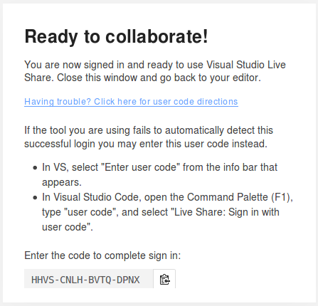
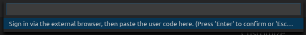
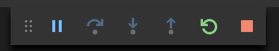
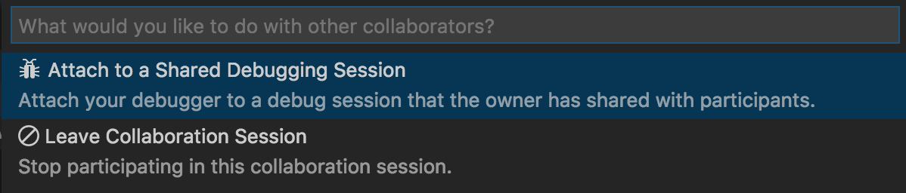
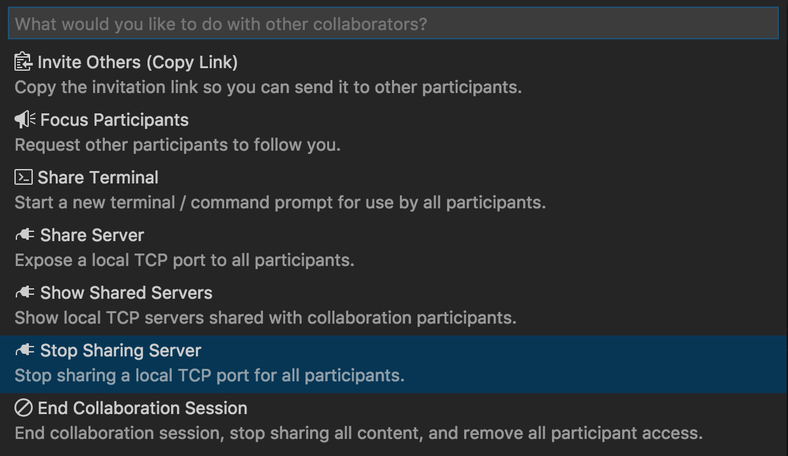

<!--
Copyright © Microsoft Corporation
All rights reserved.
Creative Commons Attribution 4.0 License (International): https://creativecommons.org/licenses/by/4.0/legalcode
-->

# How-to: Collaborate using Visual Studio Code

Ready to get collaborating with Live Share in VS Code?  If so, you're in the right spot! In this article we'll walk you through how to use some of the specific features in the Visual Studio Live Share extension for Visual Studio Code.

Note that all collaboration activities in described here involve a single **collaboration session host** and one or more **guests**. The host is the person that started the collaboration session and anyone that joins is a guest.

*Looking for an abridged summary? Check out the [share](../quickstart/share.md) or [join](../quickstart/join.md) quickstarts instead.*

>**Tip:** Did you know you can *join your own collaboration session*? This allows you to try Live Share on your own or to spin up a instance of VS or VS Code and connect to it remotely! You can even use the same identity on both instances. Check it out!

## Installation

Before you begin, you'll need to be sure you've got a version of Visual Studio Code installed that meets Live Share's core requirements. You'll need **Visual Studio Code (1.22.0 or higher)** running on:

- **Windows**: 7, 8.1, or 10

- **macOS**: Sierra (10.12) and above only.
    - _El Capitan (10.11) and below are not currently supported due to [.NET Core 2.0 requirements](https://go.microsoft.com/fwlink/?linkid=872315)._

- **Linux**: 64-bit Ubuntu Desktop 16.04+, see [below](#linux-install-steps) for information on other distributions.

    - **Be sure to install [needed Linux prerequisites](#install-linux-prerequisites)**.
    - Testing has also occurred on 64-bit Mint 18.3, Fedora 27, CentOS 7, and SuSE 12, and Manjaro 17.1 (though ArchLinux and Manjaro are not officially supported by either VS Code or .NET Core).
    - However, given the rate of change in the Linux world, your mileage may vary. See [below](#linux-install-steps) for details.
    - _32-bit Linux is not supported due to [.NET Core 2.0 requirements](https://go.microsoft.com/fwlink/?linkid=872314)_

After that, downloading and installing the Visual Studio Live Share extension is a breeze:

1. Install <a href="https://code.visualstudio.com/">Visual Studio Code</a>
2. [Download](https://aka.ms/vsls-dl/vscode) and install the VS Live Share extension from the marketplace.
3. Reload Visual Studio Code
4. Wait for dependencies to download and install (see status bar). 
    

By downloading and using Visual Studio Live Share, you agree to the [license terms](https://aka.ms/vsls-license) and [privacy statement](https://www.microsoft.com/en-us/privacystatement/EnterpriseDev/default.aspx). See [troubleshooting](../troubleshooting.md) if you run into problems.

### Linux install steps

As a Linux user, in addition to the steps above, you will need to run a command in the terminal when prompted to enable browser integrations and may need to install some missing libraries for certain distributions.

#### Install Linux prerequisites

Some distributions of Linux are missing needed libraries for Live Share. To install these dependencies quickly on supported distributions, run this command from a Terminal window:

    wget -O ~/vsls-reqs https://aka.ms/vsls-linux-prereq-script && sh ~/vsls-reqs

Assuming it completes successfully, you should be all set!

##### Known libraries missing from specific distributions

Some distributions of Linux are missing needed libraries for Live Share. The following is a list of libraries that are missing from distributions in their vanilla installation.

| Distribution | Missing libraries |
|--------|-------------------|
| Ubuntu Desktop 18.04 (64-bit) | `libcurl3 liblttng-ust0 apt-transport-https` |
| Ubuntu Desktop 17.10 (64-bit) | `libunwind8 liblttng-ust0` |
| Ubuntu Desktop 16.04 (64-bit) | &lt;none&gt; |
| Kubuntu 16.04 (64-bit) | `libunwind8 liblttng-ust0 gnome-keyring desktop-file-utils` |
| Xubuntu 16.04 (64-bit) | `libunwind8 liblttng-ust0` |
| Mint 18.3 - Cinnamon (64-bit) | `libcurl3` |
| Fedora 27 (64-bit) | &lt;none&gt; |
| openSuSE 12 (64-bit) | &lt;none&gt; |
| CentOS 7 | &lt;none&gt; |

Note that the Linux ecosystem moves quickly and that the package names may vary in certain distributions, so your results may vary. Additional details can be found below on the libraries typically required.

For example, *ArchLinux* is not officially supported by VS Code or .NET Core (and thus by extension Live Share), but there are community packages for them and we have found that the `gnome-keyring` and `libsecret` libraries are often missing from these as the community has opted to try out Live Share. You should also be aware libraries like gnome-keyring may require additional [setup steps](https://wiki.archlinux.org/index.php/GNOME/Keyring) in some desktop environments so check your distribution's documentation for details.

##### Details on required libraries

Linux distributions can vary in terms of libraries present after a vanilla install. Live Share has both .NET Core requirements and a few of its own to consider.

Visual Studio Live Share uses the .NET Core runtime which requires a number of libraries be installed. The following libraries may be missing from certain **Debian/Ubuntu** distributions or derivatives:

- libunwind8
- liblttng-ust0
- libcurl3
- libssl1.0.0
- libuuid1
- libkrb5-3
- zlib1g
- libicu52 (for Ubuntu 14.X)
- libicu55 (for Ubuntu 16.X)
- libicu57 (for Ubuntu 17.X)
- libicu60 (for Ubuntu 18.X)
- gettext
- apt-transport-https

In addition, the following are libraries **Live Share itself depends on** that may be missing in some instances (e.g. distributions not using Gnome):

- gnome-keyring
- libsecret-1-0
- desktop-file-utils

Libraries may be installed on Debian/Ubuntu based distributions by running `sudo apt install <library-name>` in a terminal. For example, this will install everything for Ubuntu 16.04/17.10/18.04 or Mint 18.3:

    sudo apt install libunwind8 liblttng-ust0 libcurl3 libssl1.0.0 libuuid1 libkrb5-3 zlib1g gnome-keyring libsecret-1-0 desktop-file-utils gettext apt-transport-https $(apt-cache search libicu | grep -o "libicu[0-9][0-9]\s")

The last part of the command automatically determines which version of libicu to install.

**Fedora/CentOS/RHL** requires similar packages but with slightly different names:

- libunwind
- lttng-ust
- libcurl
- openssl-libs
- libuuid
- krb5-libs
- libicu
- zlib

As with Debian/Ubuntu, **Live Share itself** depends on the following:

- gnome-keyring
- libsecret
- desktop-file-utils

Libraries may be installed on Fedora/CentOS/RHL based distributions by running `sudo yum install <library-name>` in a terminal. For example, this will install everything:

    sudo yum install libunwind lttng-ust libcurl openssl-libs libuuid krb5-libs libicu zlib gnome-keyring libsecret desktop-file-utils

Other distributions will require the same libraries, but the package names may be subtly different. You can [read more about .NET Core 2.0 prerequisites for other distributions here](https://docs.microsoft.com/en-us/dotnet/core/linux-prerequisites?tabs=netcore2x#linux-distribution-dependencies).

#### Linux browser integration

Once Live Share completes the installation process on Linux, you will be prompted to run a command in a Terminal that has been automatically copied to the clipboard to enable joining via the browser. **You will be prompted to do this each time the extension is installed or updated.**

> **Note:** If you do not see this notification you may be missing libraries that Live Share requires. Verify you have installed the needed [Linux prerequisites](#install-linux-prerequisites).

The command will look like this (where VERSION is replaced by the Live Share extension version):

    sudo sh ~/.vscode/extensions/ms-vsliveshare.vsliveshare-VERSION/node_modules/@vsliveshare/vscode-launcher-linux/install.sh /usr/share/code/code ~/.vscode/extensions/ms-vsliveshare.vsliveshare-VERSION/cascade.json

Run the script in a Terminal and enter your sudo password when prompted.

If you skip this step, you can still [join collaboration sessions manually](#join-manually), but you will not be able to join by opening an invite link in the browser. You can always access the command again later, by hitting **Ctrl+Shift+P** and selecting the "Live Share: Launcher Setup" command and the terminal command will be copied to your clipboard again.

## Sign in

In order to collaborate, you'll need sign into Visual Studio Live Share so everyone knows who you are. This is purely a security measure and does not opt you into any marketing or other research activities.

If you're been accepted into the private limited preview (session hosts), **use credentials that are associated with the email you used to sign up**. These can be a Microsoft personal account (e.g. @outlook.com), Microsoft-backed work or school account (AAD), or a GitHub account. Signing in is easy.

Hit **Ctrl+Shift+P** and select the "Live Share: Sign in" command or simply click on the "Sign in" status bar item and follow the directions to sign in.

A browser will appear for you use to complete the sign in process. Simply close the browser when done.

> **Linux users:** VS Code will also [prompt you to enter a user code](../use/vscode.md#sign-in-using-a-user-code) when opening the browser window. The code can be found by clicking on the "Having trouble? Click here for user code directions" link that appears in the "Ready to collaborate!" page after you've signed into Live Share via the browser. Simply paste this user code in the prompt's input field in VS Code and hit enter to finish.

If you signed up with an email that **is not already tied to a Microsoft personal, work, or school account or a GitHub account**, use this trick to unblock yourself:

1. Add the email as a secondary address to your GitHub profile
2. Verify it
3. Sign out of Live Share (if you've signed in) and back in again using your GitHub profile

If this does not work, contact vsls-feedback@microsoft.com and we can swap out your email address.

If Visual Studio Code is not picking up your sign in after you complete the sign in process in the browser, see [sign in using a user code](#sign-in-using-a-user-code). Otherwise, check out [troubleshooting](../troubleshooting.md#sign-in) for more tips.

### Sign in using a user code

If you are on Linux or are running into problems with VS Code not picking up the fact that you have completed sign in, you can enter a user code to complete the sign in process.

1. If you have not already signed in via the browser, click the **Sign in** status bar item or hit **Ctrl+Shift+P** and run the "Live Share: Sign in via Browser" command.

    

2. A browser will appear for you use to complete the sign in process.

3. Once you are done, click "Having trouble? Click here for user code directions" to see the user code.

    

4. Copy the user code.

5. Finally, paste the user code into VS Code.

    1. **On Linux**, you will already see an input field where you can paste in the user code and hit enter to finish.

    2. On other platforms, hit **Ctrl+Shift+P** and run the "Live Share: Sign in with user code" command, paste in the code in the input field that appears, and hit enter to finish.

    

## Using the scoped command menu

Nearly all Visual Studio Live Share functions are available from the Visual Studio Code "Command Palette" that can be accessed using Ctrl+Shift+P or F1. You can find a complete list of commands by typing "live share".

However, since this list can get long, you may find it easier to take advantage of a scoped command menu available from the status bar. Clicking on the sign in / session state icon in the status bar will immediately bring up a contextualized list of commands that are available for you to use.

## Share a project

After downloading and installing Visual Studio Live Share, follow these steps to start a collaboration session and invite a colleague to work with you.

1. **Sign up for the preview and wait to be accepted**

    You'll need to be signed up and *accepted* into the preview to be able to share. Visual Studio users should use their [personalization account](https://docs.microsoft.com/en-us/visualstudio/ide/signing-in-to-visual-studio) credentials to sign up.

    > **Note:** _This step is only necessary in order to "share". Anyone can "join" a collaboration session as a guest. This makes it easy for folks to work together without everyone needing to explicitly sign up or be accepted into the preview._

    If you have not done so, **[sign up now!](https://aka.ms/vsls-signup)**

2. **Sign in**

    Once you've been accepted into the preview, sign into Visual Studio Live Share with the credentials you used to sign-up. See [sign in](#sign-in) for more details.

3. **Start a collaboration session**

    Open a folder you want to share and simply click the "Share" status bar item or hit **Ctrl+Shift+P** and select "Live Share: Start a collaboration session (Share)".

    

    > **Note:** You may be asked by your desktop firewall software to allow the Live Share agent to open a port the first time you share. Accepting this is entirely optional but enables a secured "direct mode" to improve performance when the person you are working with is on the same network as you are. See [changing the connection mode](../reference/connectivity.md#changing-the-connection-mode) for details.

    An invite link will be automatically copied to your clipboard. When opened in a browser, this link allows others to join a new collaboration session that shares contents of these folders with them.

    You will also see the "Share" status bar item transition to represent the session state. See [session state](#session-states) information below for what this looks like.

    Note that if you need to get the invite link again after you've started sharing, you access it again by clicking on the session state status bar icon and select "Invite Others (Copy Link)".

4. **Send someone the link**

    Send the link over e-mail, Slack, Skype, etc. and once they join you can start collaborating! The person you invite will be able to download, install needed tools, and join the collaboration session without having to sign up or be accepted into the preview.

    See [join a collaboration session](#join-a-collaboration-session) for what the guest you invite can expect.

    That's it!!

### End the collaboration session

As a host, you can can stop sharing completely and end the collaboration session by hitting hit **Ctrl+Shift+P** and select the "Live Share: End collaboration session" command or opening the scoped command menu by clicking the session state status bar item and selecting "End Collaboration Session."

All guests will be notified that the session has ended.  Once the session has ended, guests will no longer be able to access the content and any temp files are automatically cleaned up.

Having issues with sharing? Check out [troubleshooting](../troubleshooting.md#share-and-join).

## Join a collaboration session

After downloading and installing Visual Studio Live Share, guests only need to take a couple steps to join a hosted collaboration session. There are two ways to join: [via the browser](#join-via-the-browser) and [manually](#join-manually).

### Join via the browser

The easiest way to join a collaboration session is to simply open the invite link in a web browser. Here's what you can expect when you follow this flow.

1. **Sign in**

    After installing the Live Share extension, reloading, and waiting for dependencies to finish installing, you'll want to sign in to let other collaborators know who you are. If you skip this step, you will asked to sign in during the join process.

    See [sign in](#sign-in) for more details. You *do not need to be signed up or accepted* into the private limited preview to participate in a collaboration session and will not receive email updates by simply signing into a Live Share session.

2. **Click on the invite link / open the invite in your browser**

    > **Linux users:** Be sure to run the browser integration terminal command when prompted before executing this step. See [here](#linux-browser-integration) for additional details.

    Simply open (or re-open) the invite link in a browser. Note: If you have not yet installed the Live Share extension, you'll be prompted to do so at this point and be presented with links to the extension marketplace. Install the extension and restart your tool and browser.

    You should be notified that your browser wants to launching a Visual Studio Live Share enabled tool. Accept this and a new window for your tool will launch and connect you to the session.

    

    If the host is offline or has ended the collaboration session before you joined, you'll see a message to this effect instead. You can then contact the host and ask them to share again.

    > **Note:** Be sure you've **started the tool at least once** after installing the Visual Studio Live Share extension and allowed the installation to finish before opening/re-opening the invite page. Still having trouble? See [join manually](#join-manually).

3. **Collaborate**

    That's it!! In a few moments you'll be connected and you can start collaborating.

    You will see the "Share" button transition to convey a "Session State". See [session state](#session-states) information below for what this looks like.

    You'll then be automatically taken to the file the host is currently editing once the join is complete.

### Join manually

You can also manually join without using a web link which can be useful in situations where the tool you want to use is already running, you want to use a different tool than you usually do, or if you are having trouble with getting invite links to work for some reason. The process is easy:

1. **Sign in**

    After installing the Live Share extension, reloading, and waiting for dependencies to finish installing, you'll want to sign in to let other collaborators know who you are. If you skip this step, you will asked to sign in during the join process.

    See [sign in](#sign-in) for more details. You *do not need to be signed up or accepted* into the private limited preview to participate in a collaboration session and will not receive email updates by simply signing into a Live Share session.

2. **Use the join command**

    Hit **Ctrl+Shift+P**and select "Live Share: Join collaboration session" or used the scoped command menu by clicking on the session state status bar item and select "Join Collaboration Session".

    

3. **Paste the invite link**

    Paste in the invite URL you were sent and confirm.

4. **Collaborate!**

    That's it! You should be connected to the collaboration session momentarily.

    You will see the "Share" button transition to convey a "Session State". See [session state](#session-states) information below for what this looks like.

    You'll then be automatically taken to the file the host is currently editing once the join is complete.

### Leave the collaboration session

As a guest, you can leave the collaboration session without ending it for others by simply closing the VS Code window. If you'd prefer to keep the window open, hit **Ctrl+Shift+P** and select the "Live Share: End collaboration session" command or use the scoped command menu by clicking on the session state status bar item and selecting "Leave Collaboration Session".

Any temp files are automatically cleaned up so no further action is needed.

Having issues with joining? Check out [troubleshooting](../troubleshooting.md#share-and-join).

## Co-editing

Once a guest has joined a collaboration session all collaborators will immediately be able to see each others edits and highlights in real-time.

Simply select a file from the file explorer and start editing. Guests will see edits as you make them and can contribute themselves in real time so you can iterate and rapidly nail to down solutions.

In addition, each collaborator can navigate to any file in the shared project. This means you can edit together in the same file or independently in separate files and thus seamlessly switch between investigation, small tweaks, and collaborative editing. The resulting edits are persisted on the host's machine so there is no need to synchronize, push, or send files around once you're done editing. The edits are "just there."

Further, to better allow you to highlight where problems might exist or convey ideas, selections are also visible to all guests.

### Moving to a collaborator's edit location

Since you may want to quickly jump to where another collaborator is located, if there is only one other person in the session you can hover over a status bar icon that shows the number of collaborators to see who is in the collaboration session. Simply clicking on this same icon to jumps the active editor to their exact location.

If there is more than one other person in the collaboration session, clicking on the icon presents a list of those currently in the collaboration session. You may then select a collaborator from the list to jump to their location.

### Follow a collaborator via pinning

At times the person you are collaborating with may need to show you a few different places in code to explain a problem or possible solution. While you could repeatedly jump to their location as described above you can also "pin" a tab set to their location.

Simply click on the pin icon in the upper right of the tab set. As above, if more than one other person is in the collaboration session you'll be asked to select the guest you want to follow.

The pin is for a tab set so you can use split view to have a set that is pinned and a set that is unpinned if you so desire.

To make it easy to hop in and out of pinning, the tab set is un-pinned if any of the following occurs:

1. You edit, move your cursor, or make a selection
2. You select another file
3. You click the pin icon again

Afterwards, simply click the pin icon again to follow them once again.

### Changing participant flag behaviors

By default, Visual Studio Live Share automatically displays a "flag" next to a participant's cursor on hover, or when they edit, highlight, or move their cursor. In some cases you may prefer to change this behavior.

Simply **edit settings.json** (File > Preferences > Settings), add one of the following, and then restart VS Code:

| Setting | Behavior |
|---------|----------|
| ``"liveshare.nameTagVisibility":"Never"`` | The flag is only visible when you hover over the cursor. |
| ``"liveshare.nameTagVisibility":"Activity"`` | This is the default. The flag is visible on hover or if the participant edits, highlights, or moves their cursor.
| ``"liveshare.nameTagVisibility":"Always"`` | The flag is always visible. |

## Co-debuging

Visual Studio Live Share's collaborative debugging feature is a powerful and unique way to debug an issue. Beyond enabling a collaborative experience to troubleshoot problems it also gives all collaborators the ability to investigate issues that may be environment specific by providing a shared debugging session on the host's machine.

Using it simple.

1. Be sure both the host and all guests have the appropriate debugging extension installed.

2. If not already set up for the project, the host should [configure launch.json](https://code.visualstudio.com/Docs/editor/debugging#_launch-configurations) to debug the application from VS Code as you would normally. No special setup is required.

3. Next, start debugging using the button in the debug tab as normal.

    

    > **Tip:** You can participate in VS debugging sessions from VS Code and vice versa! If the host is using Visual Studio, you can check out the [Visual Studio instructions](vs.md#co-debuging) but the steps are roughly the same.

Once the debugger attaches on the host's side, all guests are also attached. While there is one debugging "session" running on the host's machine, all collaborators are connected to it and have their own view.

Anyone can step through the debugging process which enables seamless switching between collaborators without having to negotiate control.

Each collaborator can investigate different variables, jump to different files in the call stack, variables, and breakpoints are shared across all guests and can be added by anyone. Co-editing features then allow each collaborator to track where the other is located to provide the unique ability to seamlessly switch between concurrently investigating different aspects of the problem and collaboratively debugging.

### Detaching and reattaching

As a guest, you may wish to stop debugging temporarily. Fortunately, you can simply click the "stop" icon in the debug toolbar to detach the debugger without affecting the host or other guests.

If you've updated settings so that as a guest you do not auto-attach to a co-debugging session or if you simply want to re-attach later, you can use the scoped command menu by clicking on the session state status bar icon and then selecting "Attach to a Shared Debugging Session".

### Sharing the running application in a browser

Visual Studio Code does not have the concept of an known "web application port" like Visual Studio for project types such as ASP.NET. However, if you are joining a collaboration session with a VS user that does you will automatically see the default browser appear connected to the host's running applications. See [Visual Studio features](vs.md#automatic-web-app-sharing) for more details.

In addition, you can manually share the application or other endpoints like RESTful services using the "Share Local Server" feature. VS and VS Code guests can then open a browser on the same localhost port to see the running application.  See [share a local server](#share-a-local-server) for more details.

### Change when VS Code joins debugging sessions

By default as a guest, you'll be automatically attached to debugging sessions when they are shared by the host. However, in some cases you may find this behavior disruptive.  Fortunately, you can change it as follows:

Simply **edit settings.json** (File > Preferences > Settings), add one of the following, and then restart VS Code:

| Setting | Behavior |
|---------|----------|
|``"liveshare.joinDebugSessionOption":"Automatic"`` | The default. As a guest, you'll automatically join any shared debugging session the host starts. |
| ``"liveshare.joinDebugSessionOption":"Prompt"`` | As a guest, you are prompted as to whether you want to join a shared debugging session when it is started by the host. |
| ``"liveshare.joinDebugSessionOption":"Manual"`` | As a guest, you'll need to manually join any  debugging sessions. See [detaching and reattaching](#detaching-and-reattaching). |

## Share a local server

From time to time, as a collaboration session host you may find that you want to share additional local servers or services with guests. This can range from other RESTful end-points to databases or other servers. Visual Studio Live Share lets you specify a local port number, optionally give it a name, and then share it with all guests.

The guests will then be able to access the server you shared on that port from their own local machine on the exact same port. For example, if you shared a web server **running on port 3000**, the guest can access that same running web server on their **own machine** at http://localhost:3000! This is accomplished via a secure SSH or SSL tunnel between the host and guests and authenticated via the service so you can be sure that only those in the collaboration session have access.

For security purposes, only servers running on ports you specify are available to other guests. Fortunately, its easy to add one as the collaboration session **host**. Here's how:

1. Click on the session state status bar icon.

     

2. Select "Share Local Server"

     

3. Enter the port number the server is running on and optionally a name.

     

That's it! The server on the port you specified will now be mapped to each guest's localhost on the same port (unless that port was already occupied)!

If the port is already in use on the guests machine, a different one is automatically selected. Fortunately, as a guest you can see a list of currently shared ports (by name if specified) by clicking on the session state status bar icon as above and selecting "Access Shared Server".  Selecting one copies it to the clipboard.

 

Note that *guests cannot* control which ports on the host's machine are shared for security reasons.

To **stop** sharing a local server as the host, you simply click the session state status bar icon as above, select "Stop Sharing Local Server", and select the port they want to stop sharing.

 

## Session states

After you have started or joined collaboration session and have access to shared content, the Visual Studio Live Share status bar items updates  its appearance to reflect the state of the active collaboration session.

The following are the states you will typically see:

| State | Status Bar | Description |
|-------|--------------------|-------------|
| Inactive |  | No active collaboration session and nothing is shared. |
| Host: Sharing In-Progress | | A collaboration session is starting and content sharing will begin shortly. |
| Host: Sharing | | A collaboration session is active and content is shared. |
| Guest: Joining Session | | Joining an existing collaboration session. |
| Guest: Joined |  | Joined and connected to an active collaboration session and receiving shared content. |

## Guest limitations

While there are currently some shortcomings guests will experience while using the features described above, collaboration session hosts retain the complete functionality of their tool of choice. See the following for more information:

- [Language and platform support](../reference/platform-support.md)
- [Extension support](../reference/extensions.md)
- [All major bugs, feature requests, and limitations](https://aka.ms/vsls-issues)
- [All feature requests and limitations](https://aka.ms/vsls-feature-requests)
- [Troubleshooting](../troubleshooting.md)

## Next steps

Check out these additional articles for more information.

- [Quickstart: Share your first project](../quickstart/share.md)
- [Quickstart: Join your first session](../quickstart/share.md)
- [How-to: Collaborate using Visual Studio](vs.md)
- [Connectivity requirements for Live Share](../reference/connectivity.md)

Having problems? See [troubleshooting](../troubleshooting.md) or [provide feedback](../support.md).
