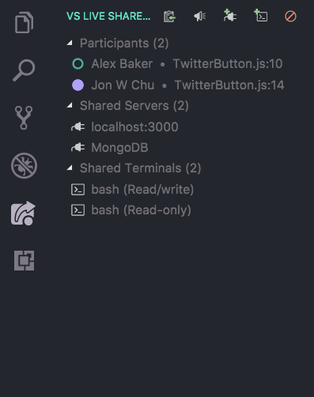
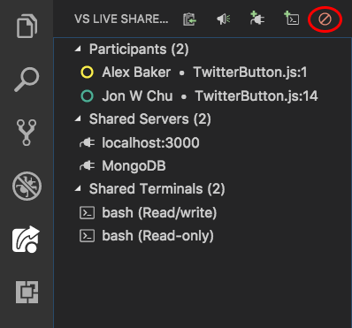
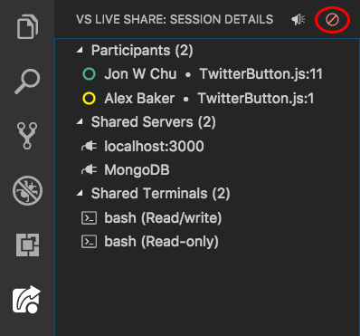
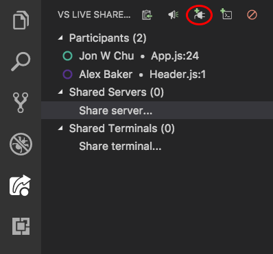
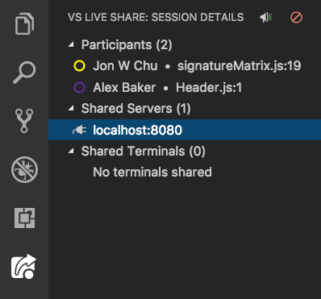
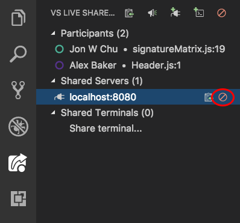
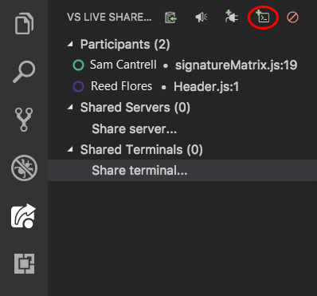
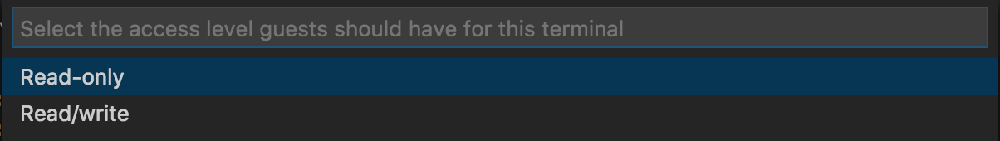
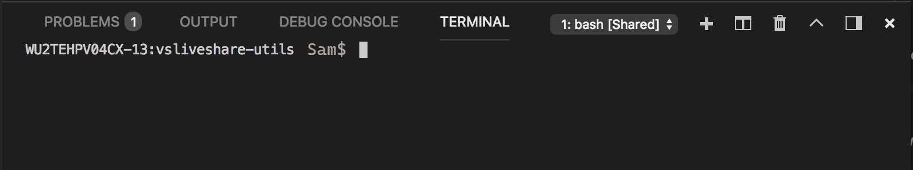
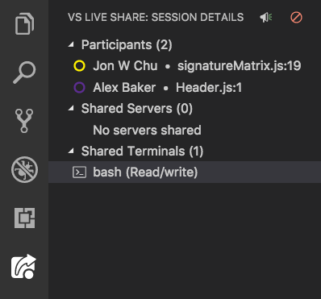

<!--
Copyright © Microsoft Corporation
All rights reserved.
Creative Commons Attribution 4.0 License (International): https://creativecommons.org/licenses/by/4.0/legalcode
-->

# How-to: Collaborate using Visual Studio Code

Ready to get collaborating with Live Share in VS Code?  If so, you're in the right spot! In this article, we'll walk you through how to use some of the specific features in the Visual Studio Live Share extension for Visual Studio Code.

Note that all collaboration activities described here involve a single **collaboration session host** and one or more **guests**. The host is the person that started the collaboration session and anyone that joins is a guest.

*Looking for an abridged summary? Check out the [share](../quickstart/share.md) or [join](../quickstart/join.md) quickstarts instead.*

> [!TIP]
> Did you know you can *join your own collaboration session*? This allows you to try Live Share on your own or to spin up an instance of Visual Studio or VS Code and connect to it remotely! You can even use the same identity in both instances. Check it out!

## Installation

Before you begin, you'll need to be sure you've got a version of Visual Studio Code installed that meets Live Share's core requirements. You'll need **Visual Studio Code (1.22.0 or higher)** running on:

- **Windows**: 7, 8.1, or 10

- **macOS**: Sierra (10.12) and above only.
    - _El Capitan (10.11) and below are not currently supported due to [.NET Core 2.0 requirements](https://go.microsoft.com/fwlink/?linkid=872315)._

- **Linux**: 64-bit Ubuntu Desktop 16.04+, Fedora Workstation 27+, CentOS 7

    - Live Share requires a number of [Linux prerequisites](#linux-install-steps) you may be prompted to install.
    - _32-bit Linux is not supported due to [.NET Core 2.0 requirements](https://go.microsoft.com/fwlink/?linkid=872314)._
    - ARM is also currently not supported.
    - See the [Linux install details](../reference/linux.md) article for details on using downstream and other distributions.

After that, downloading and installing the Visual Studio Live Share extension is a breeze:

1. Install <a href="https://code.visualstudio.com/">Visual Studio Code</a>
2. [Download](https://aka.ms/vsls-dl/vscode) and install the Visual Studio Live Share extension from the marketplace.
3. Reload Visual Studio Code
4. Wait for dependencies to download and install (see status bar). 
    
5. **Linux**: If you see a notification about installing missing libraries:
    1. Click "Install" in the notification.
    2. Enter your admin (sudo) password when prompted.
    3. Restart VS Code when done.

By downloading and using Visual Studio Live Share, you agree to the [license terms](https://aka.ms/vsls-license) and [privacy statement](https://www.microsoft.com/en-us/privacystatement/EnterpriseDev/default.aspx). See [troubleshooting](../troubleshooting.md) if you run into problems.

### Linux install steps

Linux is a highly variable environment and with the sheer number of desktop environments and distributions can be complicated to get working. If you stick to supported versions of **Ubuntu Desktop** (16.04+) or **Fedora Workstation** (27+), **CentOS 7** and only use **official distributions of VS Code**, you should find the process straightforward. However, in the event that you are using a non-standard configuration or downstream distribution, you may or may not run into some hiccups. See [Linux installation details](../reference/linux.md) for more information.

#### Install Linux prerequisites

Some distributions of Linux are missing libraries Live Share needs to function. By default, Live Share attempts to detect and install Linux prerequisites for you. You'll see a toast notification when Live Share encounters a problem that can originate from missing libraries asking you for permission to install them.

When you click "Install", a terminal window will appear where you'll need to enter your admin (sudo) password to continue. Assuming it completes successfully, restart Visual Studio Code you should be all set! You may also want to check out **[tips by distribution](../reference/linux.md#tips-by-distribution)** for other hints and workarounds if any exist.

If you see a message indicating the script does not support your distribution, see **[tips for community supported distributions](../reference/linux.md#tips-for-community-supported-distros)** for information the community has shared with us.

If you **prefer not to have VS Code run the command for you**, you can also opt to re-run the very latest version of this script at any time manually by running the following command from a Terminal window:

    wget -O ~/vsls-reqs https://aka.ms/vsls-linux-prereq-script && chmod +x ~/vsls-reqs && ~/vsls-reqs

#### Linux browser integration

Visual Studio Live Share typically **does not require additional installation steps** to enable browser integration on Linux.

While uncommon, on certain distributions you **may be notified that your admin (sudo) password is required** to complete the installation process. A terminal window will appear telling you where the browser launcher will be installed. Simply enter your password when prompted and press enter once the installation completes to close the terminal window.

You can read more about why this is required and where Live Share places files **[here](../reference/linux.md#linux-browser-integration)**. Note even if you are unable to get browser integration working you can still **[join collaboration sessions manually](../use/vscode.md#join-manually)**.

## Sign in

In order to collaborate, you'll need to sign into Visual Studio Live Share so everyone knows who you are. This is purely a security measure and does **not** opt you into any marketing or other research activities. You can sign in using a Microsoft personal account (e.g. @outlook.com), Microsoft-backed work or school account (AAD), or a GitHub account. Signing in is easy.

**Click** on the "Share" status bar item or press **Ctrl+Shift+P / Cmd+Shift+P** and select the "Live Share: Sign In With Browser" command.

A notification will appear asking you to sign in using your web browser. Clicking "launch sign in" will open a browser for you to use to complete the sign-in process. Simply close the browser when done.

> **Linux users:** You may be prompted to enter a user code if you are using an older version of Live Share (v0.3.295 or below). Update to the latest version of the extension or click the "Having trouble?" link after sign in to see the code. See [below for details](#sign-in-using-a-user-code).

If Visual Studio Code is not picking up your sign in after you complete the sign-in process in the browser, see [sign in using a user code](#sign-in-using-a-user-code). Otherwise, check out [troubleshooting](../troubleshooting.md#sign-in) for more tips.

### Sign in using a user code

If you are running into problems with VS Code not picking up a completed sign in, you can enter a "user code" instead.

1. Press **Ctrl+Shift+P / Cmd+Shift+P** and run the "Live Share: Sign in with user code" command.

2. A browser should appear for you use to complete the sign-in process.

    > [!NOTE]
    > If a browser does not appear automatically, open [this location](https://insiders.liveshare.vsengsaas.visualstudio.com/auth/login) in a browser and sign in.

3. Once you are done, click "Having trouble? Click here for user code directions" to see the user code.

    

4. Copy the user code.

5. Finally, paste the user code into the input field that appeared when you ran the command and press enter to complete the sign-in process.

    

## Using the Live Share viewlet

After installing Visual Studio Live Share, a custom tab will be added to the VS Code activity bar. In this tab, you can access all Live Share functions to collaborate. Additionally, when you share or join a collaboration session, a view will also appear in the Explorer tab for you to access all these functions as well.

<table style="border: none;">
<tr style="border: none;">
    <td width="50%" style="vertical-align: top; border: none;">
        
    </td>
    <td width="50%" style="vertical-align: top; border: none;">
        
</table>

With these views, you can see a participant's location in the shared code, click on a participant to follow them, focus participants, access shared servers and terminals, and more.

## Using the scoped command menu

Additionally, all Visual Studio Live Share functions are available from the Visual Studio Code "Command Palette" that can be accessed by pressing Ctrl+Shift+P / Cmd+Shift+P or F1. You can find a complete list of commands by typing "live share".

Since this list can get long, you may find it easier to take advantage of a scoped command menu available from the status bar. Clicking on the sign in / session state icon in the status bar will immediately bring up a contextualized list of commands that are available for you to use.

## Share a project

After downloading and installing Visual Studio Live Share, follow these steps to start a collaboration session and invite a colleague to work with you.

1. **Sign in**

    After installing the Live Share extension, reloading, and waiting for dependencies to finish installing, you'll want to sign in to let other collaborators know who you are. See [sign in](#sign-in) for more details.

2. **Open a folder**

    Use your normal workflow to open a folder, project, or solution you would like to share with your guests.

3. **[Optional] Update hidden or excluded files**

    By default, Live Share **hides** any files/folders referenced in .gitignore files in your shared folders from guests. **Hiding** a file prevents it from appearing in the guest's file tree. **Excluding** a file applies a stricter rule that will prevent Live Share from opening it for the guest in situations like go to a definition or if you step into the file while debugging or being "followed". If you want to hide/exclude different files, a **.vsls.json** file can be added to your project with these settings. See [controlling file access and visibility](../reference/security.md#controlling-file-access-and-visibility) for details.

4. **Start a collaboration session**

    Now, simply **click** the "Share" status bar item or hit **Ctrl+Shift+P / Cmd+Shift+P** and select "Live Share: Start a collaboration session (Share)".

    

    > [!NOTE]
    > You may be asked by your desktop firewall software to allow the Live Share agent to open a port the first time you share. Accepting this is entirely optional but enables a secured "direct mode" to improve performance when the person you are working with is on the same network as you are. See [changing the connection mode](../reference/connectivity.md#changing-the-connection-mode) for details.

    An invite link will be automatically copied to your clipboard. When opened in a browser, this link allows others to join a new collaboration session that shares contents of these folders with them.

    You will also see the "Share" status bar item transition to represent the session state. See [session state](#session-states) information below for what this looks like.

    Note that if you need to get the invite link again after you've started sharing, you access it again by clicking on the session state status bar icon and select "Invite Others (Copy Link)".

5. **[Optional] Enable read-only mode**

    Once you start your collaboration session, you can set the session to be read-only to prevent guests from making edits to the code being shared.

    After sharing, you will get a notification that the invite link has been copied to your clipboard. You can then select the option to make the session read-only.

    

6. **Send someone the link**

    Send the link over e-mail, Slack, Skype, etc. to those you want to invite. Note that, given the level of access Live Share sessions can provide to guests, **you should only share with people you trust** and think through the implications of what you are sharing.

    > **Security Tip:** Want to understand the security implications of some of Live Share's features? Check out the [security](../reference/security.md) article.

    If the guest you invited has questions, the "[Quickstart: Join your first session](../quickstart/join.md)" article provides some more information on getting up and running as a guest.

7. **[Optional] Approve the guest**

    By default, guests will automatically join your collaboration session and you'll be notified when they're ready to work with you. While this notification gives you the option to remove them from the session, you can also opt to instead require an explicit "approval" for anyone joining.

    To enable this feature, simply add the following to settings.json:

         "liveshare.guestApprovalRequired": true

    Once you have this setting turned on, a notification will prompt you to approve the guest before they can join.

    

    See [invitations and join access](../reference/security.md#invitations-and-join-access) for additional details on invitation security considerations.

That's it!!

### Stop the collaboration session

As a host, you can stop sharing completely and end the collaboration session at any time by opening the Live Share view in the Explorer or in the Live Share custom tab and selecting the "Stop collaboration session" icon.

All guests will be notified that the session has ended.  Once the session has ended, guests will no longer be able to access the content and any temp files are automatically cleaned up.

Having issues with sharing? Check out [troubleshooting](../troubleshooting.md#share-and-join).

## Join a collaboration session

After downloading and installing Visual Studio Live Share, guests only need to take a couple of steps to join a hosted collaboration session. There are two ways to join: [via the browser](#join-via-the-browser) and [manually](#join-manually).

> **Security Tip:** As a guest joining a collaboration session, it's important to understand that hosts may restrict your access to certain files or features. Want to understand the security implications of some of Live Share's features and settings? Check out the [security](../reference/security.md) article.

### Join via the browser

The easiest way to join a collaboration session is to simply open the invite link in a web browser. Here's what you can expect when you follow this flow.

1. **Sign in**

    After installing the Live Share extension, reloading, and waiting for dependencies to finish installing, you'll want to sign in to let other collaborators know who you are. See [sign in](#sign-in) for more details.

2. **Click on the invite link / open the invite in your browser**

    Now, simply open (or re-open) the invite link in a browser.

    > **Note**: If you have not yet installed the Live Share extension, you'll be presented with links to the extension marketplace. Install the extension and restart your tool and retry.

    You should be notified that the browser wants to launch a Live Share enabled tool. If you let it launch your selected tool, you'll be connected to the collaboration session once it starts.

    

    If the host is offline, you'll be notified at this point instead. You can then contact the host and ask them to share again.

    > [!NOTE]
    > Be sure you've **started the tool at least once** after installing the Visual Studio Live Share extension and allowed the installation to finish before opening/re-opening the invite page. Still having trouble? See [join manually](#join-manually).

3. **Collaborate**

    That's it! In a few moments you'll be connected and you can start collaborating.

    You will see the "Share" button transition to convey a "Session State". See [session state](#session-states) information below for what this looks like.

    You'll then be automatically taken to the file the host is currently editing once the join is complete.

### Join manually

You can also manually join without using a web browser which can be useful in situations where the tool you want to use is already running, you want to use a different tool than you usually do, or if you are having trouble with getting invite links to work for some reason. The process is easy:

1. **Sign in**

    After installing the Live Share extension, reloading, and waiting for dependencies to finish installing, you'll want to sign in to let other collaborators know who you are. See [sign in](#sign-in) for more details.

2. **Use the join command**

    Open the Live Share custom tab in the VS Code activity bar, and select the "Join collaboration session..." icon or entry.

    

3. **Paste the invite link**

    Paste in the invite URL you were sent and hit enter to confirm.

4. **Collaborate!**

    That's it! You should be connected to the collaboration session momentarily.

    You will see the "Share" button transition to convey a "Session State". See [session state](#session-states) information below for what this looks like.

    You'll then be automatically taken to the file the host is currently editing once the join is complete.

### Leave the collaboration session

As a guest, you can leave the collaboration session without ending it for others by simply closing the VS Code window. If you'd prefer to keep the window open, you can open the Live Share Explorer view or the Live Share custom tab and select the "Leave collaboration session" icon.

Any temp files are automatically cleaned up so no further action is needed.

Having issues with joining? Check out [troubleshooting](../troubleshooting.md#share-and-join).

## Co-editing

Once a guest has joined a collaboration session, all collaborators will immediately be able to see each other's edits and selections in real-time. All you need to do is pick a file from the file explorer and start editing. Both hosts and guests will see edits as you make them and can contribute themselves making it easy iterate and rapidly nail to down solutions.

> [!NOTE]
> Joining a read-only collaboration session prevents guests from being able to make edits to files. A host can [enable read-only mode when they share](#share-a-project). As a guest, you can tell if you have joined a read-only session by looking at your [session state](#session-states).

> [!NOTE]
> Co-editing has limitations for certain languages. See [platform support](../reference/platform-support.md) for the state of features by language.

Beyond cursors and edits, selections you make are also visible to all participants in that same file. This makes it easy to highlight where problems might exist or convey ideas.

Better yet, you and other participants can navigate to any file in the shared project. You can either edit together or independently meaning you can seamlessly switch between investigation, making small tweaks and full collaborative editing.

The resulting edits are persisted on the host's machine on save so there is no need to synchronize, push, or send files around once you're done editing. The edits are "just there."

> **Security Tip:** Given all participants can independently navigate and edit files, as a host, you may want to restrict which files guests are able to access in your project via a .vsls.json file. As a guest, it is also important to realize you may not see certain files as a result of these settings. See [controlling file access and visibility](../reference/security.md#controlling-file-access-and-visibility) for details.

### Changing participant flag behaviors

By default, Visual Studio Live Share automatically displays a "flag" next to a participant's cursor on hover, or when they edit, highlight, or move their cursor. In some cases, you may prefer to change this behavior.

Simply **edit settings.json** (File > Preferences > Settings), add one of the following lines, and then restart VS Code:

| Setting | Behavior |
|---------|----------|
| ``"liveshare.nameTagVisibility":"Never"`` | The flag is only visible when you hover over the cursor. |
| ``"liveshare.nameTagVisibility":"Activity"`` | This is the default. The flag is visible on hover or if the participant edits, highlights, or moves their cursor. |
| ``"liveshare.nameTagVisibility":"Always"`` | The flag is always visible. |

## Following

Sometimes you need to explain a problem or design that spans multiple files or locations in code. In these situations, it can be useful to temporarily follow a colleague as they move throughout the project. For this reason, when you join a collaboration session you will automatically "follow" the host. When following someone, your editor will stay in sync with their currently open file and scroll position.

> [!NOTE]
> By default, Live Share shares opened files external to the shared folder as well. If you want to disable this feature, update `liveshare.shareExternalFiles` Live Share to `false` in settings.json.

To start following a participant (as either a host or guest), click on their name in the participants' list in the Live Share Explorer view or custom tab. The circle next to their name will fill in to indicate you are following them.

Alternatively, you can click the pin icon in the upper right of the editor group or press **Ctrl+Alt+F / Cmd+Alt+F**.

> [!NOTE]
> If more than one other person is in the collaboration session, you'll be asked to select the participant you want to follow.
>
>

Since following is tied to an editor group, you can use split view (or grid layout!) to have a group that is following a participant and a group that is not. This allows you to passively follow someone while also working on something independently. With an editor group selected, you can select a participant in the participants list to have that group follow them.

To make it easy to switch out of "follow mode" and start editing on your own, you'll automatically stop following if any of these occur:

1. You start editing the currently active file
1. You open a different file
1. You close the currently active file

Additionally, you can explicitly stop following someone by clicking the pin icon again or hitting **Ctrl+Alt+F / Cmd+Alt+F**.

## Listing participants

A quick way to see who is in the collaboration session is to look at the participants list in the Live Share Explorer view or custom tab. The views will show all the participants in your session.

Clicking on any participant in this list will follow them in your active editor group.

Alternatively, you can hit **Ctrl+Shift+P / Cmd+Shift+P** and select the "Live Share: List Participants" command or **click** on the status bar item that shows the number of participants in your session.

A list of all participants in the session will then appear. Unlike clicking the pin icon, this list appears even if there is only one other person in the session with you so you can always quickly see where someone else is located. For convenience purposes, like the pin icon, you can then pick one of the participants from the list to follow them. Press escape if you'd like to exit instead.

## Focusing

Occasionally you may want everyone in a collaboration session to come and take a look at something you are doing. Live Share lets you ask that everyone "focus" their attention on you with a notification that makes it easy for them to follow you back.

Open the Live Share custom tab in the VS Code activity bar or the Live Share Explorer view, and select the "Focus participants" icon.

Once you run the command, everyone in the collaboration session will then get a notification that you've requested their attention.

They can then just click "Follow" right from the notification when they're ready to put their focus on you.

## Co-debugging

Visual Studio Live Share's collaborative debugging feature is a powerful and unique way to debug an issue. Beyond enabling a collaborative experience to troubleshoot problems, it also you and other participants in your session the ability to investigate issues that may be environment specific by providing a shared debugging session on the host's machine.

> **Security Tip:** Given all participants can independently navigate and edit files, as a host, you may want to restrict which files guests are able to access in your project via a .vsls.json file. You should also be aware that Console/REPL access means that participants can execute commands on your machine so you should only co-debug with those you trust. As a guest, it is also important to realize you may not be able to follow the debugger as it steps into certain files restricted files as a result of these settings. See [controlling file access and visibility](../reference/security.md#controlling-file-access-and-visibility) for details.

Using it simple.

1. Be sure both the host and all guests have the appropriate debugging extension installed. (Technically this is not always necessary, but it is generally a good idea.)

2. As the host, if not already set up for the project, you should [configure launch.json](https://code.visualstudio.com/Docs/editor/debugging#_launch-configurations) to debug the application from VS Code as you would normally. No special setup is required.

3. Next, the host can start debugging using the button in the debug tab as normal.

    

    > [!TIP]
    > You can also participate in Visual Studio debugging sessions from VS Code and vice versa! Check out the [Visual Studio instructions](vs.md#co-debugging) on co-debugging for more information.

Once the debugger attaches on the host's side, all guests are also automatically attached. While there is one debugging "session" running on the host's machine, all participants are connected to it and have their own view.

Anyone can step through the debugging process which enables seamless switching between collaborators without having to negotiate control.

> [!NOTE]
> See [platform support](../reference/platform-support.md) for the state of debugging features by language or platform.

Each collaborator can investigate different variables, jump to different files in the call stack, inspect variables, and even add or remove breakpoints. Co-editing features then allow each participant orator to track where the others are located to provide the unique ability to seamlessly switch between concurrently investigating different aspects of the problem and collaboratively debugging.

> [!NOTE]
> While in a read-only collaboration session, a guest will not be able to step through the debugging process. They can however, still add or remove breakpoints, and inspect variables.

### Change when VS Code joins debugging sessions

By default, as a guest, you'll be automatically attached to debugging sessions when they are shared by the host. However, in some cases, you may find this behavior disruptive. Fortunately, you can change it as follows:

Simply **edit settings.json** (File > Preferences > Settings), add one of the following lines, and then restart VS Code:

| Setting | Behavior |
|---------|----------|
|``"liveshare.joinDebugSessionOption":"Automatic"`` | The default. As a guest, you'll automatically join any shared debugging session the host starts. |
| ``"liveshare.joinDebugSessionOption":"Prompt"`` | As a guest, you are prompted as to whether you want to join a shared debugging session when it is started by the host. |
| ``"liveshare.joinDebugSessionOption":"Manual"`` | As a guest, you'll need to manually join any  debugging sessions. See [detaching and reattaching](#detaching-and-reattaching). |

### Detaching and reattaching

As a guest, you may wish to stop debugging temporarily. Fortunately, you can simply click the "stop" icon in the debug toolbar to detach the debugger without affecting the host or other guests.

If you've updated settings so you no longer auto-attach or if you simply want to reattach later, you can do so by pressing **Ctrl+Shift+P / Cmd+Shift+P** or **clicking** on the session state status bar item and selecting "Attach to a Shared Debugging Session".

### Sharing the running application in a browser

Visual Studio Code does not have the concept of a known "web application port" like Visual Studio for project types such as ASP.NET. However, if you are joining a collaboration session from a Visual Studio host, you may automatically see your default browser appear when debugging starts that is then automatically connected to the host's running applications. See [Visual Studio features](vs.md#automatic-web-app-sharing) for more details.

As a host, you can achieve something similar by manually sharing the application or other endpoints like RESTful services using the "Share Local Server" feature. Visual Studio and VS Code guests can then open a browser on the same localhost port to see the running application.  See [share a server](#share-a-server) for more details.

## Share a server

From time to time, as a collaboration session host, you may find that you want to share a web application or other locally running servers or services with guests. This can range from other RESTful end-points to databases and other servers. Visual Studio Live Share lets you specify a local port number, optionally give it a name, and then share it with all guests.

The guests will then be able to access the server you shared on that port from their own local machine on the exact same port. For example, if you shared a web server **running on port 3000**, the guest can access that same running web server on their **own machine** at http://localhost:3000! This is accomplished via a secure SSH or SSL tunnel between the host and guests and authenticated via the service so you can be sure that only those in the collaboration session have access.

> **Security Tip:** As a host, you should be very selective with the ports you share with guests and stick to application ports (rather than sharing a system port). For guests, shared ports will behave exactly like they would if the server/service was running on their own machine. This is very useful, but if the wrong port is shared can also be risky.

For security purposes, only servers running on ports you specify are available to other guests. Fortunately, it's easy to add one as the collaboration session **host**. Here's how:

1. Open the Live Share custom tab in the VS Code activity bar or the Live Share Explorer view, and select the "Share server..." entry or click the icon.

     

1. Enter the port number the server is running on and optionally a name.

     

That's it! The server on the port you specified will now be mapped to each guest's localhost on the same port (unless that port was already occupied)!

If the port is already in use on the guest's machine, a different one is automatically selected. Fortunately, as a guest, you can see a list of currently shared ports (by name if specified) in the Live Share Explorer view or custom tab in the VS Code activity bar, and look under the shared servers list. Selecting an entry opens that server in your browser. You can also right click and select the option to copy the link to the server to the clipboard.

 

Note that *guests cannot* control which ports on the host's machine are shared for security reasons.

To **stop** sharing a local server as the host, hover over the server entry in the shared servers list in the Live Share Explorer view or custom tab, and click the "Unshare server" icon.

 

## Share a terminal

Modern development makes frequent use of a wide array of command line tools. Fortunately, Live Share allows you, as a host, to optionally "share a terminal" with guests. The shared terminal can be read-only or fully collaborative so both you and the guests can run commands and see the results. You can to give guests visibility to terminal output or let them get hands-on and run tests, builds, or even triage environment-specific problems that only happen on your machine.

However, terminals are **not** shared by default since they give guests at least read-only access to the output of commands you run (if not the ability to run commands themselves). This way you can freely run commands in local terminals without risk and only share when actually need to do so. In addition, only hosts can start shared terminals to prevent guests from starting one up and doing something you are not expecting or watching.

As a host, you can share a terminal by opening the Live Share custom tab in the VS Code activity bar or the Live Share Explorer view, and selecting the "Share server..." entry or clicking the icon.

 

At this point, you can select a read-only or read/write terminal from the menu. When the terminal is read/write, everyone can type in the terminal including the host which makes it easy to intervene if a guest is doing something you do not like. However, to be safe, you should **only give read/write access to guests when you know they actually need it** and stick with read-only terminals for scenarios where you just want the guest to see the output of any commands you run.

> [!NOTE]
> If the collaboration session is in read-only mode, only read-only terminals can be shared by the host.

 

Once you've selected the kind of shared terminal you want to start, a new shared terminal will appear under VS Code's terminals tab.

 

If multiple terminals are shared, or your focus is in a different tab, you can bring focus to a specific terminal by selecting the entry in the shared terminals list.

 

To end your terminal session, simply type exit, close the terminal window, or click the "Unshare terminal" icon in the Live Share Explorer view or custom tab and everyone will be disconnected.

## Session states

After you have started or joined collaboration session and have access to shared content, the Visual Studio Live Share status bar items update their appearance to reflect the state of the active collaboration session.

The following are the states you will typically see:

| State | Status Bar | Description |
|-------|--------------------|-------------|
| Inactive |  | No active collaboration session and nothing is shared. |
| Host: Sharing In-Progress | | A collaboration session is starting and content sharing will begin shortly. |
| Host: Sharing | | A collaboration session is active and content is shared. |
| Host: Sharing Read-only | | Sharing a read-only collaboration session. |
| Guest: Joining Session | | Joining an existing collaboration session. |
| Guest: Joined |  | Joined and connected to an active collaboration session and receiving shared content. |
| Guest: Joined Read-only |  | Joined and connected to an active read-only collaboration session. |

## Guest limitations

While there are currently some shortcomings guests will experience while using the features described above, collaboration session hosts retain the complete functionality of their tool of choice. See the following for more information:

- [Language and platform support](../reference/platform-support.md)
- [Extension support](../reference/extensions.md)
- [All major bugs, feature requests, and limitations](https://aka.ms/vsls-issues)
- [All feature requests and limitations](https://aka.ms/vsls-feature-requests)
- [Troubleshooting](../troubleshooting.md)

## Next steps

Check out these additional articles for more information.

- [Quickstart: Share your first project](../quickstart/share.md)
- [Quickstart: Join your first session](../quickstart/share.md)
- [How-to: Collaborate using Visual Studio](vs.md)
- [Connectivity requirements for Live Share](../reference/connectivity.md)
- [Security features of Live Share](../reference/security.md)
- [Linux installation details](../reference/linux.md)

Having problems? See [troubleshooting](../troubleshooting.md) or [provide feedback](../support.md).
