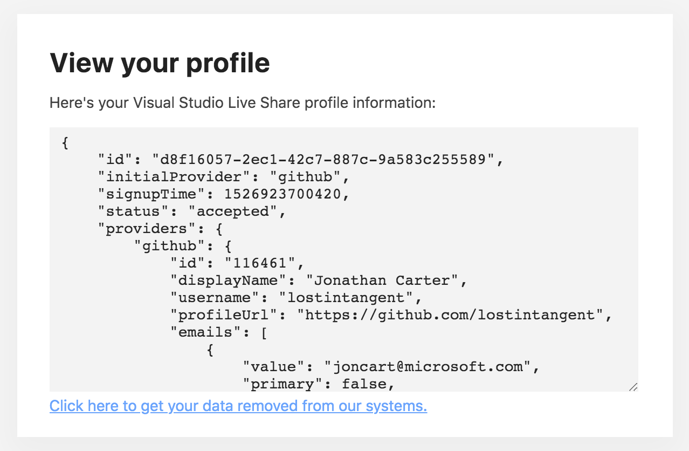
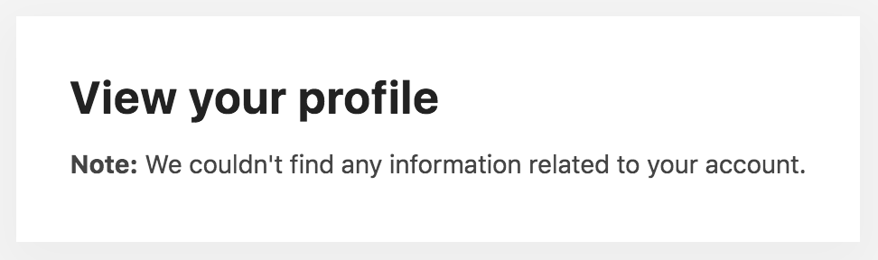

# User Profile

When you authenticate with Visual Studio Live Share, it creates a user profile for you, which simply allows the participants you collaborate with to see who you are (e.g. your e-mail address, avatar). At any given time, you can view the profile information that Live Share has stored on your behalf, by navigating to one of the following pages (depending on the identity provider you used):

- [Microsoft Account / Azure Active Directory](https://prod.liveshare.vsengsaas.visualstudio.com/auth/identity/microsoft/viewprofile)
- [GitHub](https://prod.liveshare.vsengsaas.visualstudio.com/auth/identity/github/viewprofile)

This page will ask you to sign-in (in order to verify your identity), and will then display the raw JSON output for your user profile.

If Visual Studio Live Share doesn't currently have a profile stored for the identity you logged in with, then it will let you know that as well.

## Removing Your Profile

If you'd like to remove your user profile, you can click the `Delete your account` button on the [user profile page](#user-profile). Otherwise, Visual Studio Live Share will automatically delete your profile 30 days since your last successful sign-in. In this context, a "successful sign-in" refers to the following (depending on the tool you're using):

| IDE/Editor | Your user profile will be deleted 30 days after the last time you... |
|-|-|
| Visual Studio | Launch a new instance of the IDE. In order to support single sign-on, Visual Studio Live Share refreshes your authentication session every time you open a new instance of Visual Studio. |
| Visual Studio Code | Complete the browser-based authentication workflow (e.g. clicking the `Sign In` button or running the `Live Share: Sign in with browser` command). Visual Studio Live Share will remember your authentication session on the client, to prevent you from needing to sign-in every time you share. However, that session expires after 30 days, and is never automatically refreshed, until you explicit sign-in through the browser again. |

## See also

- [Language and platform support](reference/platform-support.md)
- [Connectivity requirements for Live Share](reference/connectivity.md)
- [Security features of Live Share](reference/security.md)
- [All major bugs, feature requests, and limitations](https://aka.ms/vsls-issues)
- [All feature requests and limitations](https://aka.ms/vsls-feature-requests)

Having problems? See [troubleshooting](troubleshooting.md) or [provide feedback](support.md).
