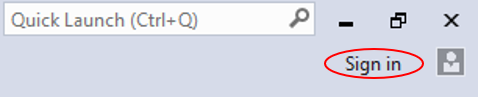
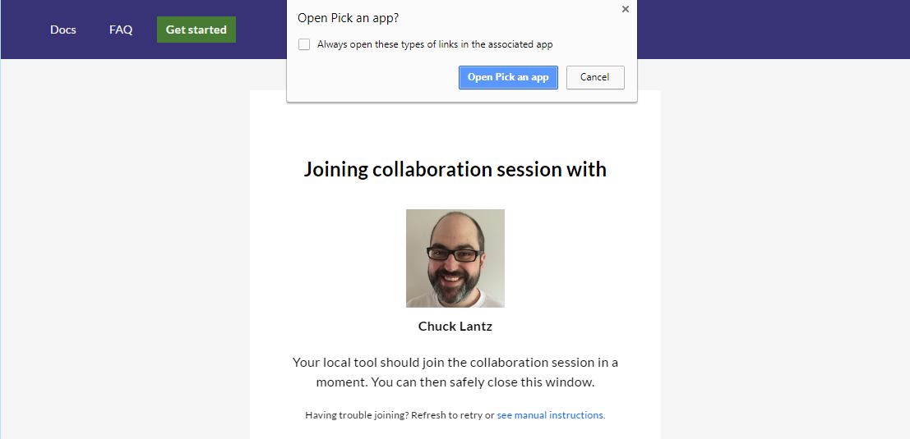

<!--
Copyright © Microsoft Corporation
All rights reserved.
Creative Commons Attribution 4.0 License (International): https://creativecommons.org/licenses/by/4.0/legalcode
-->

# Welcome to Visual Studio Live Share!

If you're here, one of the Visual Studio Live Share private limited preview members has probably **shared a collaboration session with you**! Team collaboration should be so quick and natural, that it becomes harder not to do it! For this reason, Visual Studio Live Share makes it simple to get started. 

>**Tip:** Did you know you can *join your own collaboration session*? This allows you to try Live Share on your own or to spin up a instance of VS or VS Code and connect to it remotely! You can even use the same identity on both instances. Check it out!

Just follow these steps to join a collaboration session:

### 1. Download and install Visual Studio Live Share

<table style="width: 100%; border-style: none;">
<tr>
    <td style="width: 128px; text-align: center; border:none;"></td>
    <td>
        <strong>Visual Studio 2017 15.6 or higher</strong> 
       1. Install the latest update of <a href="https://www.visualstudio.com/vs/">VS 2017</a> (15.6+) on Windows (7, 8.1, or 10). 
       2. Install a supported workload. e.g. ASP.NET, .NET Core, and/or Node.js 
       3. Download and install the Visual Studio Live Share extension from the marketplace.  
        
    </td>
</tr>
<tr>
    <td style="width: 128px; text-align: center; border:none;"></td>
    <td>
        <strong>Visual Studio Code</strong> 
        1. Install <a href="https://code.visualstudio.com/">Visual Studio Code</a> (1.20.0+) for Windows (7, 8.1, or 10) or macOS <b>(Sierra & up).</b> 
        2. Download and install the Visual Studio Live Share extension from the marketplace.  
        3. Reload and wait for dependencies to download and install (see status bar). 
        
    </td>
</tr>
</table>

By downloading and using Visual Studio Live Share, you agree to the [license terms](https://aka.ms/vsls-license) and [privacy statement](https://www.microsoft.com/en-us/privacystatement/EnterpriseDev/default.aspx). See [troubleshooting](https://aka.ms/vsls-troubleshooting) if you run into problems.

### 2. Sign in

After installing the Live Share extension, restarting, and waiting for dependencies to finish installing (VS Code), you'll want to sign in to let other collaborators know who you are. If you skip this step, you will asked to sign in during the join process. Click the "sign in" button / status bar item to get started.

<table style="border: none;">
<tr style="border: none;">
    <td width="50%" style="vertical-align: top; border: none;">
        
    </td>
    <td width="50%" style="vertical-align: top; border: none;">
        
    </td>
</tr>
</table>

In VS Code, a browser will appear for you use to sign in. You can simply close the browser when you are done.

If you are using Visual Studio and have already signed into the tool, Visual Studio Live Share will automatically use your [personalization account](https://docs.microsoft.com/en-us/visualstudio/ide/signing-in-to-visual-studio) so you can skip this step! If prefer to use a different sign-in than your VS personalization account, go to **Tools &gt; Options &gt; Live Share &gt; User account** to switch credentials.

### 3. Open/re-open the invite link in a browser

> **Linux users:** Be sure to run the browser integration terminal command when prompted before executing this step. See [here](../docs/getting-started.md#linux-browser-integration) for additional details.

Simply open (or re-open) the invite link in a browser. Note: If you have not yet installed the Live Share extension, you'll be prompted to do so at this point and be presented with links to the extension marketplace. Install the extension and restart your tool and browser.

You should be notified that your browser wants to launching a Visual Studio Live Share enabled tool. Accept this and a new window for your tool will launch and connect you to the session.

If the host is offline, the browser will instead telling you this is the case. You can then contact the host and ask them to share again.

> **Troubleshooting Tip:** When using VS Code, be sure you've **started the tool at least once** after installing the extension and waited for the dependencies to finish installing (see the status bar) before opening/re-opening the invite page. Still having trouble? See [join manually](../docs/getting-started.md#joining-manually.md) for details.

### 5. Collaborate!

That's it!! In a few moments you'll be connected to your colleague's collaboration session. Here's a few things to try out:

1. Move around the project independently and make some edits
2. Check out working intellisense for JavaScript, TypeScript, and/or C# code
3. Jump to the host's location and edit something together
4. Pin to the host and follow as they make edits in different files
5. Ask the host to start up a co-debugging session with you
6. Ask the host to share a local server so you can check out something like a web app running on their machine

Interested in joining the private limited preview so you can create collaboration sessions instead of just joining them? [Sign up now!](https://aka.ms/vsls-signup)

Still having problems? See [troubleshooting](../docs/troubleshooting.md).

## See also

- [Quick start: Sharing](welcome-owner.md)
- [Getting started and managing collaboration sessions](../docs/getting-started.md)
- [Visual Studio features](../docs/collab-vs.md)
- [Visual Studio Code features](../docs/collab-vscode.md)
- [Summary of language and platform support](../docs/platform-support.md)
- [Troubleshooting](../docs/troubleshooting.md)

Need help and not finding what you need in the docs?

- [See if someone already hit your problem by searching logged issues](https://aka.ms/vsls-issues)
- [Report a problem](../CONTRIBUTING.md#filing-problem-reports)
- [Up-vote a feature or request a new one](https://aka.ms/vsls-feature-requests)
- Or you can shoot us a [mail](mailto:vsls-feedback@microsoft.com) questions.

Interested in joining the private limited preview so you can create collaboration sessions instead of just joining them? [Sign up now!](https://aka.ms/vsls-signup)
