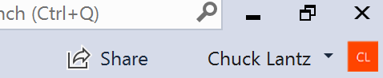

# Welcome to the Project Cascade Private Preview!

If you're here, you've probably been **accepted into the private preview**! If not, see how to **[join an existing collaboration session](welcome-joiner.md)** with **no registration required** or **[register now](http://aka.ms/project-cascade/register) so you can share**!

Team collaboration should be so quick and natural, that it becomes harder not to do it! For this reason, Project Cascade makes it simple to get started, so that you can seamlessly begin sharing your work and ideas. 

Just follow these steps to start sharing:

### 1. Download and install Project Cascade for your tool
While ultimately an extension, follow these directions for installing Project Cascade during the Private Preview. 

<table style="width: 100%; border-style: none;">
<tr>
    <td style="width: 128px; text-align: center; border:none;"></td>
    <td>
        <strong>Visual Studio 2017 Update 5</strong> 
       - Install VS 2017 Update 5 (15.5) on Windows (7, 8.1, or 10). 
       - Install a supported workload: ASP.NET, .NET Core, and/or Node.js 
       - Download and run the Project Cascade installer.  
       - Start Visual Studio after install to complete setup. 
        
    </td>
</tr>
<tr>
    <td style="width: 128px; text-align: center; border:none;"></td>
    <td>
        <strong>Visual Studio Code</strong> 
        - Download the combined Code + Cascade zip for Windows (7, 8.1, or 10) or Mac (<strong>macOS Sierra only</strong>). 
        - Unzip it where you want the install to live. 
        - Start VS Code from there to complete setup. 
        - Optional: Install the <a href="https://marketplace.visualstudio.com/items?itemName=ms-vscode.csharp">C# extension</a> to enable .NET Core support. Node.js support is built in. 
        
         
    </td>
</tr>
</table>

By downloading and using Project Cascade, you agree to the [license terms](http://aka.ms/project-cascade/license) and [privacy statement](https://www.microsoft.com/en-us/privacystatement/EnterpriseDev/default.aspx).

_Don't see your favorite IDE/editor? [Let us know!](https://github.com/Microsoft/project-cascade/issues/24) We plan to add support for additional tools based on community feedback._

### 2. Sign-in from within your IDE/editor

Once installed, start up your tool sign-in to the Project Cascade service with the same creditals you used to register.

 

> **Tip:** Need to use a different sign-in for Visual Studio than your personalization account? Go to Tools &gt; Options &gt; Project Cascade.

### 3. Start a collaboration session

Open a folder, project, or solution, and simply click "Share" within your tool and you'll get a link that allows others to join in a collaboration session on the contents of the related folders. 

 

### 4. Send someone the invite link

Send the link over e-mail, Slack, Skype, etc. and once someone joins you can begin immediately working with them! 

Note that the **person you invite does not need to register or be accepted in the private preview**. The web page for the invite link contains everything they need to know to download, install needed tools, and join the collaboration session. (However, they will not be able to _create_ their own collaboration sessions until they've been accepted in the preview.)

### 5. Collaborate!

That's it!! What to learn more about what you can do? Check out our documentation.

- [Getting started](../docs/getting-started.md)
- [Visual Studio features](../docs/collab-vs.md)
- [Visual Studio Code features](../docs/collab-vscode.md)
- [Quick start: Joining](welcome-joiner.md)

Need help and not finding what you need in the docs?

- [Report a problem](../CONTRIBUTING.md#filing-visual-studio-problems) or just [raise an issue](https://github.com/Microsoft/project-cascade/issues).
- [Up-vote a feature or request a new one](https://aka.ms/project-cascade/feature-requests)
- Join the [Slack channel](http://project-cascade.slack.com) and chat with us!
- Shoot us a [mail](mailto:project-cascade@microsoft.com) with suggestions or questions.
